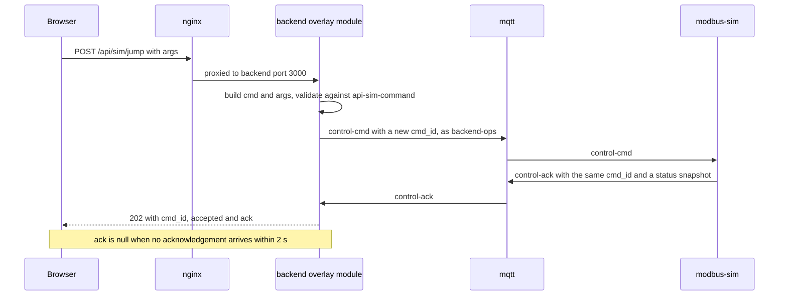
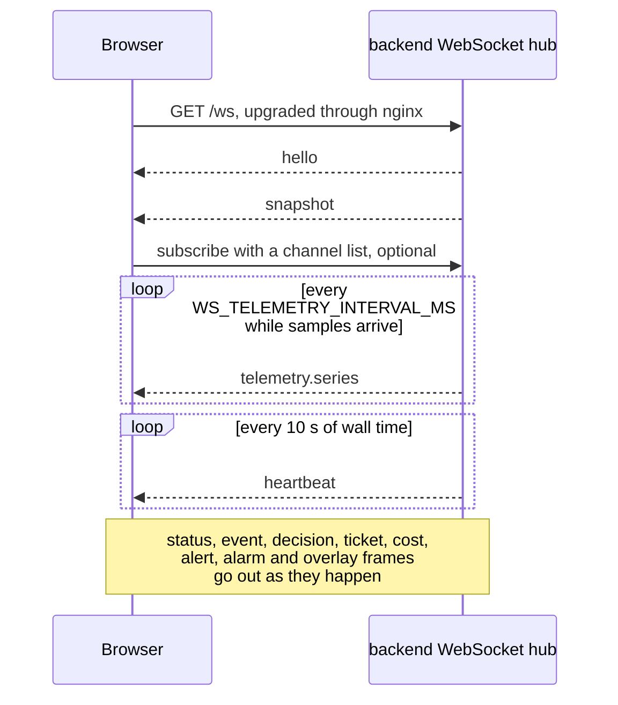

<!-- SPDX-FileCopyrightText: 2026 Meddle S.r.l. -->
<!-- SPDX-License-Identifier: CC-BY-4.0 -->

# API and topics

This is the reference for everything the stack exchanges at run time: the backend's REST routes and its WebSocket, the MQTT topics and the broker ACL that says who may use them, and the JSON Schemas behind every body, frame and message. Use it when you script against a running stack, subscribe to the broker or change a contract. Every body, frame and message named here is validated against its schema in `packages/contracts/schemas/v1/`, so those files are the authoritative field lists; this page names them and says when each one travels. For how the pieces fit together, read [architecture.md](architecture.md) first.

## REST routes

The backend serves every route under `/api` on its port 3000. In the stack you reach it through nginx on the UI port, `http://localhost:8080/api/…`; `make up-dev` also publishes the backend itself on `http://localhost:3000`.

- **JSON in and out, no authentication.** Keep the published ports on a machine or network you trust ([security.md](security.md)). Cross-origin requests are answered only outside production; in the stack, nginx serves the page and the API from one origin.
- **Validated at the boundary.** A request body with a contract is validated inside its route, and every response with a contract passes `assertValid` before it leaves. Request bodies are limited to 1 MiB.
- **Query parameters are read one by one.** A malformed or repeated parameter is a 400 whose `details.parameter` names it; it is never replaced by a default.
- **Pages.** The paged lists answer `{ "items": [...], "next_cursor": ... }`, newest first; pass `next_cursor` back as `before` for the next page. `limit` defaults to 50 and is capped at 200. The bounded lists without a contract of their own (`/alarms/native`, `/alerts/system`, `/catalog/faults`, `/cost/ledger`, `/overlay/injections` and `/overlay/markers`) answer `{ "items": [...] }` without a cursor.
- **Errors** are `api-error` bodies, `{ "error": { "code", "message", "details"? } }`; the codes are listed under [Errors](#errors).

### Health and status

| Route             | Parameters | Answer                                                                                                                                                                                                                                                                                                                                   | Contract     |
| ----------------- | ---------- | ---------------------------------------------------------------------------------------------------------------------------------------------------------------------------------------------------------------------------------------------------------------------------------------------------------------------------------------- | ------------ |
| `GET /api/health` | —          | The decision backend and its model, the state of the four connections (`db.app`, `db.gt`, `mqtt.diag`, `mqtt.ops`, each `ok` or `down`), the two watchdogs (`ok`, `silent` or `unknown`), the replay position and process counters. HTTP 503 with the same body when a connection is down; the Compose healthcheck reads the status code | `api-health` |
| `GET /api/status` | —          | The retained simulator and gateway statuses (`null` until received), the backend's own status, the system alerts raised right now, the running injections and the gate's two thresholds and persistence                                                                                                                                  | `api-status` |

The `counters` of the health body are free-form. The running service reports the telemetry flow (`telemetry_batches`, `telemetry_samples`, `telemetry_failed`, `telemetry_queued`, `telemetry_storage_errors`), dropped MQTT payloads (`mqtt_invalid`, `mqtt_handler_failures`), sink failures (`sink_persist_failures`, `sink_publish_failures`), the WebSocket (`ws_clients`, `ws_telemetry_dropped`, `ws_slow_closed`, `ws_invalid_frames`) and `links_unwired`.

### Signals and telemetry

| Route                                                | Parameters                                                                                                                                                                                   | Answer                                                                                                                                                                                                                                                                                   | Contract               |
| ---------------------------------------------------- | -------------------------------------------------------------------------------------------------------------------------------------------------------------------------------------------- | ---------------------------------------------------------------------------------------------------------------------------------------------------------------------------------------------------------------------------------------------------------------------------------------- | ---------------------- |
| `GET /api/signals`                                   | —                                                                                                                                                                                            | Every tag of the register map in register order: its id, English name, panel label, unit (empty for a digital state), kind, MetroPT-3 column, `recorded` or `synthetic`, scale, and the manual's normal bands once init has ingested the manual                                          | `api-signals`          |
| `GET /api/telemetry/series`, alias `GET /api/series` | `from`, `to` (required, data time, `from` not after `to`); `signals` or `tags` (comma-separated tag ids, every tag when absent); `points` (per tag, at most 2000, which is also the default) | The downsampled history: per analog tag the minimum and maximum of every bucket in time order, per digital tag its transitions, read from the in-memory ring (`source: ring`) or, for older windows, from the one-minute aggregates (`agg_1m`), plus the instants where data time jumped | `api-telemetry-series` |
| `GET /api/telemetry/latest`                          | —                                                                                                                                                                                            | `{ sample, machine_state }`: the newest accepted sample and the machine state detection derived from it, both `null` before the first sample. For debugging                                                                                                                              | none                   |
| `GET /api/features`                                  | —                                                                                                                                                                                            | `{ frame }`: detection's current feature frame, `null` before the first one. For debugging                                                                                                                                                                                               | none                   |
| `GET /api/alarms/native`                             | `from`, `to` (data time, both inclusive, open-ended when absent); `code` (a controller code such as `W101`); `limit` (default 1,000, at most 10,000)                                         | `{ items: [{ code, state, sim_ts, wall_ts, seq }] }`: the controller alarm transitions (`raised`, `cleared`) diffed out of the sample stream, oldest first                                                                                                                               | none                   |

### Events, decisions, episodes and tickets

| Route                                              | Parameters                                                                                                                                                                     | Answer                                                                                                                                                                                                       | Contract                                 |
| -------------------------------------------------- | ------------------------------------------------------------------------------------------------------------------------------------------------------------------------------ | ------------------------------------------------------------------------------------------------------------------------------------------------------------------------------------------------------------ | ---------------------------------------- |
| `GET /api/events/suspect`, alias `GET /api/events` | `before`, `limit`, `symptom_key`                                                                                                                                               | One page of suspect events, newest first, exactly as detection published them                                                                                                                                | `api-events`                             |
| `GET /api/decisions`                               | `before`, `limit`, `episode_id`                                                                                                                                                | One page of decision messages, newest first, failed decisions included                                                                                                                                       | `api-decisions`                          |
| `GET /api/decisions/:id`                           | —                                                                                                                                                                              | The decision message plus `state`, what the decision backend was shown, which never travels over the broker; 404 when unknown                                                                                | `decision`                               |
| `GET /api/episodes`                                | `status` (`open`, `closed` or `aborted`), `before`, `limit`                                                                                                                    | One page of episodes, newest first                                                                                                                                                                           | `api-episodes`                           |
| `GET /api/tickets`                                 | `status` (`review`, `open`, `resolved`, `closed` or `all`, the default), `before`, `limit`                                                                                     | One page of ticket messages, newest first                                                                                                                                                                    | `api-tickets`                            |
| `GET /api/tickets/:id`                             | —                                                                                                                                                                              | The ticket message plus `decisions`, the decision messages of its episode, newest first and at most 200; 404 when unknown                                                                                    | `ticket`                                 |
| `POST /api/tickets/:id/close`                      | Body `{ "verdict": "correct", "note": "...", "closed_by": "..." }`; `verdict` is `correct` or `wrong`, `note` (up to 2000 characters) and `closed_by` (up to 120) are optional | Records a technician's verdict and answers the resulting `ticket` message (`action: closed`). A ticket in review, open or resolved takes one verdict: 404 for an unknown ticket, 409 when it already has one | Body `api-ticket-close`, answer `ticket` |

Events and decisions are read from the database. Tickets and episodes are read from the backend's in-memory store, which it hydrates from the database at start-up with the open episodes and the live tickets; a ticket that was closed in an episode that ended before the last restart stays in the database but is no longer listed. The review queue has no route of its own: it is the set of tickets in status `review`, which the dashboard's Review tab asks for with `status=review`.

### Cost, alerts and catalog

| Route                               | Parameters                                                         | Answer                                                                                                                                                                                                 | Contract              |
| ----------------------------------- | ------------------------------------------------------------------ | ------------------------------------------------------------------------------------------------------------------------------------------------------------------------------------------------------ | --------------------- |
| `GET /api/cost`                     | —                                                                  | The cost panel: running totals, a split per decision backend, the cost per wall-clock day, the prices the numbers were computed with and the 50 newest ledger rows. Only answered decisions are billed | `api-cost`            |
| `GET /api/cost/ledger`              | `limit` (default 100, at most 1,000)                               | `{ items }`: the newest billed decisions, each with its backend, model, tokens, `cost_usd`, `wall_ts`, `sim_ts` and the prices it was billed at                                                        | none                  |
| `GET /api/alerts/system`            | `active` (`true` or `false`), `limit` (default 100, at most 1,000) | `{ items }`: the watchdog alerts (`telemetry_silent`, `decision_api_silent`), each as its latest message, newest raise first                                                                           | Items `alert-system`  |
| `GET /api/catalog/faults`           | —                                                                  | `{ items }`: every cause of the ingested manual in `fault_id` order, empty before init has run                                                                                                         | Items `catalog-entry` |
| `GET /api/catalog/faults/:fault_id` | —                                                                  | One cause; 404 when the manual has none with that id                                                                                                                                                   | `catalog-entry`       |

### Simulation commands and the overlay

These routes belong to the backend's overlay module, the one part of the backend that talks to the simulator's control topic and reads ground truth ([architecture.md](architecture.md#ground-truth-isolation)).

| Route                                       | Body or parameters                                                                                                                                                        | What it does                                                                                                                                                                                         | Contract                                                |
| ------------------------------------------- | ------------------------------------------------------------------------------------------------------------------------------------------------------------------------- | ---------------------------------------------------------------------------------------------------------------------------------------------------------------------------------------------------- | ------------------------------------------------------- |
| `POST /api/sim/play`, `POST /api/sim/pause` | `{ "args": {} }`                                                                                                                                                          | Commands `play` and `pause`                                                                                                                                                                          | Body `api-sim-command`, answer `api-sim-command-result` |
| `POST /api/sim/speed`                       | `{ "args": { "speed": 600 } }`, an integer from 1 to 3600                                                                                                                 | Command `set_speed`: simulated seconds per wall-clock second                                                                                                                                         | Same                                                    |
| `POST /api/sim/jump`                        | `{ "args": { "preset_id": "f3_air_leak_jun05" } }` or `{ "args": { "sim_ts": "2020-06-05T06:00:00.000Z" } }`, exactly one of the two                                      | Command `jump`, to a preset of the ground-truth catalog or to an instant inside the dataset                                                                                                          | Same                                                    |
| `POST /api/sim/inject`                      | `{ "args": { "injection_id": "oil_cooler_fouling" } }`, with an optional `params` object holding `magnitude` (above 0) and `duration_sim_min` (1 to 14400), both optional | Command `inject`; omitted parameters take the injection's own defaults, and the acknowledgement names the new `instance_id`                                                                          | Same                                                    |
| `POST /api/sim/clear`                       | `{ "args": {} }`                                                                                                                                                          | Command `clear_injections`                                                                                                                                                                           | Same                                                    |
| `POST /api/sim/reset`                       | `{ "args": {} }`                                                                                                                                                          | Command `reset`                                                                                                                                                                                      | Same                                                    |
| `GET /api/overlay/catalog`                  | —                                                                                                                                                                         | The retained ground-truth catalog: the dataset span, the preset menu, the injection menu and the failure table; 404 before the simulator has published one                                           | `gt-catalog`                                            |
| `GET /api/overlay/active`                   | —                                                                                                                                                                         | The injections running right now; 404 before the simulator has published a list                                                                                                                      | `gt-injection-active`                                   |
| `GET /api/overlay/injections`               | `from`, `to` (optional, data time)                                                                                                                                        | `{ items: [{ unit_id, instance_id, injection_id, fault_id, start_sim_ts, end_sim_ts, reason, params }] }`: the injection windows that overlap the range, oldest first, from `gt.v_injection_windows` | none                                                    |
| `GET /api/overlay/markers`                  | `from`, `to` (optional, data time)                                                                                                                                        | `{ items }`: the jump, reset and loop markers inside the range, oldest first                                                                                                                         | Items `gt-marker`                                       |

A command route builds `{ cmd, args }` from its path segment and its body and validates the pair against `api-sim-command`, whose argument definitions are copies of `control-cmd`'s that a contracts test keeps deep-equal. It then publishes a `control-cmd` with a new `cmd_id` on `plant/cau-7/control/cmd` as `backend-ops` and waits up to 2 s for the `control-ack` carrying the same id. The answer is 202 with `{ cmd_id, accepted: true, ack }`: "accepted" means published, and `ack` is the simulator's acknowledgement (`ok`, `error` and a `status-sim` snapshot taken after the command) or `null` when none arrived in time, in which case the dashboard follows the `status.sim` frames. Arguments that do not match the command answer 400 `bad_request` with the schema issues in `details.issues`; a broker connection that is down or refuses the publication answers 503 `sim_unreachable`.



The same jump the README's tour makes, from a terminal (the preset ids are in `packages/ground-truth/data/presets.json` and in `GET /api/overlay/catalog`):

```bash
curl -s -X POST http://localhost:8080/api/sim/jump \
  -H 'content-type: application/json' \
  -d '{"args":{"preset_id":"f3_air_leak_jun05"}}'
```

The answer has this shape, trimmed from the contract fixture `packages/contracts/fixtures/api-sim-command-result/valid-acknowledged.json` (the acknowledgement's envelope and most of its `status-sim` snapshot are left out):

```json
{
  "cmd_id": "4d5e6f7a-8b9c-4d0e-9f2a-3b4c5d6e7f80",
  "accepted": true,
  "ack": {
    "cmd_id": "4d5e6f7a-8b9c-4d0e-9f2a-3b4c5d6e7f80",
    "cmd": "jump",
    "ok": true,
    "error": null,
    "status": { "sim_ts": "2020-06-05T09:48:20.000Z", "state": "playing", "speed": 600 }
  }
}
```

### Errors

| Status    | `code`            | When                                                                                                                                             |
| --------- | ----------------- | ------------------------------------------------------------------------------------------------------------------------------------------------ |
| 400       | `bad_request`     | A query parameter or a body the route refused; `details.parameter` names the parameter, `details.issues` lists the schema issues of a body       |
| 400       | `bad_cursor`      | `before` is not a cursor this API issued                                                                                                         |
| 404       | `not_found`       | An unknown route under `/api`, an unknown decision, ticket or fault id, or an overlay catalog or active list the simulator has not published yet |
| 409       | `conflict`        | A second verdict on the same ticket                                                                                                              |
| 503       | `sim_unreachable` | A simulation command while the broker connection is down or refuses the publication                                                              |
| Other 4xx | `bad_request`     | Any other refusal by Fastify itself, such as malformed JSON or a body over 1 MiB, keeps its status                                               |
| 500       | `internal_error`  | Anything else; the message never carries the cause, which is logged instead                                                                      |

`GET /api/health` is the exception: its 503 carries the `api-health` body, not an `api-error`.

### Other HTTP endpoints in the stack

| Service            | Endpoint                                      | Reachable                        |
| ------------------ | --------------------------------------------- | -------------------------------- |
| `frontend` (nginx) | `GET /healthz` answers `ok`                   | On `UI_PORT`                     |
| `modbus-sim`       | `GET /healthz` and `GET /status` on port 8081 | From the host with `make up-dev` |
| `gateway`          | `GET /healthz` on port 8082                   | From the host with `make up-dev` |

What the simulator's status reports is in [simulation.md](simulation.md).

## WebSocket

`GET /ws` on the same origin (`ws://localhost:8080/ws` through nginx) upgrades to one WebSocket per client. The stream runs from server to client: the only frames a client may send are `subscribe` and `ping`, and commands travel as the REST posts above. A client frame is at most 64 KiB, and one that is not a valid `ws-client-message` is ignored.



On connect the server sends `hello`, then `snapshot`, whatever the subscription. The dashboard also reads `GET /api/status` on every open and seeds its charts from `GET /api/telemetry/series`; it treats 25 s without any frame as a dead socket and reconnects.

### Server frames

Every frame is a `ws-server-message`: the envelope (`schema` is `urn:fdp:schema:ws-server-message:v1`, `unit_id`, `wall_ts`), a `type` and a `payload`. A client must keep a default branch for an unknown `type`, because a minor version of the schema may add one.

| `type`                     | Payload                                                                                                                                                                                                                | Sent                                                                                                                                                                                                           |
| -------------------------- | ---------------------------------------------------------------------------------------------------------------------------------------------------------------------------------------------------------------------- | -------------------------------------------------------------------------------------------------------------------------------------------------------------------------------------------------------------- |
| `hello`                    | `{ server_version, schema_major, decision_backend, model, unit_id }`; `schema_major` is 1                                                                                                                              | First frame of every socket                                                                                                                                                                                    |
| `snapshot`                 | The three retained statuses, `latest_sample`, the open `episodes`, the `tickets` in review or open, up to 50 `decisions`, the raised `system_alerts` and the `overlay` catalog and active list                         | Right after `hello`                                                                                                                                                                                            |
| `heartbeat`                | `{ wall_ts, sim_ts }`, where `sim_ts` is the data time of the newest sample or `null`                                                                                                                                  | Every 10 s of wall time                                                                                                                                                                                        |
| `telemetry.series`         | `{ from_sim_ts, to_sim_ts, bucket_ms, series, last, discontinuity }`: per tag the minimum and maximum of each bucket (analog) or the transitions (digital), at most 64 points per tag, and the last value of every tag | Once per `WS_TELEMETRY_INTERVAL_MS` (250 ms) when samples arrived; a flush that spans a jump is cut into one frame per stretch of ascending data time, and the frame after the jump says `discontinuity: true` |
| `telemetry.samples`        | A `telemetry-samples` message of at most 25 raw samples                                                                                                                                                                | Same cadence, only to a socket that subscribed to this channel by name; it is a debugging channel                                                                                                              |
| `status.sim`               | `status-sim`                                                                                                                                                                                                           | As the simulator's retained status arrives: every second and on every change                                                                                                                                   |
| `status.gateway`           | `status-gateway`                                                                                                                                                                                                       | As the gateway's retained status arrives, every 5 s by default                                                                                                                                                 |
| `status.backend`           | `status-backend`                                                                                                                                                                                                       | Every 5 s and on every change, together with the retained MQTT message                                                                                                                                         |
| `event.suspect`            | `suspect-event`                                                                                                                                                                                                        | When detection raises an event                                                                                                                                                                                 |
| `decision`                 | `decision`                                                                                                                                                                                                             | After every decision, failed ones included                                                                                                                                                                     |
| `ticket`                   | `ticket`                                                                                                                                                                                                               | When a ticket is opened, updated, resolved or closed                                                                                                                                                           |
| `cost.update`              | `{ decision_id, cost_usd, total_usd, calls, backend }`                                                                                                                                                                 | After every billed decision, with the running totals                                                                                                                                                           |
| `alert.system`             | `alert-system`                                                                                                                                                                                                         | When a watchdog raises or clears an alert                                                                                                                                                                      |
| `alarm.native`             | `{ code, active, sim_ts }`                                                                                                                                                                                             | When a controller alarm in the sample stream changes state                                                                                                                                                     |
| `overlay.catalog`          | `gt-catalog`                                                                                                                                                                                                           | When the overlay module receives the simulator's catalog                                                                                                                                                       |
| `overlay.injection`        | `gt-injection`                                                                                                                                                                                                         | On every injection start and stop                                                                                                                                                                              |
| `overlay.injection_active` | `gt-injection-active`                                                                                                                                                                                                  | When the simulator publishes its list of running injections                                                                                                                                                    |
| `overlay.marker`           | `gt-marker`                                                                                                                                                                                                            | On every jump, reset and loop                                                                                                                                                                                  |

The first frame of every socket, the contract fixture `packages/contracts/fixtures/ws-server-message/valid-hello.json`:

```json
{
  "schema": "urn:fdp:schema:ws-server-message:v1",
  "unit_id": "cau-7",
  "wall_ts": "2026-06-05T09:41:00.000Z",
  "type": "hello",
  "payload": {
    "server_version": "1.0.0",
    "schema_major": 1,
    "decision_backend": "jev",
    "model": "jev-1.13.0",
    "unit_id": "cau-7"
  }
}
```

### Client frames

```json
{ "type": "subscribe", "channels": ["status.sim", "status.backend", "telemetry.series", "decision", "ticket"] }
```

```json
{ "type": "ping" }
```

Both come from the fixtures in `packages/contracts/fixtures/ws-client-message/`. Before its first `subscribe` a socket receives every frame type except `telemetry.samples`. A `subscribe` replaces that set with the listed types (an empty list mutes every channel); `hello` and `snapshot` are sent once on connect whatever the subscription. `ping` is accepted and answered by nothing.

### Delivery and slow clients

Frames go out as they happen. A telemetry frame is skipped for a socket that holds more than 1 MB of unsent data, since the next flush brings the chart up to date, and a socket that stays above 4 MB for 10 s is closed with code 1008; other frames are never dropped. On shutdown the backend closes every socket with 1001. Every frame is checked against `ws-server-message` before it is sent: every frame in the tests, one in a hundred in production, where a frame that fails is logged and not sent.

## MQTT topics

`packages/contracts/topics.json` defines the topic tree. TypeScript code builds its topics with the generated `topics` builders, and the Go services build theirs in `services/modbus/internal/mqttio`, whose tests compare them with `topics.json`. Every payload is UTF-8 JSON that extends the envelope (`schema`, `unit_id`, `wall_ts`), and data-bearing messages add `sim_ts`. Every topic uses QoS 1 and has the unit id, `cau-7`, in its second level. The broker runs without persistence, so its publishers send their retained messages again: the simulator republishes its catalog and its list of running injections on every connection, and the status topics are refreshed every few seconds.

| Template                            | Schema                | Publisher (credential)                    | QoS | Retained | Readable by                       |
| ----------------------------------- | --------------------- | ----------------------------------------- | --- | -------- | --------------------------------- |
| `plant/{unit_id}/telemetry/samples` | `telemetry-samples`   | gateway (`gateway`)                       | 1   | no       | anonymous, `eval`, `backend-diag` |
| `plant/{unit_id}/control/cmd`       | `control-cmd`         | backend overlay module (`backend-ops`)    | 1   | no       | `sim`, `eval`                     |
| `plant/{unit_id}/control/ack`       | `control-ack`         | modbus-sim (`sim`)                        | 1   | no       | `backend-ops`, `eval`             |
| `plant/{unit_id}/status/sim`        | `status-sim`          | modbus-sim (`sim`)                        | 1   | yes      | anonymous, `eval`, `backend-diag` |
| `plant/{unit_id}/status/gateway`    | `status-gateway`      | gateway (`gateway`)                       | 1   | yes      | anonymous, `eval`, `backend-diag` |
| `plant/{unit_id}/status/backend`    | `status-backend`      | backend diagnosis client (`backend-diag`) | 1   | yes      | anonymous, `eval`, `backend-diag` |
| `plant/{unit_id}/events/suspect`    | `suspect-event`       | backend diagnosis client (`backend-diag`) | 1   | no       | anonymous, `eval`                 |
| `plant/{unit_id}/decisions`         | `decision`            | backend diagnosis client (`backend-diag`) | 1   | no       | anonymous, `eval`                 |
| `plant/{unit_id}/alerts/ticket`     | `ticket`              | backend diagnosis client (`backend-diag`) | 1   | no       | anonymous, `eval`                 |
| `plant/{unit_id}/alerts/system`     | `alert-system`        | backend diagnosis client (`backend-diag`) | 1   | no       | anonymous, `eval`                 |
| `gt/{unit_id}/catalog`              | `gt-catalog`          | modbus-sim (`sim`)                        | 1   | yes      | `backend-ops`, `eval`             |
| `gt/{unit_id}/injection`            | `gt-injection`        | modbus-sim (`sim`)                        | 1   | no       | `backend-ops`, `eval`             |
| `gt/{unit_id}/injection/active`     | `gt-injection-active` | modbus-sim (`sim`)                        | 1   | yes      | `backend-ops`, `eval`             |
| `gt/{unit_id}/marker`               | `gt-marker`           | modbus-sim (`sim`)                        | 1   | no       | `backend-ops`, `eval`             |

In the running stack, the backend's diagnosis client subscribes to `plant/cau-7/telemetry/samples` and `plant/cau-7/status/#`, its overlay module to the four `gt/` topics and `plant/cau-7/control/ack`, and the simulator to `plant/cau-7/control/cmd`.

| Schema                | What a message carries                                                                                                                                                                                                                                                    |
| --------------------- | ------------------------------------------------------------------------------------------------------------------------------------------------------------------------------------------------------------------------------------------------------------------------- |
| `telemetry-samples`   | 1 to 25 samples, each with `seq`, `sim_ts`, `flags` (`discontinuity`, `missing`), `values` keyed by tag id in SI units with the digital tags as booleans, and `alarms`, the active controller codes; an optional `poll` block describes the read                          |
| `control-cmd`         | `cmd_id`, `cmd` (`play`, `pause`, `set_speed`, `jump`, `inject`, `clear_injections`, `reset`) and its `args`                                                                                                                                                              |
| `control-ack`         | The echoed `cmd_id` and `cmd`, `ok`, `error` (`null` or a code and a message), the `status-sim` snapshot after the command and, for an injection it started, the `instance_id`                                                                                            |
| `status-sim`          | `state` (`stopped`, `playing`, `paused`), `speed`, `sim_ts`, `head_seq`, the dataset span, `loop` and `uptime_s`, and never anything about injections                                                                                                                     |
| `status-gateway`      | The last sequence number, the dropped samples, the poll counters and errors, the poll interval, the samples per second and the state of the Modbus link                                                                                                                   |
| `status-backend`      | The decision backend and model, the decision counters, the two heartbeat flags, the open episodes and tickets, and the version                                                                                                                                            |
| `suspect-event`       | The symptom, the rules that fired, the machine state, the window, evidence sentences and the observations in level, trend and duration words                                                                                                                              |
| `decision`            | The backend and model, `status`, `choice`, `probabilities`, `confidence`, up to six candidates with their manual section, the severity, the gate outcome with its thresholds, token usage and cost, latency, the SHA-256 of the state sent, and `error` for a failed call |
| `ticket`              | `action` (`opened`, `updated`, `resolved`, `closed`) and `status` (`review`, `open`, `resolved`, `closed`); the fault, cause, checks, remedy and manual section; the evidence, confidence and severity; the technician's `closure` once closed                            |
| `alert-system`        | `kind` (`telemetry_silent`, `decision_api_silent`), `state` (`raised`, `cleared`), `since_wall_ts` and `details`                                                                                                                                                          |
| `gt-catalog`          | The dataset span, the preset menu, the injection menu and the failure table                                                                                                                                                                                               |
| `gt-injection`        | One injection instance starting or stopping: `instance_id`, `injection_id`, `fault_id`, its parameters, its planned end and, on a stop, the reason                                                                                                                        |
| `gt-injection-active` | The running instances; an empty list clears the overlay                                                                                                                                                                                                                   |
| `gt-marker`           | `kind` (`jump`, `reset`, `loop`), the optional `preset_id`, `sim_ts_from` and `sim_ts_to`                                                                                                                                                                                 |

`ticket-closure` has no topic of its own: a verdict travels inside the `closed` ticket message. The README shows a [decision message](../README.md#one-decision-end-to-end); a telemetry batch looks like this, trimmed from `packages/contracts/fixtures/telemetry-samples/valid-single.json` to five of its sixteen tags:

```json
{
  "schema": "urn:fdp:schema:telemetry-samples:v1",
  "unit_id": "cau-7",
  "wall_ts": "2026-09-19T10:00:01.004Z",
  "samples": [
    {
      "seq": 1,
      "sim_ts": "2020-02-01T00:00:00.000Z",
      "flags": { "discontinuity": true, "missing": false },
      "values": {
        "line_pressure": 9.67,
        "oil_temperature": 58.4,
        "motor_current": 3.77,
        "load_valve": false,
        "ambient_temperature": 9.1
      },
      "alarms": []
    }
  ]
}
```

To watch the stream with any MQTT client:

```bash
# Everything an anonymous client may read
mosquitto_sub -h localhost -p 1883 -t 'plant/#' -v

# Decisions only
mosquitto_sub -h localhost -p 1883 -t 'plant/cau-7/decisions' -v
```

## Broker ACL

`infra/mosquitto/acl` is rendered from the `acl` block of `topics.json` by `make mosquitto-acl` (`scripts/ops/render-mosquitto-acl.ts`), and `scripts/ops/acl.test.ts` and CI's `contract-drift` job fail when the two drift. The ACL is an isolation boundary, not a security control: every password is a published PoC default ([security.md](security.md#the-poc-defaults)).

| Credential     | Used by                                                                                                                 | Reads                                                                                                                                | Writes                                                                                                |
| -------------- | ----------------------------------------------------------------------------------------------------------------------- | ------------------------------------------------------------------------------------------------------------------------------------ | ----------------------------------------------------------------------------------------------------- |
| anonymous      | Any client without credentials, such as the README's `mosquitto_sub` and the broker's own healthcheck                   | `plant/cau-7/telemetry/#`, `plant/cau-7/status/#`, `plant/cau-7/events/#`, `plant/cau-7/decisions`, `plant/cau-7/alerts/#`, `$SYS/#` | Nothing                                                                                               |
| `eval`         | The evaluation's stack tests, the positive control of the isolation tests and debugging; no Compose service receives it | `plant/#`, `gt/#`, `$SYS/#`                                                                                                          | Nothing                                                                                               |
| `gateway`      | `gateway`                                                                                                               | Nothing                                                                                                                              | `plant/cau-7/telemetry/#`, `plant/cau-7/status/gateway`                                               |
| `sim`          | `modbus-sim`                                                                                                            | `plant/cau-7/control/cmd`                                                                                                            | `plant/cau-7/control/ack`, `plant/cau-7/status/sim`, `gt/#`                                           |
| `backend-diag` | The backend's diagnosis client, `apps/backend/src/mqtt/diag-client.ts`                                                  | `plant/cau-7/telemetry/#`, `plant/cau-7/status/#`                                                                                    | `plant/cau-7/events/#`, `plant/cau-7/decisions`, `plant/cau-7/alerts/#`, `plant/cau-7/status/backend` |
| `backend-ops`  | The backend's overlay module, `apps/backend/src/mqtt/ops-client.ts`                                                     | `plant/cau-7/control/ack`, `gt/#`                                                                                                    | `plant/cau-7/control/cmd`                                                                             |

Each password comes from `MQTT_<USER>_PASSWORD` (the user name in upper case, `-` becoming `_`, as in `MQTT_BACKEND_DIAG_PASSWORD`), which the broker's entrypoint hashes at every start; the defaults equal the user names (`gateway`, `sim`, `backend-diag`, `backend-ops`, `eval`). Compose passes the same variable to the broker and to the service that uses the credential, so an override needs no rebuild. Adding a credential means editing `topics.json`, running `make mosquitto-acl`, adding the user to `infra/mosquitto/passwd.txt` and running `make mosquitto-passwd`.

How Mosquitto 2.0.22 applies the file, as measured by `scripts/ops/mosquitto.integration.test.ts` ([`infra/mosquitto/README.md`](../infra/mosquitto/README.md)):

- The general block, the `topic` lines before the first `user` line, applies to anonymous clients only; an authenticated client gets exactly its own `user` block.
- A subscription to a denied topic is granted (SUBACK reason 0) and then simply never delivers. Isolation is therefore tested by non-delivery: a retained message published by an allowed credential, nothing received by the denied one within 2 s, and a positive control in the same test.
- A publication to a denied topic is refused: on MQTT 5 the PUBACK carries reason 135 (not authorised), on MQTT 3.1.1 the message is dropped silently. The backend's two clients speak MQTT 3.1.1.
- A wrong password is refused at CONNECT.

The ground-truth root is readable with the read-only `eval` credential, for debugging:

```bash
mosquitto_sub -h localhost -p 1883 -u eval -P eval -t 'gt/#' -v
```

## JSON Schemas and fixtures

`packages/contracts/schemas/v1/` holds 38 schemas, JSON Schema draft 2020-12, each with `$id` `urn:fdp:schema:<file stem>:v1`, a `title` and a `description`. They share their definitions (timestamps, identifiers, enums, the envelope) through `urn:fdp:schema:common:v1#/$defs/<name>` rather than repeating a pattern. Timestamps are ISO-8601 UTC instants with exactly three fractional digits and a `Z`.

| Group                         | Schemas                                                                                                                                                                                                                   | Envelope           |
| ----------------------------- | ------------------------------------------------------------------------------------------------------------------------------------------------------------------------------------------------------------------------- | ------------------ |
| Shared definitions            | `common`, never a message on its own                                                                                                                                                                                      | —                  |
| Telemetry, control and status | `telemetry-samples`, `control-cmd`, `control-ack`, `status-sim`, `status-gateway`, `status-backend`, `alert-system`                                                                                                       | Yes                |
| Diagnosis                     | `suspect-event`, `decision`, `ticket`, `ticket-closure`                                                                                                                                                                   | Yes                |
| Catalog                       | `catalog-entry` (one cause) and `catalog` (the whole catalog document the manual build exports and the evaluation scores against)                                                                                         | No                 |
| Ground truth                  | Messages `gt-catalog`, `gt-injection`, `gt-injection-active`, `gt-marker`; the data files and their entries `gt-presets`, `gt-preset-def`, `gt-injections`, `gt-injection-def`, `gt-failure-table`                        | Messages only      |
| WebSocket                     | `ws-server-message`, `ws-client-message`                                                                                                                                                                                  | Server frames only |
| REST                          | `api-error`, `api-health`, `api-status`, `api-signals`, `api-telemetry-series`, `api-events`, `api-decisions`, `api-episodes`, `api-tickets`, `api-ticket-close`, `api-cost`, `api-sim-command`, `api-sim-command-result` | No                 |

### Fixtures

`packages/contracts/fixtures/<schema>/` holds at least one `valid-*.json` and one `invalid-*.json` for every schema except `common`. An invalid fixture may carry a top-level `$expect_error`, a substring of the expected `<path> <message>` issue (for example `/samples/0/sim_ts must match pattern`), which the harness strips before it validates. The same files are read by the TypeScript harness, by the Go conformance tests in `services/modbus/internal/contracts` and by init's Python tests, and a change that turns a committed valid fixture invalid is breaking by definition. `fixtures/embeddings/all-minilm-l6-v2.json` holds eight reference sentences with their vectors, against which init and the backend check their embeddings.

The contracts suite (`pnpm --filter @fdp/contracts test`, part of `make test`) asserts that:

- every schema compiles in Ajv's draft 2020-12 strict mode and declares `$schema`, `$id`, `title` and `description`;
- every valid fixture passes, every invalid one fails with its expected issue, and every envelope fixture carries its own `$id` in `schema`;
- the schema text of `status-sim` and `telemetry-samples` names no injection vocabulary;
- every topic in `topics.json` names an existing schema, only `backend-ops` and `eval` read the `gt/` root, anonymous clients and `backend-diag` read neither `gt/` nor the control topics, and `eval` writes nothing;
- the channel list of `ws-client-message` equals the frame types of `ws-server-message`, and the argument definitions of `api-sim-command` equal those of `control-cmd`;
- the generators reproduce the committed files byte for byte.

### Validating a message

In TypeScript, import from `@fdp/contracts`; the validators are compiled once when the module loads.

```ts
import { assertValid, validate, validateMqtt, type Decision } from "@fdp/contracts";

const result = validate("decision", body); // never throws: { ok: true, value } or { ok: false, errors }
const decision: Decision = assertValid("decision", body); // throws SchemaValidationError
const fromBroker = validateMqtt("plant/cau-7/decisions", payload); // the topic picks the schema, then JSON.parse and validate
```

From a terminal, the package resolves its own sources under the `@fdp/source` condition, so a file can be checked without a build. From `packages/contracts`:

```bash
node --conditions=@fdp/source --input-type=module -e "
import { readFileSync } from 'node:fs';
import { validateMqtt } from '@fdp/contracts';
const payload = readFileSync('fixtures/telemetry-samples/valid-single.json');
const result = validateMqtt('plant/cau-7/telemetry/samples', payload);
console.log(result.ok ? 'valid' : result.errors.map((e) => e.text).join('\n'));
"
```

It prints `valid`, or one line per issue in the `<path> <message>` form. In Go, `contracts.NewValidator(dir)` from `services/modbus/internal/contracts` loads a schema directory (`CONTRACTS_SCHEMA_DIR`, default `/contracts/schemas/v1`) and `Validate(schemaName, doc)` checks a document. In Python, init validates its catalog with `jsonschema`'s `Draft202012Validator` over `CONTRACTS_DIR/schemas/v1`.

A new schema, a new field or a new fixture follows [`packages/contracts/README.md`](../packages/contracts/README.md) (Adding a schema) and the rules of [`packages/contracts/VERSIONING.md`](../packages/contracts/VERSIONING.md); `make generate` regenerates the TypeScript, the register map and the Go table, and the result goes in its own `chore(contracts): regenerate` commit.

## Further reading

- [`packages/contracts/topics.json`](../packages/contracts/topics.json): the topics and the ACL, as the code reads them.
- [`packages/contracts/schemas/v1/`](../packages/contracts/schemas/v1/) and [`packages/contracts/fixtures/`](../packages/contracts/fixtures/): every schema and its fixtures.
- [`packages/contracts/VERSIONING.md`](../packages/contracts/VERSIONING.md): what may change without a new major.
- [`packages/contracts/README.md`](../packages/contracts/README.md): the contracts package, its commands and how to add a schema.
- [`apps/backend/README.md`](../apps/backend/README.md): the backend's modules, including the REST and WebSocket API and the overlay.
- Code: [`apps/backend/src/api/`](../apps/backend/src/api/), [`apps/backend/src/ws/hub.ts`](../apps/backend/src/ws/hub.ts), [`apps/backend/src/overlay/`](../apps/backend/src/overlay/), [`apps/backend/src/mqtt/`](../apps/backend/src/mqtt/), [`infra/mosquitto/acl`](../infra/mosquitto/acl), [`infra/mosquitto/README.md`](../infra/mosquitto/README.md).
- Related guides: [architecture.md](architecture.md) for the services and the contracts overview, [decision-backends.md](decision-backends.md) for the decision and ticket messages, [detection.md](detection.md) for the suspect event, [simulation.md](simulation.md) for the control commands and the simulator's status, [security.md](security.md) for what the ports expose, and [development.md](development.md) for running the backend from source.
