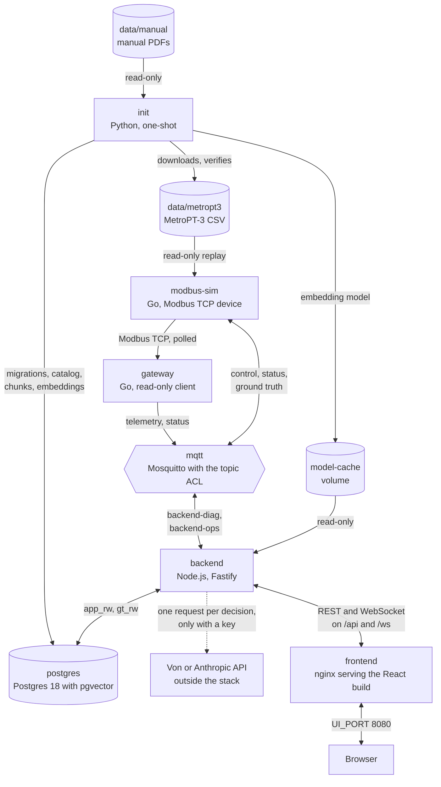
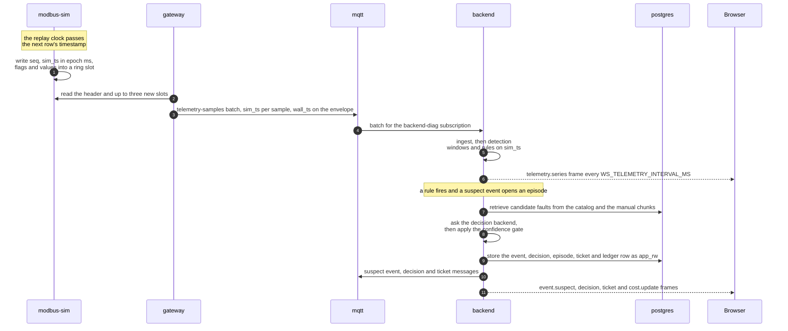
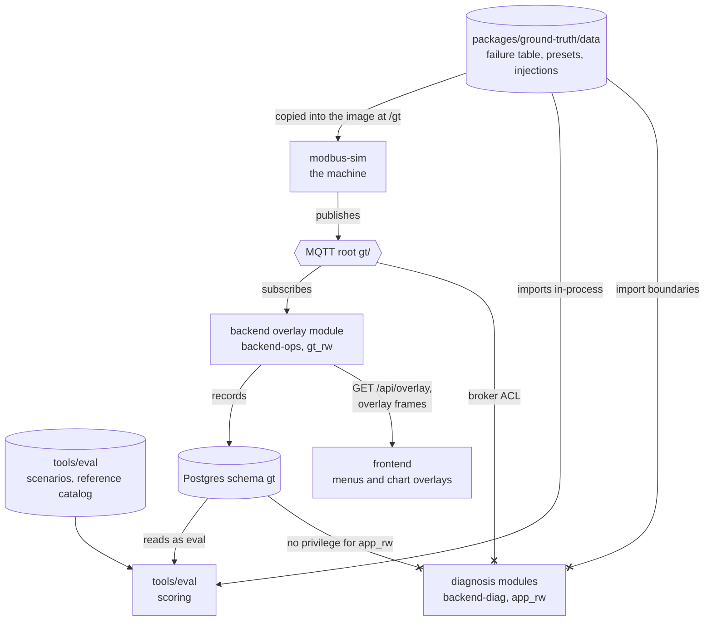

<!-- SPDX-FileCopyrightText: 2026 Meddle S.r.l. -->
<!-- SPDX-License-Identifier: CC-BY-4.0 -->

# Architecture

This guide is the map of the stack: which service owns what, how one sample travels from a row of the recording to a ticket in the browser, the contracts every service shares, where the data is stored, how ground truth is kept away from the diagnosis and which import directions the linters allow. Read it after the README's [How it works](../README.md#how-it-works) and before you change a service boundary, a message or a table. It stays at the level of the whole system; the exact routes, frames and topics are in [api.md](api.md), and each part has its own guide, linked where it comes up.

## The seven services

`compose.yaml` defines the stack as seven services in one Compose project, `fault-diagnosis-poc`. Every image the stack builds uses the repository root as its build context, so each Dockerfile can reach the workspace packages, `db/migrations` and `packages/contracts`; only `postgres` runs a stock image. Six services run for the life of the stack with a healthcheck and `restart: unless-stopped`; `init` runs once and exits.



| Service      | Built from                                                           | What it owns                                                                                                                                                                                                                                                                                                                   | Ports                                                                      |
| ------------ | -------------------------------------------------------------------- | ------------------------------------------------------------------------------------------------------------------------------------------------------------------------------------------------------------------------------------------------------------------------------------------------------------------------------ | -------------------------------------------------------------------------- |
| `postgres`   | Image `pgvector/pgvector:0.8.6-pg18-trixie`                          | The database: schemas `app` and `gt` in the `pgdata` volume, and the three login roles that `infra/postgres/initdb/00-roles.sh` creates on the first start                                                                                                                                                                     | 5432, published only by `compose.dev.yaml`                                 |
| `mqtt`       | `infra/mosquitto/Dockerfile` on `eclipse-mosquitto:2.0.22`           | The topic tree and its ACL; it renders the hashed password file from the `MQTT_*_PASSWORD` variables at every start and keeps no persistence                                                                                                                                                                                   | 1883, published as `MQTT_PORT`                                             |
| `init`       | `tools/init` (Python 3.13, `fdp-init`)                               | The one-shot preparation: waits for the database and the broker, applies the migrations, downloads and verifies MetroPT-3, fetches the embedding model, extracts the manual into the fault catalog and the chunk index (optionally structured by the LLM when `LLM_API_KEY` is set), writes a report to `reports/` and exits 0 | none                                                                       |
| `modbus-sim` | `services/modbus`, target `sim` (Go)                                 | The machine: replays the CSV at `REPLAY_SPEED`, adds the synthetic ambient temperature and any running fault injection, evaluates the CTRL-7 controller alarms, serves the register map over Modbus TCP, answers replay commands and publishes the ground truth under `gt/`                                                    | 5020 Modbus TCP, published as `MODBUS_PORT`; 8081 `/healthz` and `/status` |
| `gateway`    | `services/modbus`, target `gateway` (Go)                             | The edge connector: reads the simulator's registers, decodes them with the generated register map and publishes telemetry batches and its own status; it never writes to the device                                                                                                                                            | 8082 `/healthz`                                                            |
| `backend`    | `apps/backend` (Node.js 24, Fastify 5)                               | The diagnosis (ingest, detection, retrieval, the decision backend, the confidence gate, episodes, tickets, cost and heartbeats), the overlay module that alone reads ground truth, the REST API and the WebSocket                                                                                                              | 3000, published only by `compose.dev.yaml`                                 |
| `frontend`   | `apps/frontend` (React 19 and shadcn/ui, Vite build served by nginx) | The dashboard; nginx serves the static build and proxies `/api/` and `/ws` to `backend:3000`, so the browser talks to one origin                                                                                                                                                                                               | 8080, published as `UI_PORT`                                               |

The healthchecks are `pg_isready` for `postgres`, a subscription to `$SYS/broker/uptime` for `mqtt`, the `probe` subcommand of each Go binary, `GET /api/health` for `backend` and `GET /healthz`, answered by nginx itself, for `frontend`. The `depends_on` conditions give the start order: `init` waits until `postgres` and `mqtt` are healthy; `modbus-sim` and `backend` wait until `init` has exited successfully, because the simulator needs the CSV that init downloads and the backend refuses to start without a migrated database and the embedding model files; `gateway` waits for a healthy `modbus-sim`, and `frontend` for a healthy `backend`. `make up` returns once every service is healthy and fails when init fails; init's exit code, in `make logs`, names the failing step ([Troubleshooting](../README.md#troubleshooting)).

| Mount                                            | Used by                                   | Holds                                                                 |
| ------------------------------------------------ | ----------------------------------------- | --------------------------------------------------------------------- |
| `pgdata` (named volume) at `/var/lib/postgresql` | `postgres`                                | The database (Postgres 18 declares its volume there, not at `…/data`) |
| `model-cache` (named volume) at `/models`        | `init` read-write, `backend` read-only    | The embedding model files                                             |
| `./data/metropt3`                                | `init` read-write, `modbus-sim` read-only | The downloaded MetroPT-3 CSV                                          |
| `./data/fixtures`                                | `init` and `modbus-sim`, read-only        | The slices `make fixtures` cuts for the faster replay                 |
| `./data/manual`, `./data/byo-manual`             | `init`, read-only                         | The manual PDFs                                                       |
| `./data/SHA256SUMS`                              | `init`, read-only                         | The hashes the dataset and the slices are verified against            |
| `./reports`                                      | `init`, read-write                        | The ingest report                                                     |
| `./infra/postgres/initdb`                        | `postgres`, read-only                     | `00-roles.sh`                                                         |

Two override files change the topology. `compose.dev.yaml` (`make up-dev`) publishes 5432, 3000, 8081 and 8082 on fixed host ports. `compose.ci.yaml`, which `make smoke` and CI apply, adds an eighth service, `typesafe-mock`: the mock Von endpoint from `packages/contracts/mock`, answering with its `best-overlap` policy at confidence 0.9. It points the backend at that mock with `DECISION_BACKEND=von`, replays the fixture slice `/data/fixtures/metropt3/ci-slice.csv` with autoplay on, replaces the model-cache volume with a host directory CI can cache, and publishes Postgres on an ephemeral loopback port so `make eval-stack` can score a stack the smoke test left running.

Only two values are secrets, `TYPESAFE_API_KEY` and `LLM_API_KEY`. Compose hands them to `backend` (both) and `init` (`LLM_API_KEY`) and to no other service; [security.md](security.md) covers what they unlock and what leaves the stack.

## From a CSV row to a ticket on screen

This is the path of one sample with the defaults of `.env.example`. The README's [One decision, end to end](../README.md#one-decision-end-to-end) shows the same path from the decision's point of view.



1. **Replay.** `modbus-sim` streams `METROPT_CSV` from its read-only mount. Its clock advances at `REPLAY_SPEED` times real time (600 by default, 1 to 3600) while playing, and a row is emitted when the clock passes the row's timestamp. For each row the simulator computes the synthetic ambient temperature, applies any running fault injection, evaluates the CTRL-7 alarms and writes the sample into the next slot of a ring of 256 slots of holding registers: a sequence number, the row's timestamp in epoch milliseconds, the `discontinuity` and `missing` flags, the values and the alarm bits. The stack starts paused (`SIM_AUTOPLAY=false`) until someone presses Play. Details: [simulation.md](simulation.md).
2. **Gateway.** `gateway` reads the header block and up to three new slots per Modbus request (function code 3, unit 1), polls again at once while new samples keep coming and waits `POLL_INTERVAL_MS` (50 ms) when a poll finds none. It decodes each slot with the generated register map into SI numbers and booleans keyed by tag, expands the alarm bits into controller codes and publishes batches of up to 25 samples as `telemetry-samples` on `plant/cau-7/telemetry/samples` with QoS 1. Sequence gaps are counted as dropped samples in its retained status; it never interprets a value.
3. **Broker.** Mosquitto delivers the batch to every client the ACL lets read the topic: the backend's diagnosis client, the read-only `eval` credential and anonymous subscribers such as the README's `mosquitto_sub`.
4. **Ingest.** The backend's diagnosis client (credential `backend-diag`) validates each payload against the schema its topic declares and drops invalid payloads and samples it has already seen. Accepted samples go into an in-memory ring of 65,536 samples, into one-minute aggregates in `app.telemetry_agg_1m` and, when a controller alarm changes state, into `app.native_alarms`. Raw samples are never stored. The WebSocket hub decimates the accepted samples into one `telemetry.series` frame every `WS_TELEMETRY_INTERVAL_MS` (250 ms).
5. **Detection.** Detection computes windows, trends, the machine state and the load cycles in code; when a rule fires it raises a `suspect-event` that describes the symptom in level, trend and duration words, never as a raw series. Details: [detection.md](detection.md).
6. **Decision.** The pipeline opens an episode for the symptom, or re-decides an open one every `DECISION_INTERVAL_SIM_MIN` (30 simulated minutes). It retrieves at most six candidate faults from the catalog and the manual chunks, asks the decision backend (Von, the LLM backend or the rules-only baseline) which one explains the event, and passes the answer through the confidence gate: a named fault at confidence 0.85 or more opens a ticket, from 0.60 a ticket in review (from 0.65 for Von, which has its own pair); anything else is only logged. Details: [decision-backends.md](decision-backends.md).
7. **Sinks.** The runtime writes the event, the decision with its candidates, the episode, the ticket and the cost ledger row to schema `app` as `app_rw`; publishes the event, the decision and the ticket on `plant/cau-7/events/suspect`, `plant/cau-7/decisions` and `plant/cau-7/alerts/ticket`; and broadcasts the matching WebSocket frames, `event.suspect`, `decision`, `ticket` and `cost.update`.
8. **Screen.** nginx forwards the WebSocket to the browser. The dashboard's single WebSocket client routes each frame by type into its query cache, so the decision appears in the alert feed and the ticket in the tickets table without another request.

### Simulated time and wall time

Two clocks travel with every sample and are never mixed. Data time, `sim_ts`, is the recording's own clock; wall time, `wall_ts`, is the clock of the machine running the stack. Epoch milliseconds exist only inside the Modbus registers; every message carries ISO-8601 UTC instants with millisecond precision and a trailing `Z`.

| Stage             | Data time (`sim_ts`)                                                                                                                                                                                                                                                               | Wall time (`wall_ts`)                                                                                                                                                            |
| ----------------- | ---------------------------------------------------------------------------------------------------------------------------------------------------------------------------------------------------------------------------------------------------------------------------------- | -------------------------------------------------------------------------------------------------------------------------------------------------------------------------------- |
| CSV and simulator | The row's timestamp, read as UTC, goes into the slot as epoch milliseconds. The replay clock (an anchor instant, a speed and the wall clock) decides when a row is emitted                                                                                                         | Paces the replay                                                                                                                                                                 |
| Gateway           | Copied from the slot into each sample                                                                                                                                                                                                                                              | Stamped on the batch envelope                                                                                                                                                    |
| Backend           | Windows, trends and rule hold times; episode timing (`DECISION_INTERVAL_SIM_MIN`, `EPISODE_CLEAR_SIM_MIN`); the `sim_ts` of events and decisions and the ticket's `opened_sim_ts` and `updated_sim_ts`; the aggregate minutes and their retention (`TELEMETRY_RETENTION_SIM_DAYS`) | Heartbeats (`HEARTBEAT_TELEMETRY_TIMEOUT_S`, `HEARTBEAT_DECISION_TIMEOUT_S`); the ledger's `wall_ts`; the aggregate flush every 5 s and the retention job every 10 minutes; logs |
| WebSocket and UI  | Chart points and the `sim_ts` inside every message                                                                                                                                                                                                                                 | The frame envelope and the `heartbeat` frame every 10 s                                                                                                                          |

Data time is not continuous. The simulator collapses every gap of more than 60 s in the recording, and a jump, a reset or the wrap at the end of the data moves its clock too; the first sample after any of them carries `flags.discontinuity`. Detection resets its windows on that flag, the pipeline aborts the open episodes and resolves their open and review tickets at the instant of the last sample before the jump, and the hub starts a new `telemetry.series` frame marked `discontinuity: true`, so the charts break their lines there. That flag is the only way a jump reaches detection; the marker that names the preset travels on the ground-truth root, which the diagnosis cannot read.

## Contracts

`packages/contracts` (`@fdp/contracts`) is the single definition of everything the services exchange. It imports nothing from the workspace, and its files, not the generated TypeScript, are what the three languages agree on.

| Path                          | What it holds                                                                                                                                                                                                                                 |
| ----------------------------- | --------------------------------------------------------------------------------------------------------------------------------------------------------------------------------------------------------------------------------------------- |
| `schemas/v1/*.schema.json`    | The source of truth: 38 hand-written JSON Schemas (draft 2020-12, `$id` `urn:fdp:schema:<name>:v1`) for the shared definitions in `common`, every MQTT payload, the WebSocket frames, the REST bodies, the catalog and the ground-truth files |
| `schemas/meta/`               | Schemas for the three configuration files below, under the `urn:fdp:meta:` namespace so they never appear in a message                                                                                                                        |
| `topics.json`                 | The 14 topic templates with their payload schema, QoS, retain flag and publisher, and the broker ACL per credential                                                                                                                           |
| `embedding.json`              | The embedding model pin: `sentence-transformers/all-MiniLM-L6-v2` at a fixed revision, file hashes, mean pooling, 256 tokens, 384 dimensions                                                                                                  |
| `generated/register-map.json` | The canonical Modbus register map                                                                                                                                                                                                             |
| `src/generated/`              | Generated TypeScript: the embedded schemas, the types, the Ajv validators, the topic builders, the register map and the embedding pin                                                                                                         |
| `src/`                        | The public API (`src/index.ts`): `validate`, `assertValid`, `validateMqtt`, the topic builders and the time helpers                                                                                                                           |
| `fixtures/<schema>/`          | At least one valid and one invalid example per schema, read by the TypeScript, Go and Python tests alike; `fixtures/embeddings/` holds the reference vectors                                                                                  |
| `mock/`                       | Local stand-ins for the Von and Anthropic APIs, used by the tests, the evaluation and `compose.ci.yaml`                                                                                                                                       |

Every MQTT message and WebSocket frame extends one envelope, defined in `common.schema.json`: `schema` (the `$id`, which carries the major version), `unit_id` (`cau-7`) and `wall_ts`; messages about data add `sim_ts`. Top-level objects stay open, so a consumer ignores fields it does not know, while nested objects are closed. The REST bodies of their own, the `api-*` schemas, carry no envelope.

`topics.json` is the one description of the topic tree: two roots, `plant/` for operations and `gt/` for ground truth, the unit id in the second level, QoS 1 everywhere, and retained messages only for the three status topics, the ground-truth catalog and the list of running injections. Its `acl` block is rendered into `infra/mosquitto/acl` by `make mosquitto-acl`. The full topic table and the ACL are in [api.md](api.md#mqtt-topics).

The register map is generated from the manual's own registries, `manual/spec/signals.yaml`, `alarms.yaml` and `settings.yaml`, so the manual, the simulator and the gateway cannot disagree about tag order, scale or unit. The device exposes holding registers only (function code 3, unit 1, big-endian words, high word first): a 32-register header at address 0 with the head sequence, the current data time, the replay state and speed, the ring geometry and the map version, and a ring of 256 slots of 32 registers at address 1024. A slot holds the sequence number, the data time, the two flags, the seven analog tags as scaled `int16` values, the eight digital tags, the synthetic `ambient_temperature` and the alarm bits. Details: [simulation.md](simulation.md).

### Generation and drift

`make generate` runs `pnpm --filter @fdp/contracts generate`. `scripts/generate.ts` turns the schemas, `topics.json` and `embedding.json` into `src/generated/` (types through `json-schema-to-typescript`, Ajv 8 validators compiled once when the module loads, typed topic builders), and `scripts/generate-regmap.ts` writes `generated/register-map.json`, `src/generated/register-map.ts` and the Go table `services/modbus/internal/regmap/register_map_gen.go`. The outputs are committed and never edited by hand. CI's `contract-drift` job regenerates them and fails on any difference (`packages/contracts/scripts/check-drift.sh`), then renders the broker ACL and fails when `infra/mosquitto/acl` changes.

| Language                                   | How it uses the contracts                                                                                                                                                                                                                                                                                                                                                           |
| ------------------------------------------ | ----------------------------------------------------------------------------------------------------------------------------------------------------------------------------------------------------------------------------------------------------------------------------------------------------------------------------------------------------------------------------------- |
| TypeScript (backend, frontend, evaluation) | Imports the types, validators, topic builders and register map from `@fdp/contracts`. The backend validates every inbound MQTT payload, every request body with a contract and every message it publishes; its REST answers are checked before they leave and its WebSocket frames by sampling ([api.md](api.md)). The frontend imports types only and validates nothing at runtime |
| Go (simulator, gateway)                    | Hand-written structs in `services/modbus/internal/contracts`; for every schema they model, the tests round-trip each valid fixture and reject each invalid one against the same schema files with `santhosh-tekuri/jsonschema/v6`. The register table is generated                                                                                                                  |
| Python (init)                              | Validates the extracted catalog against `catalog-entry` and `catalog` with `jsonschema`; the init image copies `schemas/` and `embedding.json` to `/contracts`                                                                                                                                                                                                                      |

### Versioning

The package follows semver (`1.0.0`), and every schema carries its major in its `$id`, which every message repeats in its `schema` field; only v1 exists. A minor change is additive and keeps the `$id`: a new optional field, a new schema file, a new enum value where consumers have a default branch, a looser constraint. A change that makes a committed valid fixture invalid is breaking by definition and goes into a new `schemas/v2/`, shipped beside v1 during the migration ([`packages/contracts/VERSIONING.md`](../packages/contracts/VERSIONING.md)). The register map versions itself separately, in its JSON and in header registers 12 and 13, and the gateway refuses a device whose major differs. A change to `embedding.json` invalidates the stored vectors, so init re-ingests the manual when the pin no longer matches the one recorded with the last ingest.

## Persistence

One Postgres database (`POSTGRES_DB`, default `fdp`) with the `vector` and `pg_trgm` extensions holds two schemas that nothing joins in the database: `app` for everything the diagnosis reads and writes, `gt` for the recorded ground truth.

| Schema                 | Tables and views                                                                                                                                                                                                                                                            | Written by                   |
| ---------------------- | --------------------------------------------------------------------------------------------------------------------------------------------------------------------------------------------------------------------------------------------------------------------------- | ---------------------------- |
| `app`, manual          | `manual_documents`, `ingest_runs`, `chunks` (text, a generated `tsvector` and a `vector(384)` embedding with an HNSW cosine index)                                                                                                                                          | init                         |
| `app`, catalog         | `catalog_sections`, `catalog_conditions`, `catalog_causes`, `catalog_condition_causes`, `catalog_checks`, `catalog_remedies`, `catalog_signal_moves`, `catalog_alarms`, `catalog_signals`, and the view `v_catalog_entries`, one row per cause in the `catalog-entry` shape | init                         |
| `app`, telemetry       | `telemetry_agg_1m` (per tag and data-time minute), `native_alarms`, `heartbeats`                                                                                                                                                                                            | backend                      |
| `app`, diagnosis       | `suspect_events`, `episodes`, `decisions`, `decision_candidates`, `tickets`, `ticket_closures`                                                                                                                                                                              | backend                      |
| `app`, cost and health | `cost_ledger` (with a generated `cost_usd`), the view `v_cost_totals`, `system_alerts`                                                                                                                                                                                      | backend                      |
| `gt`                   | `injections`, `markers`, `catalog_snapshot`, and the view `v_injection_windows`                                                                                                                                                                                             | the backend's overlay module |

| Role                          | Used by                                                    | Privileges after the migrations                 |
| ----------------------------- | ---------------------------------------------------------- | ----------------------------------------------- |
| `fdp_admin` (`POSTGRES_USER`) | init: migrations and ingestion                             | Owns both schemas and every object in them      |
| `app_rw`                      | The backend's diagnosis pool, `apps/backend/src/db/app.ts` | DML on `app`; nothing on `gt`, not even `USAGE` |
| `gt_rw`                       | The backend's overlay pool, `apps/backend/src/db/gt.ts`    | DML on `gt`; nothing on `app`                   |
| `eval`                        | `tools/eval`, including `make eval-stack`                  | DML on `app`; `USAGE` and `SELECT` only on `gt` |

`infra/postgres/initdb/00-roles.sh` creates the three login roles the first time the `pgdata` volume is empty, with the passwords `PG_APP_PASSWORD`, `PG_GT_PASSWORD` and `PG_EVAL_PASSWORD` (non-secret PoC defaults `app_rw`, `gt_rw` and `eval`); changing one afterwards needs `make reset-db`. Migrations never create roles, they only grant and revoke privileges, and `0001` refuses to run when a role is missing.

### Migrations

The schema is defined only by the numbered plain-SQL files in `db/migrations`. They apply forward-only in ascending order, each in its own transaction, and each is recorded with its SHA-256 in `public.schema_migrations`. The runner refuses an applied file whose hash changed, a file numbered below the highest applied version and an applied version whose file is gone, so a correction is always a new file and a clean start is `make reset` or `make reset-db`.

| File                             | Owner     | Adds                                                                                                             |
| -------------------------------- | --------- | ---------------------------------------------------------------------------------------------------------------- |
| `0001_extensions_schemas.sql`    | contracts | The extensions, schemas `app` and `gt`, grants, default privileges and the role guard                            |
| `0002_ground_truth.sql`          | contracts | `gt.injections`, `gt.markers`, `gt.catalog_snapshot`, `gt.v_injection_windows` and explicit revokes for `app_rw` |
| `0003_manual_chunks.sql`         | contracts | `manual_documents`, `ingest_runs`, `chunks`                                                                      |
| `0004_catalog.sql`               | contracts | The `catalog_*` tables and `v_catalog_entries`                                                                   |
| `0005_telemetry.sql`             | contracts | `telemetry_agg_1m`, `native_alarms`, `heartbeats` and the prune function                                         |
| `0006_diagnosis.sql`             | contracts | `suspect_events`, `episodes`, `decisions`, `decision_candidates`, `tickets`, `ticket_closures`                   |
| `0007_cost_system.sql`           | contracts | `cost_ledger`, `v_cost_totals`, `system_alerts`                                                                  |
| `0008_chunk_links.sql`           | init      | `fault_id`, `alarm_code` and `table_kind` on `app.chunks`                                                        |
| `0009_backend_episode_links.sql` | backend   | A column comment and a partial index for merged episodes                                                         |

The runner exists twice with the same semantics. `tools/init/src/fdp_init/migrate.py` is the production runner: init runs it as `POSTGRES_USER` as soon as the database and the broker answer. `packages/db-migrate` (`@fdp/db-migrate`) is its TypeScript twin, used by the backend and evaluation tests, whose `startPostgres()` helper starts a throw-away pgvector container with the roles and every migration, and it also has a command line. Both runners pass the shared conformance fixture in `db/conformance/`. The backend refuses to start against a database below migration 9 and exits with "run init first". How to add a migration: [`db/README.md`](../db/README.md).

Raw telemetry is never stored. The backend keeps the newest 65,536 samples in memory and writes one-minute aggregates; a job every 10 wall minutes deletes aggregates older than `TELEMETRY_RETENTION_SIM_DAYS` (365) simulated days.

## Ground-truth isolation

Ground rule 3 ([CONTRIBUTING.md](../CONTRIBUTING.md#ground-rules)): fault-injection labels and the MetroPT-3 failure table live in their own module, and diagnosis code may not import or read them; only evaluation code and a read-only UI overlay endpoint may. Ground truth is anything that says which fault is present and when, and the separation is enforced mechanically rather than by convention, so that a slip fails a check instead of quietly flattering the evaluation.

It lives in exactly four places:

1. `packages/ground-truth/data/`: `metropt3-failures.json` (the resolved failure table), `presets.json` (the jump menu) and `injections.json` (the injection types), each validated against its `gt-*` schema.
2. The MQTT root `gt/`: the simulator publishes its catalog (retained), every injection start and stop, the list of running injections (retained) and a marker for every jump, reset and loop there, never under `plant/`.
3. The Postgres schema `gt`, written only by the backend's overlay module as `gt_rw`.
4. The evaluation's scenario files, `tools/eval/scenarios/*.json` with the expected labels, and its reference catalog, `tools/eval/fixtures/catalog.json`.

It reaches its permitted readers without touching diagnosis code:

- The `modbus-sim` image copies `packages/ground-truth/data/` to `/gt`, the simulator's default `GT_DIR`. The simulator is the machine, so it knows what it injects; the Compose files never name the path, and the gateway image carries one binary and nothing else.
- The backend's overlay module (`apps/backend/src/overlay/`) subscribes to the four `gt/` topics with the `backend-ops` credential, records the catalog, the injection events and the markers in schema `gt` through `gt_rw`, keeps the latest catalog and list of running injections in memory, and serves the read-only `GET /api/overlay/*` routes and the `overlay.*` WebSocket frames. The UI builds its Jump to and Inject fault menus and its chart overlays from them. The same module turns `POST /api/sim/*` into commands on `plant/cau-7/control/cmd`.
- `tools/eval` imports `@fdp/ground-truth` in-process and, when it scores a running stack, reads schema `gt` as `eval`. Details: [evaluation.md](evaluation.md).
- The diagnosis sees telemetry only. Telemetry carries no injected flag, and a jump reaches it only as the `discontinuity` flag, which detection needs anyway to reset its windows.

In the diagram, arrows are the permitted paths and the lines that end in a cross are the ones the mechanisms below block.



| Layer                          | Mechanism                                                                                                                                                                                                                                                                                                                                                                                                                                                             | Checked by                                                                                                                                               |
| ------------------------------ | --------------------------------------------------------------------------------------------------------------------------------------------------------------------------------------------------------------------------------------------------------------------------------------------------------------------------------------------------------------------------------------------------------------------------------------------------------------------- | -------------------------------------------------------------------------------------------------------------------------------------------------------- |
| Package graph, TypeScript      | Only `tools/eval` declares `@fdp/ground-truth`, and pnpm's strict `node_modules` makes any other import unresolvable. Dependency-cruiser rules `no-gt-in-backend`, `no-gt-in-frontend`, `no-gt-reachable-from-diagnosis` (transitive) and `no-overlay-in-diagnosis`; inside the backend `no-gt-anywhere`, `gt-pool-only-in-overlay-repo`, `overlay-read-routes-stay-read-only` and `overlay-config-stays-in-the-overlay`. ESLint `no-restricted-imports` mirrors them | `make boundaries`; `packages/ground-truth/test/no-consumers.test.ts`; `apps/backend/test/arch/imports.test.ts`                                           |
| Credentials inside the backend | `PG_GT_PASSWORD` and `MQTT_BACKEND_OPS_PASSWORD` are read only by `overlay/config.ts`; the diagnosis `Env` type cannot carry them, and ESLint forbids `process.env` outside the two configuration modules                                                                                                                                                                                                                                                             | `apps/backend/test/arch/imports.test.ts`                                                                                                                 |
| Broker                         | The ACL gives `backend-diag` and anonymous clients no read on `gt/` or on the control topics. A denied subscription is granted and then never delivered, so the tests assert non-delivery against a positive control. Both backend clients refuse to connect without their credential                                                                                                                                                                                 | `apps/backend/test/integration/mqtt-acl.test.ts` and `db-roles.test.ts`, `scripts/ops/mosquitto.integration.test.ts`, the isolation step of `make smoke` |
| Database                       | `app_rw` has no privilege on schema `gt`, not even `USAGE`; `gt_rw` has none on `app`; no foreign key crosses the two schemas                                                                                                                                                                                                                                                                                                                                         | `packages/db-migrate/test/integration/isolation.test.ts`, `apps/backend/test/integration/db-roles.test.ts`                                               |
| Data                           | `telemetry-samples` and `status-sim` name no injection field, checked on the schema text; every payload the simulator publishes under `plant/` is searched for ground-truth words while an injection runs                                                                                                                                                                                                                                                             | `packages/contracts/test/schemas.test.ts`, `services/modbus/internal/sim/noleak_test.go`                                                                 |
| Go                             | The gateway never reaches `internal/sim`, `internal/injection`, `internal/replay`, `internal/ctrl7` or `internal/machine`, and its sources never name ground-truth vocabulary                                                                                                                                                                                                                                                                                         | `services/modbus/internal/arch/` through `go test ./internal/arch/...`; golangci-lint `depguard`                                                         |
| Python                         | init imports no other tool package, and its sources never name ground truth                                                                                                                                                                                                                                                                                                                                                                                           | `uv run lint-imports`; `tools/init/tests/unit/test_no_ground_truth_refs.py`                                                                              |
| Sources, manifests, Compose    | `fdp-checks gt-paths` scans `apps/backend/src` outside `overlay/`, `apps/frontend/src` and every app's Dockerfiles and `package.json` for the package name, `ground-truth`, quoted `gt/` topic literals and `gt.` table names; `compose-check` refuses a ground-truth path in the Compose files                                                                                                                                                                       | `make gt-paths`, `make compose-check`                                                                                                                    |

`make lint` runs `gt-paths`, `compose-check` and `boundaries`, and CI runs `make lint`; the unit tests in the table run in `make test` and the container-backed ones in `make test-integration`. The README's [Ground truth stays out of the diagnosis](../README.md#ground-truth-stays-out-of-the-diagnosis) has the short version.

## Import boundaries

The boundary rules allow a fixed list of edges between the workspace's packages, and anything they do not list is forbidden. The table shows what each package may import from the rest of the workspace.

| From                                                                      | May import                                                                                                                                 |
| ------------------------------------------------------------------------- | ------------------------------------------------------------------------------------------------------------------------------------------ |
| `packages/contracts`                                                      | Nothing                                                                                                                                    |
| `packages/db-migrate`                                                     | Nothing                                                                                                                                    |
| `packages/ground-truth`                                                   | `@fdp/contracts`                                                                                                                           |
| `apps/backend`                                                            | `@fdp/contracts`; `@fdp/db-migrate` from its tests only                                                                                    |
| `apps/frontend`                                                           | `@fdp/contracts`, types only                                                                                                               |
| `tools/eval`                                                              | `@fdp/contracts`, `@fdp/ground-truth`, `@fdp/db-migrate` and the backend's `./pipeline` entry, the only path `@fdp/backend` exports        |
| Go `cmd/gateway`, `internal/gateway`                                      | Never `internal/sim`, `internal/injection`, `internal/replay`, `internal/ctrl7` or `internal/machine`, directly or through another package |
| Go `cmd/modbus-sim`                                                       | Never `internal/gateway`                                                                                                                   |
| Python `fdp_init`, `fdp_manual_build`, `fdp_repo_checks`, `fdp_blocklist` | None of the others                                                                                                                         |

Inside `apps/backend/src` the diagnosis modules (`ingest`, `detection`, `retrieval`, `decision`, `gate`, `episodes`, `tickets`, `cost`, `heartbeat`, `pipeline`) never import `overlay/`, `db/gt.ts` or `mqtt/ops-client.ts`, and never import the `mqtt` or `pg` driver: only the adapters under `mqtt/`, `db/` and `persistence/` and the process entry do. `pipeline/` imports no host at all (nothing from `db`, `mqtt`, `api`, `ws`, `overlay` or `runtime`), which is what lets `tools/eval` run the same pipeline in-process.

| Language         | Gate                                                                                                                                                                                                                                                                                                                                                                                                                                   | Mirror for the editor                                                                    | Proof that the rules fire                                                                                                                                                                                                                 |
| ---------------- | -------------------------------------------------------------------------------------------------------------------------------------------------------------------------------------------------------------------------------------------------------------------------------------------------------------------------------------------------------------------------------------------------------------------------------------- | ---------------------------------------------------------------------------------------- | ----------------------------------------------------------------------------------------------------------------------------------------------------------------------------------------------------------------------------------------- |
| TypeScript       | Dependency-cruiser. The root `.dependency-cruiser.cjs` holds one named rule per edge, `not-to-unresolvable` and a transitive `reachable` rule, and runs over `apps`, `packages` and `tools` (`pnpm run lint:boundaries`). `apps/backend/.dependency-cruiser.cjs` holds the rules between the backend's own modules and runs with `pnpm --filter @fdp/backend lint`. pnpm's strict `node_modules` refuses undeclared workspace packages | ESLint `no-restricted-imports` in `eslint.config.js` and `apps/backend/eslint.config.js` | Fixture workspaces in `scripts/boundaries/fixtures/` (`clean`, `violations`) tested by `scripts/boundaries/*.test.ts`; `apps/backend/test/arch/imports.test.ts` adds a forbidden import to a copy of `src` and expects the cruise to fail |
| Go               | `services/modbus/internal/arch/imports_test.go`, over the transitive closure `go list -deps` reports                                                                                                                                                                                                                                                                                                                                   | golangci-lint `depguard` in `services/modbus/.golangci.yml`                              | `TestForbiddenDetectsViolation` in the same package                                                                                                                                                                                       |
| Python           | import-linter contracts in the root `pyproject.toml`: `independence` of the four tool packages and `forbidden` imports from `fdp_init`                                                                                                                                                                                                                                                                                                 | —                                                                                        | —                                                                                                                                                                                                                                         |
| Across languages | `fdp-checks gt-paths`, described above                                                                                                                                                                                                                                                                                                                                                                                                 | —                                                                                        | —                                                                                                                                                                                                                                         |

```bash
make boundaries   # dependency-cruiser over apps, packages and tools; go test ./internal/arch/...; uv run lint-imports
make gt-paths     # uv run fdp-checks gt-paths
make lint         # every linter, both of the above included
```

The toolchain, the other linters and the gate levels are in [development.md](development.md).

## Further reading

- [`packages/contracts/README.md`](../packages/contracts/README.md) and [`packages/contracts/VERSIONING.md`](../packages/contracts/VERSIONING.md): the message schemas, the MQTT topics, the register map generator and the versioning rules.
- [`db/README.md`](../db/README.md): the roles, the forward-only migrations and the `app` and `gt` schemas.
- [`packages/ground-truth/README.md`](../packages/ground-truth/README.md): the ground-truth package and its files.
- [`services/modbus/README.md`](../services/modbus/README.md) and [simulation.md](simulation.md): the simulator, the gateway and the register model.
- [`apps/backend/README.md`](../apps/backend/README.md) and [`apps/frontend/README.md`](../apps/frontend/README.md): the backend's modules and the UI.
- Code: [`compose.yaml`](../compose.yaml), [`compose.dev.yaml`](../compose.dev.yaml), [`compose.ci.yaml`](../compose.ci.yaml), [`packages/contracts/README.md`](../packages/contracts/README.md), [`packages/contracts/VERSIONING.md`](../packages/contracts/VERSIONING.md), [`db/README.md`](../db/README.md), [`infra/mosquitto/README.md`](../infra/mosquitto/README.md), [`.dependency-cruiser.cjs`](../.dependency-cruiser.cjs), [`apps/backend/.dependency-cruiser.cjs`](../apps/backend/.dependency-cruiser.cjs), [`pyproject.toml`](../pyproject.toml), [`services/modbus/.golangci.yml`](../services/modbus/.golangci.yml).
- Related guides: [api.md](api.md) for the routes, frames, topics and schemas, [simulation.md](simulation.md) for the device and the gateway, [detection.md](detection.md) and [decision-backends.md](decision-backends.md) for the two halves of the diagnosis, [manual.md](manual.md) for what init stores, [dataset.md](dataset.md) for the recording and the ground-truth files, [evaluation.md](evaluation.md) for the harness that hosts the same pipeline, [security.md](security.md) for what the stack exposes, and [development.md](development.md) for the toolchain and the gate levels.
