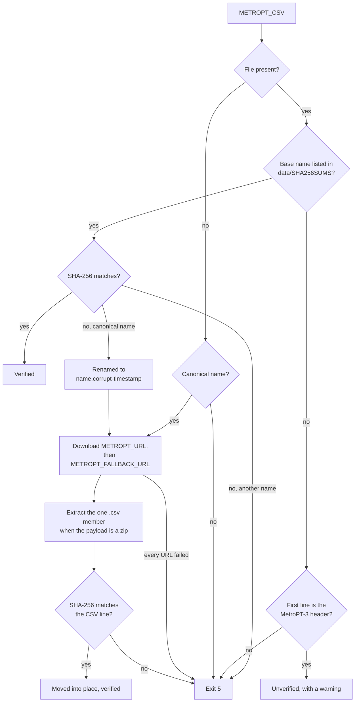
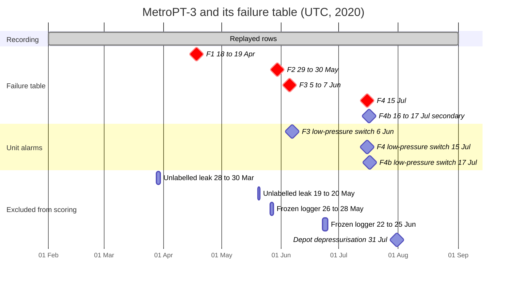

<!-- SPDX-FileCopyrightText: 2026 Meddle S.r.l. -->
<!-- SPDX-License-Identifier: CC-BY-4.0 -->

# Dataset

The telemetry the stack replays is MetroPT-3, a public recording of a real compressor. This guide covers where the recording comes from and what its columns mean, how init downloads and verifies it, the corrected failure table the evaluation scores against, the nine replay presets, and the slices that tests and CI cut from it. Read it before you change a ground-truth file or add a scenario or a slice, or when you want to know why a replay shows what it shows. How the replay itself works is in [simulation.md](simulation.md).

## MetroPT-3

### Where it comes from

MetroPT-3 is telemetry from the air production unit of a metro train, published by Davari, Veloso, Ribeiro and Gama in 2021 as dataset 791 of the UCI Machine Learning Repository (<https://archive.ics.uci.edu/dataset/791/metropt+3+dataset>). It covers seven months of 2020 and comes with a failure table of four air leaks. The sources behind this guide:

- the UCI page, <https://archive.ics.uci.edu/dataset/791/metropt+3+dataset>: the variable list, the licence, the split that uses the first month for training, and the failure table with its two `#1` rows and its `30Apr` maintenance note;
- the description inside the UCI zip, `Data Description_Metro.pdf`, which repeats the page's text;
- the accompanying paper the UCI page cites, Davari et al., IEEE DSAA 2021, <https://doi.org/10.1109/DSAA53316.2021.9564181>, which carries a schematic of the unit;
- a master's thesis on predictive maintenance for the air production unit of metro vehicles, Barros, M. (2020), Faculty of Economics, University of Porto, supervised by J. Gama and R. Ribeiro, open access in the university's repository under handle [10216/141232](https://hdl.handle.net/10216/141232): its table of the 2020 maintenance reports gives the report times behind the failure table, and it notes that the oil-level sensor of this unit is wired in reverse and that the unit has no flowmeter;
- Veloso et al. (2022), _The MetroPT dataset for predictive maintenance_, Scientific Data 9, 764 (arXiv [2207.05466](https://arxiv.org/abs/2207.05466)), which describes the sensors of a later recording of the same unit design.

The statistics behind most figures in this guide are computed from the CSV by `scripts/data/metropt3_stats.py` into [`data/metropt3-first-month-stats.json`](../data/metropt3-first-month-stats.json).

In the stack the recording plays CAU-7, the fictional unit of the bundled manual: every recorded signal of the register map is read from one MetroPT-3 column, and the simulator adds a synthetic ambient temperature ([simulation.md](simulation.md#the-register-map-from-signalsyaml)).

### The 15 variables

"Published" is the dataset's own description; the last column is what the file actually shows.

| #   | Column            | Kind    | Unit | Published meaning                                                  | Tag in the stack               | What the data shows                                                                 |
| --- | ----------------- | ------- | ---- | ------------------------------------------------------------------ | ------------------------------ | ----------------------------------------------------------------------------------- |
| 1   | `TP2`             | analog  | bar  | Pressure on the compressor (discharge)                             | `discharge_pressure`           | About 0 whenever the unit is not loaded: the cleanest sign that it is delivering    |
| 2   | `TP3`             | analog  | bar  | Pressure at the pneumatic panel (line pressure)                    | `line_pressure`                | A saw-tooth between cut-in near 8.05 bar and cut-out near 10.03 bar                 |
| 3   | `H1`              | analog  | bar  | Pressure drop when the cyclonic separator discharges               | `separator_discharge_pressure` | Equals `TP3` when not loaded and is about 0 while loaded: an inverse load indicator |
| 4   | `DV_pressure`     | analog  | bar  | Pressure drop when the dryer towers discharge                      | `dryer_purge_pressure`         | About 0 in every state; 0.6 to 2.5 bar, sustained, during the dryer-side leaks      |
| 5   | `Reservoirs`      | analog  | bar  | Pressure downstream of the reservoirs                              | `reservoir_pressure`           | Identical to `TP3` within 0.014 bar                                                 |
| 6   | `Oil_temperature` | analog  | °C   | Compressor oil temperature                                         | `oil_temperature`              | Median 56.6 °C in February; 73 to 89 °C in leak episodes                            |
| 7   | `Motor_current`   | analog  | A    | Current of one phase of the motor                                  | `motor_current`                | About 0 A off, 3.8 A unloaded, 6.0 A loaded, not the 7 A of the description         |
| 8   | `COMP`            | digital |      | Intake valve, 1 when there is no air intake                        | `intake_closed`                | 0 exactly while loaded                                                              |
| 9   | `DV_eletric`      | digital |      | Outlet valve command, 1 under load (the misspelling is the file's) | `load_valve`                   | With `COMP` it defines the loaded state                                             |
| 10  | `Towers`          | digital |      | Which dryer tower is drying                                        | `dryer_tower`                  | A 0 pulse of about 60 s after every cut-in                                          |
| 11  | `MPG`             | digital |      | Starts the compressor under load below 8.2 bar                     | `regulator_contact`            | Equal to `COMP` in 99.6 % of rows                                                   |
| 12  | `LPS`             | digital |      | Low-pressure switch, active below 7 bar                            | `low_pressure_switch`          | Fires far more often at depot depressurisations than during leaks                   |
| 13  | `Pressure_switch` | digital |      | Detects the discharge in the drying towers                         | `purge_switch`                 | 1 nearly always, with short 0 blips                                                 |
| 14  | `Oil_level`       | digital |      | Active when the oil is below the expected level                    | `oil_level_ok`                 | Wired in reverse on this unit, so 1 is normal; 0 in long blocks in August           |
| 15  | `Caudal_impulses` | digital |      | Pulse counter of the air volume sent to the reservoirs             | `flow_pulse`                   | No usable flow information at this sampling rate                                    |

The stack derives the machine state from three of them: loaded when `COMP` is 0 and `DV_eletric` is 1, otherwise unloaded when the motor current is 1 A or more and off below that. Over the whole file the unit is off in 54.5 % of the rows, unloaded in 29.9 % and loaded in 15.6 %.

The first month, 1 to 28 February (214,850 rows, none of them frozen), is the reference period of the manual's normal bands and of the detection baselines. Summer weeks cycle faster and run warmer than February, which is why detection also keeps rolling baselines ([detection.md](detection.md)).

### Sampling, size and clock

| Fact     | Value                                                                                                                                                                                 |
| -------- | ------------------------------------------------------------------------------------------------------------------------------------------------------------------------------------- |
| File     | `MetroPT3(AirCompressor).csv`, 218,300,507 bytes, inside the UCI zip `metropt+3+dataset.zip` (218,381,995 bytes)                                                                      |
| Rows     | 1,516,948, with no nulls and strictly increasing timestamps                                                                                                                           |
| Span     | 2020-02-01 00:00:00 to 2020-09-01 03:59:50, 213.2 days                                                                                                                                |
| Sampling | 10 s between rows in 88.2 % of the steps, 9 to 13 s in nearly all the others; the unnamed first column counts 0, 10, 20 and so on, because the CSV keeps one row in ten of a 1 Hz log |
| Gaps     | 331 steps longer than 60 s, 909.5 h in total (17.8 % of the span)                                                                                                                     |
| Missing  | No row at all on 29 February and 26 April 2020                                                                                                                                        |
| Clock    | No time zone in the file; read as UTC                                                                                                                                                 |

The first line of the file, which init checks and every slice keeps:

```text
,timestamp,TP2,TP3,H1,DV_pressure,Reservoirs,Oil_temperature,Motor_current,COMP,DV_eletric,Towers,MPG,LPS,Pressure_switch,Oil_level,Caudal_impulses
```

The timestamps carry no zone. On 29 March 2020, when summer time began in Europe, the file has a full 01:00 hour and a full 02:00 hour, so its clock did not skip an hour, and the local report times of the thesis fit a UTC clock. The stack therefore reads every timestamp as UTC, and the failure table records `"clock": "utc-assumed"`.

### Licence and credit

MetroPT-3 is licensed CC BY 4.0. Credit it as: Davari, N., Veloso, B., Ribeiro, R., & Gama, J. (2021). _MetroPT-3 Dataset_. UCI Machine Learning Repository. <https://doi.org/10.24432/C5VW3R>.

The repository commits no row of it. The files derived from it that it does commit, `data/SHA256SUMS`, `data/fixtures/metropt3-slices.json`, the failure table and the presets, carry the same licence and the authors' credit through `REUSE.toml` and `data/SHA256SUMS.license`. A slice cut from the file is an excerpt (modified: rows selected) and stays on your machine.

## Download and verification

### What init does

Every time the stack starts, the one-shot `init` service makes sure that `METROPT_CSV` holds the dataset before the simulator starts, and on the first start that means downloading it; the simulator waits for init to complete. The step is `tools/init/src/fdp_init/dataset/metropt.py` ([tools/init/README.md](../tools/init/README.md)) and follows this order:



- **Only the canonical name is downloaded.** That name is `MetroPT3(AirCompressor).csv`; any other path, such as a slice, must already exist. A slice listed in `data/SHA256SUMS` whose hash does not match is a repository error, not something to download again.
- **A hand-placed file is verified like a download.** Put the CSV in `data/metropt3/` and init checks its hash on the next start.
- **The hash is cached.** Hashing 218 MB on every start is avoided by a sidecar, `<file>.sha256.json`, trusted while the file's size and modification time match. `fdp-init dataset --rehash` ignores it; `docker compose run --rm init dataset --rehash` runs that step alone.
- **Downloads survive interruptions.** They stream to a `.part` file, resume with an HTTP `Range` request, retry network errors, timeouts and HTTP 408, 429 and 5xx answers with up to five attempts per URL, and must finish within `INIT_DOWNLOAD_TIMEOUT_S` (3600 s). A payload that starts with the zip magic bytes, or whose URL ends in `.zip`, is unpacked: the one `.csv` member is extracted and the description PDF in the archive is left behind.
- **A failure stops the stack.** init exits with code 5, and `make up` fails with it; `make logs` shows which URL or which hash was at fault.

In fixture mode (`METROPT_CSV=/data/fixtures/metropt3/ci-slice.csv`) the slice must exist on the host first: without `make fixtures`, init exits 5. Compose mounts `./data/metropt3` into init read-write, and `./data/fixtures` and `./data/SHA256SUMS` read-only.

| Variable                  | Default                                                               | Meaning                                                    |
| ------------------------- | --------------------------------------------------------------------- | ---------------------------------------------------------- |
| `METROPT_URL`             | the UCI zip                                                           | First download URL; the planned project mirror replaces it |
| `METROPT_FALLBACK_URL`    | `https://archive.ics.uci.edu/static/public/791/metropt+3+dataset.zip` | Tried when `METROPT_URL` fails, if it is a different URL   |
| `METROPT_CSV`             | `/data/metropt3/MetroPT3(AirCompressor).csv`                          | Container path init verifies and the simulator replays     |
| `METROPT_CSV_HOST`        | `data/metropt3/MetroPT3(AirCompressor).csv`                           | Host path `make fixtures` cuts from                        |
| `INIT_DOWNLOAD_TIMEOUT_S` | `3600`                                                                | Budget of the whole download                               |

### The hashes in `data/SHA256SUMS`

`data/SHA256SUMS` is in `sha256sum` format and lists the CSV, the UCI zip and every slice `make fixtures` cuts. init looks a file up by its base name, so a slice is verified exactly as the full download is. CI keys its dataset cache on this file, and the same CSV hash appears as `source.sha256` in `data/fixtures/metropt3-slices.json` and as `source.csv_sha256` in the failure table. The file as committed:

```text
db30ccb4ea402e3c8bf2c99db06e288d4f2a772f6928f9dbe26a920d69793e24  MetroPT3(AirCompressor).csv
aab991a970e58210de853bb8078ce0e63abb4d9412fdc5c79792dae3d8e1721a  metropt+3+dataset.zip
897222b0aaee03895281c34338ce8f6e935573583b168b3f17c89386ebfd6b22  ci-slice.csv
1cbeed591960aeffc986f01ac7cc50f3a9409f2befb929f6f5462a0cfd919d59  sim-day-2020-02-01.csv
68a91f51a98f796f961e8439b58eb09a3d69610d46d265efc76a4509022dec0b  parity-feb01.csv
5b3c5e5b94a87e0eae6483eafdddb30667bdd0685eb45b3452a290c03ed29fdd  baseline-feb03.csv
0cb0b31cb313b5de4a1dc44fd95681736d788f485d4b05a981a5d2243fb71f00  f1-apr18.csv
7f67b9418e83e1e7ba0900f4b0ae4eac761c7e490d49ecbeebd5e8ebfe679d68  f2-may30.csv
932c3e3eacad6fae6b57089cc2a3436a38b2c3f9c624eca1f7e0cdf5af4244c5  f3-jun05.csv
d95138af19ca91a81062aabd086ac92cb8ded5ad58fa1eb73ca274b1e2c37949  f4-jul15.csv
53ab07161d3c49d74faad8eabd0f8a06dfac5d6fe8fc86ac34248196ad73f01d  f4b-jul17.csv
a40fa9fb07f5a7642dd906df673f30917f3c82dd86af4949f209a91f0c61b3a2  summer-jul05.csv
db0cf7119de9dae5458a10ec541704768628213233243fac2f620d440b66a883  depot-jul31.csv
4430fa39f22217614179a7969823b95af39cdb8424934aa87e93208e90938c2e  depot-apr30.csv
beb1fdd8c66aa2f827c66d4be684a7a3b87d2b214eb2ce0b10b919368c623c66  frozen-jun22.csv
28a2a0ddd37b00d25293b6263b61756a87fa269dcaa9f4f1ed50a897805c2089  unlabelled-may19.csv
2418b10e1629d82b73fa70ce43856c20dc99159a8747b8a69964c44cd463fc01  august-aug10.csv
42b3c5e79ad7643057fd244646642c4b1832a7b1785e6e8965407971bf00e1fe  sim-gate.csv
8f22e6a5dd98f52388a1cbc9d3127bf9a08e9fb9ba715551ad0a114e1ac55805  heldout-mar17.csv
8e3ce7abe23161a1509a8a6c3c0cd0dd72b99e6f921bcdf060a81b4c42899085  heldout-mar22.csv
207888d1a09d0b67aa4b96f489ea8a680c520a1f8412f544dae06bd78c7bdfe1  heldout-apr05.csv
f2df6e427e65fc729d87a252279b1bae2dcf7b1ed26251de6f201ef8ec797593  heldout-jun26.csv
e68d3fe258a540a4c5e5fa57d6a976dfaee27f119aa64105cfd5356a7bb0f8df  heldout-jun29.csv
49e62ccbc97ff4e235ce1242ea5e245be4a551ef2d4adf349ec6aa03b9f74561  heldout-aug01.csv
```

### `make fetch-dataset`

Outside Compose, `make fetch-dataset` runs `scripts/data/fetch-metropt3.sh`, the host-side downloader that CI also runs when its dataset cache misses. It downloads `METROPT_URL` when that variable is set in your shell, and the UCI zip otherwise; the script does not read `.env`. It identifies what arrived by its hash (the zip line or the CSV line of `data/SHA256SUMS`), extracts the CSV from the zip, verifies it and leaves it in `data/metropt3/`. A download that matches neither line is deleted and the script exits 1. It needs `curl`, `unzip`, `awk` and either `sha256sum` or `shasum`; `--force` downloads again even when a verified copy is already there.

```bash
make fetch-dataset                         # UCI zip, or $METROPT_URL when set
scripts/data/fetch-metropt3.sh --force     # download again over a verified copy
```

### The planned project mirror

Ground rule 5 ([CONTRIBUTING.md](../CONTRIBUTING.md#ground-rules)) lets MetroPT-3 reach a machine by download only: init fetches it from `METROPT_URL`, falling back to UCI. A project mirror is planned as a GitHub Release asset of this repository, holding the original file unchanged beside a notice crediting the authors, the DOI and the licence; publishing it means setting `METROPT_URL` to the asset and adding its hash to `data/SHA256SUMS`. Until then `METROPT_URL` defaults to the UCI zip and the fallback equals it. The weekly `quickstart-download` CI job, which runs the quick start without the dataset cache, is what keeps the download path tested.

## The failure table

The published table lists four air leaks, with a row number used twice, a whole-day placeholder as one end time and a maintenance date that falls a month before its failure. The project resolves it with the data as arbiter, and `packages/ground-truth/data/metropt3-failures.json` (schema `gt-failure-table`) holds the result. The file is generated from `data/metropt3-first-month-stats.json` by `pnpm --filter @fdp/ground-truth build-failure-table`, and `pnpm --filter @fdp/ground-truth check-failure-table` fails when the committed bytes drift from it.

Two qualifications apply to every figure derived from the table. It is **provisional** until it has been independently reviewed, and a changed window means re-running the affected evaluations. And because the detection rules were designed after looking at these four failures, every score against them is **in-sample**. Only the evaluation, the simulator (which forwards the table on `gt/cau-7/catalog`) and the backend's read-only overlay may read it; the diagnosis never does ([architecture.md](architecture.md#ground-truth-isolation)).



### How the windows were resolved

1. **The duplicated row number.** The published rows are chronological, so the second `#1` is F2; the thesis confirms a leak report that night. `uci_nr` keeps the published number for traceability.
2. **"Maintenance on 30Apr at 12:00"** is read as 30 May 12:00, a month typo: the leak signature is in the data on the night of 29 to 30 May and absent a month earlier, and every other maintenance note follows its failure by 6 to 26 hours. The data shows no intervention at that hour, so the record says `maintenance_verified: false`. F4's maintenance at 00:00 on 16 July is the only verified one: the pressure decay returns to normal at exactly that hour.
3. **F1 ends at 02:00 on 19 April**, not at the published 23:59 on 18 April, a whole-day placeholder: the unit stays stuck loaded until 01:56 and the repair venting follows. The logger was frozen from 09:20 on 17 April to 00:18 on 18 April, so the true onset is unknown (`onset_known: false`) and every lead time for F1 is a lower bound.
4. **F3 keeps its published end**, 14:30 on 7 June, when logging stopped and the train was withdrawn; the unit was still stuck loaded when logging resumed. 7 June 14:30 to 8 June 16:00 is an excluded repair window, never a negative.
5. **F4 keeps its published acute window** and records `precursor_from`, 21:28 on 14 July, when its fast pressure decay becomes measurable; the evaluation credits a correct ticket from that instant on.
6. **F4b**, a recurrence the thesis reports and the published table does not carry, is a secondary positive with `in_headline: false`: it never counts as a false positive and never counts towards the four air leaks.
7. **Excluded windows** are neither positive nor negative: the unlabelled episodes, the frozen-logger blocks, the repairs, the depot depressurisations and F4b.
8. **The clock is UTC**, and every window is stored as an ISO-8601 UTC instant with milliseconds.

### The five failures

Windows are half-open: the start belongs to the window and the end does not. All times are UTC, 2020.

| Id  | Scoring window              | Data onset → recovery                                   | `fault_id`, accepted ids                       | Signature | First native alarm | Headline |
| --- | --------------------------- | ------------------------------------------------------- | ---------------------------------------------- | --------- | ------------------ | -------- |
| F1  | 18 Apr 00:00 → 19 Apr 02:00 | 18 Apr 00:23:59, true onset unknown → 19 Apr 01:55:36   | `dryer_purge_leak`, also `downstream_air_leak` | A         | none               | yes      |
| F2  | 29 May 23:30 → 30 May 06:00 | 29 May 23:14:56 → 30 May 05:56:46                       | `dryer_purge_leak`, also `downstream_air_leak` | A         | none               | yes      |
| F3  | 5 Jun 10:00 → 7 Jun 14:30   | 5 Jun 09:48:30 → 8 Jun 13:54:18                         | `dryer_purge_leak`, also `downstream_air_leak` | A         | 6 Jun 19:42:19     | yes      |
| F4  | 15 Jul 14:30 → 19:00        | 15 Jul 14:25:23 → 18:52:54, precursor from 14 Jul 21:28 | `downstream_air_leak`                          | B         | 15 Jul 17:20:11    | yes      |
| F4b | 16 Jul 20:00 → 17 Jul 06:00 | 17 Jul 00:54 → 05:35                                    | `downstream_air_leak`                          | B         | 17 Jul 00:56:00    | no       |

The published rows and the maintenance records behind them:

| Id  | Published (UCI)                                 | Report, thesis (local time) | Maintenance (UTC)          |
| --- | ----------------------------------------------- | --------------------------- | -------------------------- |
| F1  | `#1`, 18 Apr 00:00 → 18 Apr 23:59               | 18 Apr 07:05                | none recorded              |
| F2  | `#1`, read as `#2`, 29 May 23:30 → 30 May 06:00 | 30 May 01:10                | 30 May 12:00, not verified |
| F3  | `#3`, 5 Jun 10:00 → 7 Jun 14:30                 | 5 Jun 18:00                 | 8 Jun 16:00, not verified  |
| F4  | `#4`, 15 Jul 14:30 → 19:00                      | 15 Jul 18:25                | 16 Jul 00:00, verified     |
| F4b | not in the table                                | 17 Jul 05:46                | none recorded              |

The `fault_id` values are ids of the manual's fault catalog. `accepted_fault_ids` lists the primary one first, and a ticket that names any of them inside the window counts as a true positive ([evaluation.md](evaluation.md)).

### Two leak signatures

The four headline leaks show two different signatures in the data, and the manual's catalog has a cause for each, `dryer_purge_leak` and `downstream_air_leak`:

- **Signature A, a leak on the dryer and drain side (F1 to F3, and the unlabelled episodes).** The compressor stays loaded and never reaches its cut-out pressure: the line pressure plateaus between 7.5 and 9.5 bar, the dryer purge pressure sits at 0.6 to 2.5 bar instead of about 0, the motor current sags to 5.5 to 5.7 A and the oil climbs to 73 to 78 °C within one or two hours. The line pressure stays above 7.5 bar, so the low-pressure switch does not fire and the unit raises no alarm of its own.
- **Signature B, a leak downstream (F4 and F4b).** The dryer purge pressure stays normal. Loaded runs get longer and cycles closer together, the pressure decays much faster while the unit is not loaded, and at last the compressor cannot keep up: it stays loaded while the line pressure falls through 7 bar, the low-pressure switch fires and the oil reaches 89 °C.

### Native alarms

`native_alarm_first` is the start of the first low-pressure switch episode of 30 seconds or more inside the scoring window: the alarm the unit's own switch gave. F1 and F2 have none, because a signature-A leak keeps the line pressure above 7 bar. F3's is a vent, 34 hours after the onset. F4's comes at 17:20:11, about three hours after the unit got stuck loaded, and F4b's at 00:56. Because the switch misses signature A, the evaluation measures lead time against the first controller alarm its port of CTRL-7 raises in the window and reports this low-pressure figure beside it ([evaluation.md](evaluation.md#lead-time-against-the-units-own-alarms)).

### Unlabelled episodes

Twelve stuck-loaded runs with raised purge pressure look exactly like F1 to F3 but carry no label; all twelve have `fault_id_hint: dryer_purge_leak`. They are excluded windows, so a detection inside one is neither rewarded nor counted as a false positive; the evaluation reports those detections separately.

| Start → end (UTC, 2020)           | Hours | Note                                                        |
| --------------------------------- | ----- | ----------------------------------------------------------- |
| 6 Mar 21:42:25 → 22:59:53         | 1.29  | Short; never reported                                       |
| 11 Mar 05:15:20 → 06:10:11        | 0.92  | Short; never reported                                       |
| 12 Mar 00:16:06 → 11:49:50        | 11.56 | The thesis records a strange-noise report at 08:25 that day |
| 26 Mar 04:00:30 → 04:52:52        | 0.88  | Short; never reported                                       |
| 27 Mar 07:12:10 → 11:38:11        | 4.44  | The thesis lists a report that day without any detail       |
| 28 Mar 07:22:24 → 30 Mar 07:41:06 | 48.31 | A vent from 23:05 to 23:28 on 28 March; never reported      |
| 12 Apr 11:50:31 → 23:36:00        | 11.76 | Six days before F1                                          |
| 13 May 13:44:04 → 14 May 04:36:21 | 14.87 | Sixteen days before F2                                      |
| 19 May 10:05:50 → 10:51:45        | 0.77  | Short; never reported                                       |
| 19 May 22:22:17 → 20 May 23:02:33 | 24.67 | Ten days before F2; the _Unlabelled leak_ preset            |
| 1 Jun 14:49:54 → 15:39:08         | 0.82  | Short; never reported                                       |
| 3 Jun 10:06:00 → 11:08:49         | 1.05  | Short; never reported                                       |

### Excluded windows

`excluded_windows` holds 30 windows, each with a reason. A window of the failure table takes precedence over an excluded one when a label is looked up, so a frozen block that reaches into a failure does not unlabel its first minutes.

| Reason                   | Windows | Which                                                                                                                                    |
| ------------------------ | ------- | ---------------------------------------------------------------------------------------------------------------------------------------- |
| `unlabelled_positive`    | 12      | The unlabelled episodes above                                                                                                            |
| `frozen_logger`          | 9       | The frozen-logger blocks below                                                                                                           |
| `depot_depressurisation` | 5       | 19 May 02:00:15 → 06:02:59, 2 Jun 19:23:21 → 20:52:53, 8 Jun 11:48:04 → 12:28:12, 14 Jul 02:16:26 → 02:52:16, 31 Jul 01:35:33 → 06:04:16 |
| `repair`                 | 3       | 19 Apr 02:00 → 03:30, 7 Jun 14:30 → 8 Jun 16:00, 15 Jul 19:00 → 16 Jul 01:00                                                             |
| `secondary_positive`     | 1       | F4b, 16 Jul 20:00 → 17 Jul 06:00                                                                                                         |

A depot depressurisation is the system losing its pressure with the motor off, typically at night in the depot or after a logging gap: the low-pressure switch stays on for 30 minutes or more without any leak. These are the canonical cases where the right answer is "none of these", and the evaluation reports them separately ([evaluation.md](evaluation.md)).

### Frozen-logger blocks

Nine times the logger kept writing rows while the analog values stood still: `TP2`, `TP3`, `H1`, the oil temperature and the motor current identical for 60 rows or more, with the digital signals flickering. Together they hold 50,855 rows and 170.6 hours. The replay plays them as recorded, and detection has to recognise them ([detection.md](detection.md)).

| Start → end (UTC, 2020)           | Rows   | Hours | Note                       |
| --------------------------------- | ------ | ----- | -------------------------- |
| 11 Mar 18:29:54 → 18:59:14        | 147    | 0.49  |                            |
| 13 Apr 18:29:20 → 19:27:16        | 290    | 0.97  |                            |
| 17 Apr 09:20:43 → 18 Apr 00:18:07 | 4,469  | 14.96 | Just before F1             |
| 20 Apr 04:49:17 → 21 Apr 01:16:52 | 6,109  | 20.46 |                            |
| 26 May 09:19:36 → 28 May 03:16:28 | 12,448 | 41.95 |                            |
| 12 Jun 02:01:56 → 17:06:06        | 4,501  | 15.07 |                            |
| 22 Jun 15:06:21 → 25 Jun 05:08:35 | 18,514 | 62.04 | The _Frozen logger_ preset |
| 21 Jul 13:45:12 → 22:03:16        | 2,480  | 8.3   |                            |
| 22 Jul 06:43:44 → 13:04:24        | 1,897  | 6.35  |                            |

### Gaps

331 steps between rows are longer than 60 s, 909.5 hours in all: 230 of them exceed 10 minutes, 160 one hour and 5 a day. Most start between 00:00 and 01:00 or between 19:00 and 20:00, when the train is in the depot. The longest runs from 01:10:51 on 25 April to 01:12:49 on 27 April, 48.0 hours. The replay collapses every gap and flags the first row after it with `discontinuity` ([simulation.md](simulation.md#gaps-and-the-discontinuity-flag)).

Gaps are not excluded windows. `gaps_over_1h` copies the 160 gaps longer than one hour so that scenarios can be planned without the CSV; it is reference data. The evaluation finds the gaps in the replayed stream itself and leaves them, with a 30-minute tail, out of the negative time ([evaluation.md](evaluation.md)).

## The nine presets

`packages/ground-truth/data/presets.json` (schema `gt-presets`) defines the **Jump to** menu; the labels are the menu text. A jump lands on the first row at or after `sim_ts` minus `lead_in_min`, so most presets start with some ordinary operation before the event. How a jump works is in [simulation.md](simulation.md#jumping-to-a-preset). All times are UTC, 2020.

| Label                                | `preset_id`             | Kind       | Time         | Lead-in | Failure | Note                                                                                                                                                      |
| ------------------------------------ | ----------------------- | ---------- | ------------ | ------- | ------- | --------------------------------------------------------------------------------------------------------------------------------------------------------- |
| Normal operation – 1 Feb 2020        | `baseline_feb`          | baseline   | 1 Feb 00:00  | 0 min   |         | The start of the recording, where the README's **Play** begins                                                                                            |
| Air leak – 18 Apr 2020               | `f1_air_leak_apr18`     | failure    | 18 Apr 00:00 | 120 min | F1      | Starts at 22:00 on 17 April, inside the frozen-logger block, which is replayed as recorded; the six-minute gap after the block ends at 00:18 is collapsed |
| Air leak – 30 May 2020               | `f2_air_leak_may30`     | failure    | 29 May 23:30 | 330 min | F2      | Starts at 18:00 on 29 May                                                                                                                                 |
| Air leak – 5 Jun 2020                | `f3_air_leak_jun05`     | failure    | 5 Jun 10:00  | 240 min | F3      | The README tour preset; starts at 06:00                                                                                                                   |
| Air leak precursor – 14 Jul 2020     | `f4_precursor_jul14`    | precursor  | 14 Jul 21:30 | 0 min   | F4      | Starts at 21:30; the fast decay is visible at least 17 hours before the acute phase                                                                       |
| Air leak – 15 Jul 2020               | `f4_air_leak_jul15`     | failure    | 15 Jul 14:30 | 90 min  | F4      | The acute phase; starts at 13:00                                                                                                                          |
| Unlabelled leak – 19 May 2020        | `unlabelled_leak_may19` | diagnostic | 19 May 22:22 | 142 min |         | Starts at 20:00; an episode that looks like a labelled failure and is not scored                                                                          |
| Frozen logger – 22 Jun 2020          | `frozen_logger_jun22`   | diagnostic | 22 Jun 15:06 | 66 min  |         | Starts at 14:00; exercises the frozen guard                                                                                                               |
| Depot depressurisation – 31 Jul 2020 | `depot_lps_jul31`       | diagnostic | 31 Jul 01:35 | 30 min  |         | Starts at 01:05; the controller alarm fires without a leak: the abstention case                                                                           |

The kinds are `baseline` for normal operation, `failure` for a labelled window, `precursor` for the run-up to one and `diagnostic` for cases that test the diagnosis without being scored as failures. With the CI slice as the replay source only `baseline_feb`, `f3_air_leak_jun05` and `depot_lps_jul31` land where they should ([The CI slice](#the-ci-slice)).

## Fixture slices

### Why the repository holds no MetroPT-3 rows

Ground rule 5 ([CONTRIBUTING.md](../CONTRIBUTING.md#ground-rules)) lets MetroPT-3 reach a machine by download only, and rule 6 keeps large files out of Git. So no MetroPT-3 row is committed anywhere in the repository, not even a small excerpt. What is committed is the definition of every slice the tests read, in `data/fixtures/metropt3-slices.json`: its time segments in the dataset clock, its row count and the SHA-256 of the cut CSV. `make fixtures` turns the definitions back into files under the gitignored `data/fixtures/metropt3/`.

### Cutting the slices

```bash
make fetch-dataset   # once: download MetroPT-3 into data/metropt3/ and verify it
make fixtures        # cut every slice into data/fixtures/metropt3/ and verify the result
```

`make fixtures` runs `scripts/data/cut-metropt-slices.py` over `METROPT_CSV_HOST`, by default `data/metropt3/MetroPT3(AirCompressor).csv`; a worktree points it at the main checkout instead of copying the file. The cutter reads the source once and checks its size and SHA-256 against the definitions. It copies the header line and every field verbatim, the unnamed index column included, so the simulator reads a slice exactly as it reads the full file, and it keeps each row whose timestamp falls in a segment (`from ≤ timestamp < to`). Each slice is written to a `.part` file first and compared with the recorded row count and hash. `--only <name>` cuts one slice, and `--report <path>` re-measures the definitions after a segment changes.

When the source is missing, `make fixtures` prints `fixtures: MetroPT-3 source not found at <path>; skipping (set METROPT_CSV_HOST or run make fetch-dataset)` and exits 0, so a checkout that needs no dataset is not held up; with `FDP_REQUIRE_DATASET=1` the same case fails. Tests follow the same rule: a test that reads a slice skips when it is absent and fails under `FDP_REQUIRE_DATASET=1`, and the tests that must run offline use synthetic waveforms instead, such as the simulator's `services/modbus/testdata/synthetic-tiny.csv`. In CI, the `setup-dataset` action restores `data/metropt3/` from a cache keyed on `data/SHA256SUMS`, downloads it on a miss, sets `FDP_REQUIRE_DATASET=1` and runs `make fixtures`.

Two variables are easy to confuse. `METROPT_CSV_HOST` is the host path `make fixtures` cuts from. `METROPT_CSV` is the container path init verifies and the simulator replays.

### The CI slice

`ci-slice` is the replay source of CI and of the faster local replay ([Faster replay](../README.md#faster-replay) in the README). It joins three segments of the recording, 20 hours and 5,882 rows in all:

| Segment (UTC, 2020)  | Rows  | What it holds                                               |
| -------------------- | ----- | ----------------------------------------------------------- |
| 1 Feb 00:00 → 06:00  | 2,180 | Normal operation, where **Play** starts                     |
| 5 Jun 06:00 → 14:00  | 2,906 | The F3 air leak with its four-hour lead-in: the README tour |
| 31 Jul 01:00 → 07:00 | 796   | A depot depressurisation: the abstention case               |

Set `METROPT_CSV=/data/fixtures/metropt3/ci-slice.csv` in `.env` to use it; `compose.ci.yaml` does the same for CI, and `compose.yaml` already mounts `./data/fixtures` into init and the simulator. The joins between segments are ordinary source gaps, which the simulator collapses with a discontinuity, so no code path is specific to CI. The simulator's index of the slice reports three gaps: the two joins and a real gap of 3.8 hours inside the depot segment, from 02:09:04 to 05:57:50 on 31 July.

Only three presets land where they should: `baseline_feb`, `f3_air_leak_jun05` and `depot_lps_jul31`. Every other preset seeks to the first row at or after its target and so lands at the start of the next segment; the smoke test and the end-to-end tour use the three that fit.

### Every slice

`data/fixtures/metropt3-slices.json` (schema `urn:fdp:fixture:metropt3-slices:v1`) defines twenty-two slices; the hashes are in [`data/SHA256SUMS`](#the-hashes-in-datasha256sums).

| Slice                | Segments (UTC, 2020)                                                                                                     | Rows   | Purpose                                                   |
| -------------------- | ------------------------------------------------------------------------------------------------------------------------ | ------ | --------------------------------------------------------- |
| `ci-slice`           | 1 Feb 00:00 → 06:00, 5 Jun 06:00 → 14:00, 31 Jul 01:00 → 07:00                                                           | 5,882  | The CI and faster-replay source                           |
| `sim-day-2020-02-01` | 1 Feb 00:00 → 2 Feb 00:00                                                                                                | 7,144  | One full normal day for the simulator                     |
| `parity-feb01`       | 1 Feb 00:00 → 02:00                                                                                                      | 727    | The short window the evaluation's parity checks replay    |
| `baseline-feb03`     | 3 Feb 00:00 → 4 Feb 00:00                                                                                                | 8,716  | A first-month day: the detection negatives                |
| `f1-apr18`           | 17 Apr 20:00 → 19 Apr 04:00                                                                                              | 11,148 | F1 with its lead-in and the frozen block before it        |
| `f2-may30`           | 29 May 18:00 → 30 May 12:00                                                                                              | 6,438  | F2                                                        |
| `f3-jun05`           | 5 Jun 04:00 → 6 Jun 04:00                                                                                                | 8,716  | F3, the README tour                                       |
| `f4-jul15`           | 14 Jul 06:00 → 16 Jul 02:00                                                                                              | 10,771 | F4 with its 17-hour precursor                             |
| `f4b-jul17`          | 16 Jul 18:00 → 17 Jul 08:00                                                                                              | 3,706  | The unpublished recurrence F4b                            |
| `summer-jul05`       | 5 Jul 00:00 → 6 Jul 00:00                                                                                                | 8,716  | A normal summer day: the seasonal-drift negative          |
| `depot-jul31`        | 31 Jul 00:00 → 08:00                                                                                                     | 1,309  | A depot depressurisation: the abstention case             |
| `depot-apr30`        | 30 Apr 23:00 → 1 May 13:00                                                                                               | 59     | A second depressurisation, sparsely logged                |
| `frozen-jun22`       | 22 Jun 12:00 → 23 Jun 00:00                                                                                              | 3,786  | The frozen-logger guard                                   |
| `unlabelled-may19`   | 19 May 20:00 → 21 May 00:00                                                                                              | 8,915  | An unlabelled leak: neither positive nor false positive   |
| `august-aug10`       | 10 Aug 00:00 → 11 Aug 00:00                                                                                              | 8,716  | The August stretch with `Oil_level` at 0                  |
| `sim-gate`           | 3 Feb 00:00 → 06:00, 17 Apr 22:00 → 18 Apr 06:00, 29 May 18:00 → 30 May 03:00, 5 Jun 06:00 → 12:00, 15 Jul 13:00 → 19:00 | 12,514 | One file that visits every scenario the stack gate drives |
| `heldout-mar17`      | 17 Mar 00:00 → 18 Mar 00:00                                                                                              | 8,551  | Held-out positive: injected `intake_valve_sticking`       |
| `heldout-mar22`      | 22 Mar 00:00 → 23 Mar 00:00                                                                                              | 8,717  | Held-out positive: injected `motor_overload`              |
| `heldout-apr05`      | 5 Apr 00:00 → 6 Apr 00:00                                                                                                | 8,716  | Held-out negative, a normal day                           |
| `heldout-jun26`      | 26 Jun 00:00 → 27 Jun 00:00                                                                                              | 8,678  | Held-out positive: injected `air_leak_downstream`         |
| `heldout-jun29`      | 29 Jun 00:00 → 30 Jun 00:00                                                                                              | 8,677  | Held-out positive: injected `oil_cooler_fouling`          |
| `heldout-aug01`      | 1 Aug 00:00 → 2 Aug 00:00                                                                                                | 8,684  | Held-out negative, a normal day                           |

The six `heldout-` slices belong to the sealed held-out set of the evaluation ([evaluation.md](evaluation.md#the-held-out-set)); their days were drawn blind, and nothing but that set's one run replays them.

The page a human reads first is [`data/fixtures/README.md`](../data/fixtures/README.md).

## Further reading

- [`data/fixtures/README.md`](../data/fixtures/README.md): the slice definitions and how they are cut.
- [`packages/ground-truth/README.md`](../packages/ground-truth/README.md): the label helpers and the commands of the ground-truth package.
- [`tools/init/README.md`](../tools/init/README.md): the init service, its dataset step and its exit codes.
- Code and data: `tools/init/src/fdp_init/dataset/metropt.py` and `tools/init/src/fdp_init/util/fetch.py`; `scripts/data/fetch-metropt3.sh`, `scripts/data/cut-metropt-slices.py` and `scripts/data/metropt3_stats.py`; `packages/ground-truth/data/` and `packages/ground-truth/scripts/build-failure-table.ts`; `data/SHA256SUMS`, `data/metropt3-first-month-stats.json` and `data/fixtures/metropt3-slices.json`; `.github/actions/setup-dataset/action.yml`.
- Related guides: [simulation.md](simulation.md) for the replay, the jumps and the injections, [detection.md](detection.md) for the first-month baselines and the guards against gaps and frozen blocks, [evaluation.md](evaluation.md) for how the failure table is scored, [manual.md](manual.md) for the CAU-7 signals the columns map to, [architecture.md](architecture.md#ground-truth-isolation) and [security.md](security.md) for ground-truth isolation, and [development.md](development.md) for the toolchain.
