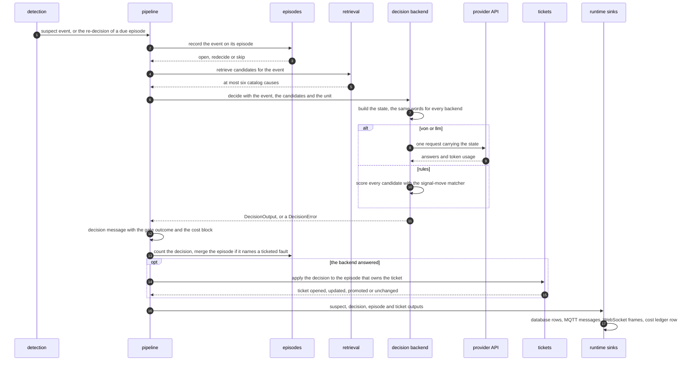
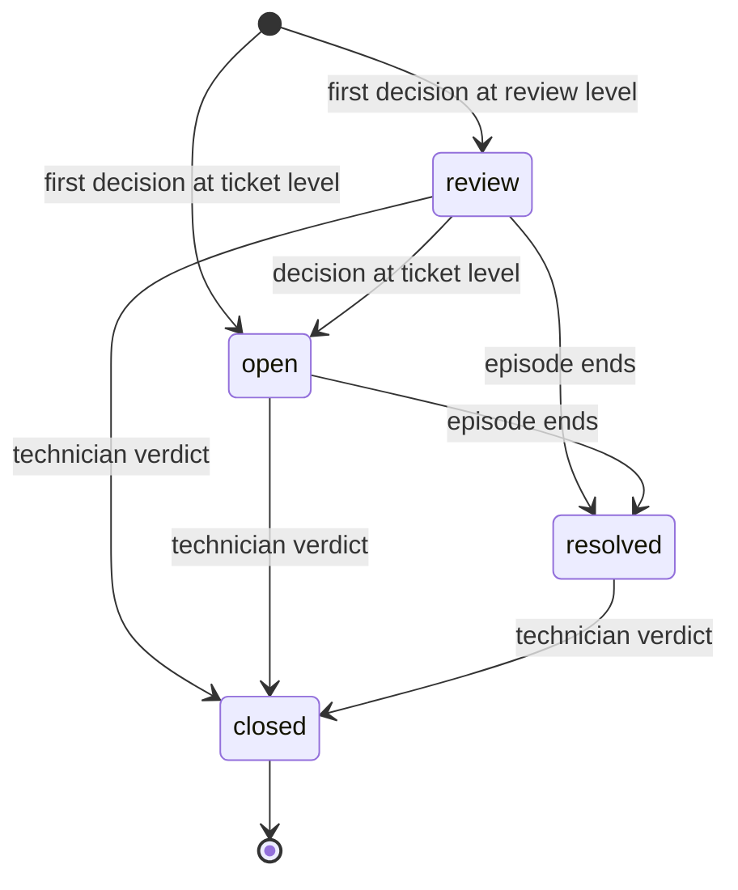

<!-- SPDX-FileCopyrightText: 2026 Meddle S.r.l. -->
<!-- SPDX-License-Identifier: CC-BY-4.0 -->

# Decision backends

This guide follows a suspect event from the moment the backend asks "which fault is this?" to the ticket a technician closes. It covers the interface every decision backend implements, the state they all read, how Von, the LLM backend and the rules-only baseline answer, and what the confidence gate, the episodes, the tickets and the cost ledger do with the answer. Read it before you change a threshold, compare backends or add one, and whenever you want to know why a suspect event did or did not open a ticket. The [README](../README.md#decision-backends) has the one-table summary. How suspect events are raised is in [detection.md](detection.md), how the candidate faults are retrieved from the manual in [manual.md](manual.md), and the routes, frames and topics in [api.md](api.md).

The code lives in `apps/backend/src/`:

| Module                | What it does                                                                     |
| --------------------- | -------------------------------------------------------------------------------- |
| `decision/types.ts`   | The `DecisionBackend` interface, the `DecisionOutput` shape and `DecisionError`  |
| `decision/state.ts`   | Builds the state every backend reads                                             |
| `decision/select.ts`  | Builds the backend that `DECISION_BACKEND` names                                 |
| `decision/von/`       | The Von questions, the request and the answer parser                             |
| `decision/llm/`       | The provider port, the Anthropic provider and the answer schema                  |
| `decision/rules/`     | The rules-only baseline                                                          |
| `decision/message.ts` | Turns an answer or a failure into the `decision` contract message, gate included |
| `gate/index.ts`       | The confidence gate                                                              |
| `episodes/`           | The episode state machine and its in-memory store                                |
| `tickets/`            | The ticket lifecycle and what a ticket says                                      |
| `cost/`               | Prices, the cost arithmetic and the ledger                                       |

## The interface and the decision shape

Every backend implements one interface. Condensed from `apps/backend/src/decision/types.ts`:

```ts
interface DecisionBackend {
  readonly name: "von" | "llm" | "rules";
  readonly model: string; // the model id its answers carry; rules-v1 for the rules backend
  decide(input: DecisionInput, options?: { signal?: AbortSignal }): Promise<DecisionOutput>;
}

interface DecisionInput {
  readonly event: SuspectEvent; // the suspect-event contract message
  readonly candidates: readonly Candidate[]; // catalog entries retrieval offered, at most six, best first
  readonly unit_id: string;
}
```

A backend is a function of its input. It returns what it saw, what it answered and what it cost, always in the same `DecisionOutput`, so the gate, the episodes, the tickets, the cost ledger, the UI and the evaluation never branch on which backend answered.

| Field                      | What it holds                                                                                                                                                                          |
| -------------------------- | -------------------------------------------------------------------------------------------------------------------------------------------------------------------------------------- |
| `backend`, `model`         | Which backend answered, and the model id the answer came from                                                                                                                          |
| `choice`                   | A candidate `fault_id`, or `none_of_these`                                                                                                                                             |
| `probabilities`            | Mass over the candidate ids plus `none_of_these`, summing to 1                                                                                                                         |
| `confidence`               | The number the gate reads; what it measures depends on the backend (next table)                                                                                                        |
| `support`                  | Per candidate, a figure from 0 to 1 for how well its expected movements show in the observations; `null` for a candidate the backend did not judge                                     |
| `severity`                 | `level` (`low`, `medium`, `high` or `critical`), `score` (the level's index, 0 to 3), `probabilities` keyed by that index, `confidence`, and the Score's `legend` when Von returns one |
| `usage`                    | `input_tokens` and `output_tokens` as the provider reported them; zeros for the rules backend                                                                                          |
| `latency_ms`, `request_id` | How long the call took, and the provider's request id when there is one                                                                                                                |
| `state`, `state_digest`    | The state the backend saw, and the sha256 of its canonical JSON                                                                                                                        |
| `raw`                      | The provider's request and response bodies, without headers or keys                                                                                                                    |

`confidence` is the one field whose meaning differs, on purpose:

| Backend | `confidence` is                                                                                                                                   |
| ------- | ------------------------------------------------------------------------------------------------------------------------------------------------- |
| Von     | The `fault` Choice's own confidence: how peaked its distribution over the options is                                                              |
| LLM     | `p(choice) − p(best other option)` over the renormalised probabilities, and 0 when the model chose an option it did not rank first; a self-report |
| Rules   | `s1 · clamp((s1 − s2) / 0.3, 0, 1)` over the candidates' supports: a margin, not a probability ([why](#why-the-confidence-is-a-margin))           |

The gate compares each quantity with its own backend's pair of thresholds: Von's pair, `VON_GATE_*`, at review 0.65 and ticket 0.85 by default, and `GATE_*`, at 0.60 and 0.85, for the rules and LLM backends ([Thresholds for Von](#thresholds-for-von)). Because the three quantities are not on one scale, every report that compares backends names the quantity it shows.

### One decision, step by step



The pipeline (`apps/backend/src/pipeline/index.ts`) awaits each decision before it looks at the next sample, so the history it records is the order a technician would have seen. The runtime and `tools/eval` are two hosts of this same pipeline, so the evaluation exercises the code path described here. Retrieval (`apps/backend/src/retrieval/`) offers at most six causes and at least three, so the Choice always has an alternative to `none_of_these`: the causes the manual files under the event's condition come first, and when none of the six is benign, the best-ranked benign cause among the first twelve takes the last seat. How it ranks them is in [manual.md](manual.md).

### The decision message

`decision/message.ts` turns a `DecisionOutput` into the `decision` contract message ([`decision.schema.json`](../packages/contracts/schemas/v1/decision.schema.json)) and applies the gate there, once, so the message, the database row and the broker payload cannot disagree about the outcome. The message adds the ids (`decision_id`, `episode_id`, `event_id`), `sim_ts`, `status`, up to six `candidates` with their probability, benign flag and manual section, the `gate` block with the outcome, the thresholds it used and a one-sentence `reason`, and the `cost` block. The state itself stays out: it goes to `app.decisions.state`, and only `state_digest` travels. The message is published on `plant/cau-7/decisions`, sent to the browser as a `decision` WebSocket frame and stored in `app.decisions`, with one `app.decision_candidates` row per candidate. `GET /api/decisions/:id` returns it together with the state.

Trimmed from the contract fixture [`valid-von-ticket.json`](../packages/contracts/fixtures/decision/valid-von-ticket.json). Its numbers were written for the fixture; they are not a Von answer, its gate block carries a configured review threshold of 0.6 rather than Von's default 0.65, and its cost block uses the default Von price of the [price variables](#the-cost-ledger-and-the-price-variables):

```jsonc
{
  "backend": "von",
  "model": "von-1.13.0",
  "status": "ok",
  "choice": "dryer_purge_leak",
  "probabilities": {
    "dryer_purge_leak": 0.71,
    "downstream_air_leak": 0.14,
    "high_air_demand": 0.07,
    "minimum_pressure_valve_fault": 0.05,
    "none_of_these": 0.03,
  },
  "confidence": 0.91,
  "support": {
    "dryer_purge_leak": 0.88,
    "downstream_air_leak": 0.42,
    "high_air_demand": 0.23,
    "minimum_pressure_valve_fault": 0.17,
  },
  "candidates": [
    {
      "fault_id": "dryer_purge_leak",
      "condition_id": "continuous_load",
      "name": "Dryer purge valve not seating",
      "probability": 0.71,
      "benign": false,
      "manual_ref": {
        "section": "8.3",
        "anchor": "fault:dryer_purge_leak",
        "title": "Compressor stays loaded and does not reach cut-out",
      },
    },
    // … three more candidates
  ],
  "severity": {
    "level": "high",
    "score": 2,
    "probabilities": { "0": 0.02, "1": 0.11, "2": 0.74, "3": 0.13 },
    "confidence": 0.74,
  },
  "gate": { "outcome": "ticket", "abstained": false, "ticket_min_confidence": 0.85, "review_min_confidence": 0.6 },
  "usage": { "input_tokens": 1834, "output_tokens": 0 },
  "cost": {
    "usd": 0.000077028,
    "price_input_per_mtok": 0.042,
    "price_output_per_mtok": 0,
    "prices_as_of": "2026-09-19",
  },
  "error": null,
  // … ids, timestamps, the gate's reason, latency_ms, request_id and state_digest
}
```

### When a decision fails

A backend that gets no usable answer throws a `DecisionError` with one of seven kinds (`auth`, `validation`, `rate_limit`, `overloaded`, `network`, `timeout`, `unknown`), plus the HTTP status and the provider's request id when it has them. A failed call is still a decision message, so an outage shows in the decision list instead of looking like a quiet machine:

| Field                                   | Value in a failed decision                              |
| --------------------------------------- | ------------------------------------------------------- |
| `status`                                | `failed`                                                |
| `choice`, `probabilities`, `confidence` | `none_of_these`, `{ "none_of_these": 1 }`, 0            |
| `candidates`, `support`                 | Empty                                                   |
| `severity`                              | `low`                                                   |
| `gate`                                  | `log`, with a reason saying the gate was not applied    |
| `usage`                                 | Zeros, so the call costs nothing and gets no ledger row |
| `error`                                 | `{ kind, status?, message }`                            |

A failed decision never reaches the gate and changes no ticket. It still counts on its episode, which therefore waits for its next re-decision instead of asking again on every event. A retriever that throws fails the decision the same way, as kind `unknown` with a message that starts "retrieval failed" (or with the retriever's own `DecisionError`), and the backend is not called. Three failed decisions in a row, or a failure streak older than `HEARTBEAT_DECISION_TIMEOUT_S` (60 s) with no success since, raise the `decision_api_silent` system alert; the next success clears it. There is no fall-back to another backend, because a fall-back would hide outages. A backend that throws anything other than a `DecisionError` is treated as a defect: the pipeline rejects the whole telemetry batch and puts its episodes and tickets back as they were.

### Choosing the backend

`config/env.ts` resolves `DECISION_BACKEND` and refuses a backend whose key is missing; `decision/select.ts` builds the backend from factories that the composition root (`apps/backend/src/app.ts`) injects, so tests and `tools/eval` can swap any of them.

| `DECISION_BACKEND` | Keys                                             | Result                                                                    |
| ------------------ | ------------------------------------------------ | ------------------------------------------------------------------------- |
| Unset              | `TYPESAFE_API_KEY` set                           | Von                                                                       |
| Unset              | `TYPESAFE_API_KEY` not set                       | Rules                                                                     |
| `von`              | `TYPESAFE_API_KEY` not set                       | Start-up fails: "DECISION_BACKEND is von but TYPESAFE_API_KEY is not set" |
| `llm`              | `LLM_API_KEY` set, `LLM_PROVIDER=anthropic`      | LLM                                                                       |
| `llm`              | `LLM_API_KEY` not set, or another `LLM_PROVIDER` | Start-up fails, naming the variable                                       |
| `rules`            | Any                                              | Rules                                                                     |

The backend and its model are logged at start-up and reported by the health and status routes ([api.md](api.md)); the UI shows the active backend. The key variables are in the README's [Configuration](../README.md#configuration) table.

## The state: words, not numbers

Every backend reads the same object, built by `buildState` in `apps/backend/src/decision/state.ts` from the suspect event and the candidates. Von receives it as the request's `state`, the LLM backend as its user message, and the rules backend scores it. One builder for all three means that no backend can win by having been shown more.

| Path                               | Content                                                                                                |
| ---------------------------------- | ------------------------------------------------------------------------------------------------------ |
| `machine.kind`                     | One fixed sentence describing the unit                                                                 |
| `machine.mode`, `machine.mode_for` | `loaded`, `unloaded`, `off`, `unknown` or `load requested, motor not running`, and for how long        |
| `machine.ambient`                  | `cold`, `mild`, `warm`, `hot` or `unknown`                                                             |
| `symptom.condition`, `symptom.for` | The title of the condition the event's `symptom_key` names, and how long the event's window has lasted |
| `symptom.also_present`             | The titles of the co-symptoms: other conditions whose rules fire at the same time                      |
| `observations[]`                   | `signal`, `label`, `level`, `trend`, `since`, and `by_hours` on the idle pressure decay                |
| `controller_alarms`                | The active controller messages, code and title, or `["none"]`                                          |
| `candidates[]`                     | `id`, `cause` (the catalog name), `condition`, `expected_signal_moves` and `benign`                    |

The words come from closed vocabularies:

| Field                      | Words                                                                                       |
| -------------------------- | ------------------------------------------------------------------------------------------- |
| `level`                    | `far below normal`, `below normal`, `normal`, `above normal`, `far above normal`, `unknown` |
| `trend`                    | `rising`, `falling`, `flat`, `erratic`, `stuck`, `unknown`                                  |
| `since`, `mode_for`, `for` | `seconds`, `minutes`, `about an hour`, `several hours`, `about a day`, `days`               |

### Why words

Detection has already turned every number into a level against the first-month band, a trend and a duration ([detection.md](detection.md)). The suspect event still carries each observation's value and unit, for the UI and the evaluation, but the state builder drops them. There are two reasons: Von is a System One model, built for quick judgments rather than arithmetic, and buckets computed in code are both more accurate and auditable. The split follows the backend's first principle, "code computes, the model judges": windows, thresholds, trends and arithmetic stay in code, and the model answers only the three questions a technician answers at a glance (which fault, if any; how well each candidate fits; how serious). A test holds the rule: once register tags, controller codes and path indexes are taken out, no digit remains in any state, instruction or criteria string. A side effect is that raw telemetry never leaves the stack ([security.md](security.md)).

### What the state includes

- **Observations.** At most 12. The signals that the candidates' expected movements name come first, even when they sit normal and flat, because an expectation that a signal stays put or that a switch holds its state can only be judged if the signal is there. The other signals that are moving (level not normal, or trend not flat) follow. Inside each group the larger deviation comes first: far above or far below weighs 3 and above or below 2, plus 2 for an erratic or stuck trend and 1 for rising or falling; detection's own order breaks ties, so the same event and candidates always give the same list. A row whose level and trend are both unknown enters only when a candidate names it.
- **Labels.** The running backend names each signal with the register map's human name; a derived behaviour without one reads as its id in words.
- **Expected movements.** The catalog's rendered sentences (`signal_moves_text`), the same lines the manual prints. A catalog extracted from a PDF has none, and the builder then writes one sentence per movement from the signal and the direction word.
- **A load request the motor does not answer.** When the event is `loaded`, has held that mode for at least detection's 60 s value window, and the motor-current median it carries is below 1.0 A, `machine.mode` reads `load requested, motor not running` instead of `loaded`. The rule is the manual's own S304 "Motor start failure" (`load_valve = 1` and `motor_current < 1.0 A`); every other case keeps detection's word. The rule was added after the evaluation results on the core scenario `depot_lps_jul31` had been seen, so any later figure on that scenario is in-sample.
- **The idle decay by kind of hour.** When detection read the last day of `unloaded_pressure_decay` by kind of hour, its row gains `by_hours`, one sentence saying whether the decay is faster than usual in the busy hours and in the unit's quiet hours, "when the plant draws least air". This is the evidence the manual uses to tell a network leak from heavy air demand ([detection.md](detection.md#quiet-hours)).
- **Nothing from outside.** No text enters the state that did not come out of the catalog or out of detection. The only free text is the manual's own wording, which limits the prompt-injection surface to text this project wrote.

Trimmed from the golden request [`f3-request.json`](../apps/backend/test/fixtures/von/f3-request.json), a test fixture of the Von backend:

```jsonc
{
  "machine": {
    "kind": "oil-injected screw compressor with a twin-tower desiccant dryer, load/unload regulation",
    "mode": "loaded",
    "mode_for": "about an hour",
    "ambient": "warm",
  },
  "symptom": {
    "condition": "Compressor stays loaded and does not reach cut-out",
    "also_present": ["Dryer purge pressure high, air escaping at the purge silencer"],
    "for": "about an hour",
  },
  "observations": [
    // … one row
    {
      "signal": "dryer_purge_pressure",
      "label": "Dryer purge pressure",
      "level": "far above normal",
      "trend": "flat",
      "since": "about an hour",
    },
    // … two rows
    {
      "signal": "line_pressure",
      "label": "Line pressure",
      "level": "below normal",
      "trend": "flat",
      "since": "about an hour",
    },
    // … six rows, then a switch one candidate expects to stay off
    {
      "signal": "low_pressure_switch",
      "label": "Low-pressure switch",
      "level": "normal",
      "trend": "flat",
      "since": "about an hour",
    },
  ],
  "controller_alarms": ["W102 Continuous load time exceeded", "W103 Dryer purge pressure high"],
  "candidates": [
    {
      "id": "dryer_purge_leak",
      "cause": "Dryer purge valve not seating",
      "condition": "Compressor stays loaded and does not reach cut-out",
      "expected_signal_moves": [
        "Dryer purge pressure (P4) is persistently high while loaded. The clearest sign: the purge line carries pressure all the time instead of only during a changeover pulse.",
        // … six more
      ],
      "benign": false,
    },
    // … five more candidates
  ],
}
```

### The size budget

Every token of a request is billed (`cost_usd = input_tokens × price / 1e6`), and the questions grow with the state: the Choice's criteria repeat every candidate's expected movements and each candidate adds a Noul. Unnoticed growth would be a silent cost regression, so the whole request is budgeted, in tokens estimated as `ceil(characters / 3)`:

| What                                       | Budget |
| ------------------------------------------ | ------ |
| The state alone                            | 4,000  |
| The state plus every question              | 8,000  |
| The state plus the longest single question | 6,000  |

`decision/von/questions.test.ts` asserts all three over every condition of the manual's catalog, with and without every co-symptom. The golden request and the input tokens the mock reports for it (`f3-usage.json`) are committed, so growth shows up in a diff. The cap of 12 observations and the budgets are not raised to make a request fit.

## Von

Von is TypeSafe AI's System One model. `apps/backend/src/decision/von/` sends it one request per decision that asks three kinds of question over the state, and reads the answers in code.

| Setting       | Value                                                                                  |
| ------------- | -------------------------------------------------------------------------------------- |
| Selected when | `TYPESAFE_API_KEY` is set and `DECISION_BACKEND` is unset or `von`                     |
| SDK           | `von-sdk` 0.6.0                                                                        |
| Endpoint      | `TYPESAFE_BASE_URL` (default `https://api.typesafe.ai`), `POST /v1/systemone`          |
| Model         | `VON_MODEL` (default `von-1.13.0`), sent explicitly on every request                   |
| Timeout       | 10 s per attempt                                                                       |
| Retries       | The SDK's own, two by default, on rate limits and server errors; the backend adds none |
| SDK logging   | Off: at debug level the SDK would print headers and bodies                             |

**The pinned model.** The SDK's default model resolves to the alias `von-latest`, and a run that cannot say which version answered it is not an evaluation. The backend therefore passes `VON_MODEL` on every call, and `config/env.ts` refuses at start-up any value that is not `von-<major>.<minor>.<patch>`. The decision records the `model` the response names; when it differs from the pinned id, the backend logs a warning rather than failing. Thresholds are tuned per Von version, so a new `VON_MODEL` means checking them again.

**One request.** Questions that share a state travel together, keyed by question id. The ids never reach the model; each question's full wording is in its `instructions`. Every backticked path in a question is listed in its `inspect`, and every `inspect` path resolves in the state: `decision/von/questions.test.ts` checks both directions.

| Question id        | Primitive                                          | What it asks                                                       | Becomes                                 |
| ------------------ | -------------------------------------------------- | ------------------------------------------------------------------ | --------------------------------------- |
| `fault`            | Choice over the candidate ids plus `none_of_these` | Which candidate's expected movements match the observations?       | `choice`, `probabilities`, `confidence` |
| `match_<fault_id>` | Noul, one per candidate                            | Do the observations show this candidate's defining movement?       | That candidate's `support`              |
| `severity`         | Score over four levels                             | How serious is the situation for the plant's air supply right now? | `severity`                              |

### The fault Choice

The Choice's instructions, as the golden request carries them:

```json
{
  "question": "Which candidate in `candidates` has `expected_signal_moves` that match the movements listed in `observations`?",
  "inspect": ["observations", "controller_alarms", "candidates"],
  "focus": "Match the direction of each movement, not its cause. A candidate whose expected movements point the wrong way, or expect a movement that is absent, does not match.",
  "note": "Choose none_of_these when no candidate's expected movements fit."
}
```

Each candidate becomes one option, with criteria built from its catalog entry and never from text written per cause:

- `what`: the cause's name and summary, followed by the manual's note for that cause under the event's symptom, unless the summary already contains it.
- `signals`: its expected movements, as the state lists them.
- `not_for`: a list that opens with the negated defining movement ("Cases where dryer purge pressure stays normal", or a generic sentence when that signal is not among the observations). Only when the manual wrote a note for this cause under the event's symptom does the list go on with the notes the manual wrote under that symptom for the cause's neighbours: the other candidates whose movements name a signal this one's also name, closest overlap first. Two notes under one condition are a distinction the manual drew between two causes, which is the contrast the model needs where options overlap.
- `none_of_these`: a `what` ("No candidate's expected movements match the observations"), a contrastive `not_for`, and no examples, so the abstention carries no text that describes a candidate.

No option quotes another cause's name, and no fault id appears in code. The contrastive criteria belong to the change that gave the diagnosis the evidence the manual uses to separate high air demand from a leak, which was made after the in-sample results had been seen ([evaluation.md](evaluation.md#decisions-that-shape-the-figures)); they are built so that no option is told it does not apply to evidence it expects itself.

### The Nouls

One Noul per candidate, in retrieval's order, asks about that candidate's first expected movement only, by path, so the question and the state agree literally. Its criteria describe one movement too, so that they never ask more than the question does. From the golden request:

```json
{
  "type": "noul",
  "instructions": {
    "question": "Does `observations` show the movement in `candidates[0].expected_signal_moves[0]`?",
    "inspect": ["observations", "candidates[0].expected_signal_moves"],
    "focus": "Judge that one movement: the same signal moving in the same direction. Ignore the other expected movements — code counts those."
  },
  "criteria": {
    "true": {
      "what": "The observations contain that signal moving in that direction",
      "examples": [
        "Expected: line pressure falls faster than normal while unloaded; observed: unloaded pressure decay far above normal"
      ]
    },
    "false": {
      "what": "That signal is absent from the observations, is normal, or moves the other way",
      "examples": ["Expected: dryer purge pressure far above normal; observed: dryer purge pressure normal"]
    }
  }
}
```

A Noul answers with one number from 0 to 1 and no confidence of its own: its distance from 0.5 is the signal.

### The severity Score

| Index | Level      | The situation the level describes                                                                                                                                                                        |
| ----- | ---------- | -------------------------------------------------------------------------------------------------------------------------------------------------------------------------------------------------------- |
| 0     | `low`      | Readings drift outside their normal band but the unit still holds line pressure and cycles normally                                                                                                      |
| 1     | `medium`   | The unit still holds line pressure but works harder than normal: load cycles more frequent or longer, pressure decays faster while unloaded, or a temperature keeps rising                               |
| 2     | `high`     | The unit no longer reaches its cut-out pressure or runs loaded continuously, or a controller warning is active                                                                                           |
| 3     | `critical` | Air supply is lost or a shutdown condition is active: line pressure below the low-pressure switch, oil temperature far above its limit, or the compressor running continuously while line pressure falls |

The levels describe situations, stand alone and carry no numerals, and the rare extreme has a level of its own. What to do about a situation is policy, which stays in code and in the ticket text. Severity is shown on alerts and tickets and never changes the gate outcome.

### Reading the answers

`decision/von/parse.ts` reads the answers. Every answer stays inside the options that were sent, so no prose is parsed.

| Output field     | Read from                                                                                                                                                                |
| ---------------- | ------------------------------------------------------------------------------------------------------------------------------------------------------------------------ |
| `choice`         | `answers.fault.choice`, a candidate id or `none_of_these`                                                                                                                |
| `probabilities`  | `answers.fault.probabilities`                                                                                                                                            |
| `confidence`     | `answers.fault.confidence`                                                                                                                                               |
| `support`        | `answers["match_<fault_id>"].noul`, one per candidate                                                                                                                    |
| `severity`       | The level with the most mass in `answers.severity.probabilities` (a tie keeps the lower level); `score` is its index, and the Score's `confidence` and `legend` are kept |
| `usage`, `model` | The response's `usage` and `model`                                                                                                                                       |

Two policies live in code rather than in the questions:

- **Tie-break.** When the two options with the most mass are both candidates and lie within 0.05 of each other, the one with the higher Noul becomes the `choice`; `probabilities` and `confidence` stay as Von answered. The abstention has no Noul and is never tie-broken.
- **Inconsistency.** A chosen candidate whose own Noul is below 0.4 answered two questions two ways. The backend logs a warning and nothing more: the gate reads only `confidence`, and the case can be found later from the stored `choice` and `support`.

An answer that cannot be read is a `validation` failure, never a guess: a response without a model, answers or usage, a label that was not offered, a missing Noul or a non-numeric probability. Provider failures map to `DecisionError` kinds as follows, and no error carries the provider's body:

| Failure                                                         | `DecisionError` kind |
| --------------------------------------------------------------- | -------------------- |
| HTTP 401 or 403                                                 | `auth`               |
| HTTP 400, 404, 413 or 422, or the SDK refusing the question set | `validation`         |
| HTTP 429                                                        | `rate_limit`         |
| HTTP 529                                                        | `overloaded`         |
| Any other HTTP status                                           | `unknown`            |
| Timeout, or the call aborted                                    | `timeout`            |
| No connection                                                   | `network`            |

### Thresholds for Von

Von is gated at review 0.65 and ticket 0.85 by default; the rules and LLM backends are gated at 0.60 and 0.85. The gate reads a pair per backend: Von's is `VON_GATE_TICKET_MIN_CONFIDENCE` and `VON_GATE_REVIEW_MIN_CONFIDENCE`, with those defaults whatever `GATE_*` says, while the rules and LLM backends keep `GATE_*`, because their confidences are a margin and a self-report on other scales. Von's pair, with the persistence before a ticket at N = 1, is the pre-registered choice recorded in [`tools/eval/records/von-thresholds-choice.md`](../tools/eval/records/von-thresholds-choice.md). The rule behind it was fixed in [`tools/eval/records/von-thresholds-preregistration.md`](../tools/eval/records/von-thresholds-preregistration.md) before any Von decision on the tuning list existed: `make eval-sweep` replays the tuning list from the recorded Von answers, every resample, re-gates it over a grid of threshold pairs, applies a hard limit on false tickets and false reviews per negative machine-day first, then the selection clauses the record states, starting from the incumbent N = 1, 0.60 / 0.85 ([evaluation.md](evaluation.md#choosing-vons-thresholds)). Which clause decided is not published, because each clause states an outcome of Von's figures. Von was evaluated, and its results are unpublished pending TypeSafe's terms: Von-derived figures stay in the gitignored `reports/` ([evaluation.md](evaluation.md#current-results)).

### Without a key: the mock server

`@fdp/contracts/mock` serves a local stand-in for the TypeSafe API: `startMockTypeSafe` in tests, or `pnpm --filter @fdp/contracts run mock` on its own (port 8089, any non-empty key). It answers with one of three policies, `default`, `confident-first` or `best-overlap`, set by `--answer-policy` or `MOCK_ANSWER_POLICY`. The CI stack (`compose.ci.yaml`, used by `make smoke`) runs the Von backend against it with `best-overlap`, which puts 0.9 on the candidate whose expected movements best match the observations. That clears the ticket threshold, so the CI stack always opens tickets with status `open` and never `review`. The dashboard screenshots in `docs/img/` come from that stack: they show the interface, not a model's accuracy. Mock answers are never results.

The golden request [`f3-request.json`](../apps/backend/test/fixtures/von/f3-request.json) freezes the body the backend sends for one fixed test event, and `f3-usage.json` beside it holds the input tokens the mock reports for that body. A change to any question regenerates both in the same commit:

```bash
pnpm --filter @fdp/backend exec vitest run src/decision/von/index.test.ts --update
```

Changing the questions also invalidates recorded evaluation cassettes, because their request digest covers the questions ([evaluation.md](evaluation.md)). To try the real services, `make smoke-live` sends one Von and one LLM decision through a stack with the keys in `.env`; those are paid calls, so the target is opt-in.

## The LLM backend

`apps/backend/src/decision/llm/` asks Anthropic Claude the same three questions over the same state, in one structured-output call per decision. It exists for comparison: the model reports its own probabilities, so its confidence is a self-report, and an evaluation report that shows it must say so.

| Setting       | Value                                                                                                      |
| ------------- | ---------------------------------------------------------------------------------------------------------- |
| Selected when | `DECISION_BACKEND=llm`, with `LLM_API_KEY` set and `LLM_PROVIDER=anthropic`, the only provider implemented |
| SDK           | `@anthropic-ai/sdk` 0.127.0, behind the `LlmProvider` port of `decision/llm/provider.ts`                   |
| Model         | `LLM_MODEL`, default `claude-opus-5`                                                                       |
| Endpoint      | The SDK's default, or `LLM_BASE_URL`                                                                       |
| Output budget | `max_tokens` 4096                                                                                          |
| Timeout       | 60 s per call                                                                                              |
| Retries       | The SDK's own, two by default; the backend adds none                                                       |

Condensed from `decision/llm/anthropic.ts`:

```ts
client.messages.parse({
  model: LLM_MODEL,
  max_tokens: 4096,
  system: SYSTEM_PROMPT, // fixed: the three questions
  messages: [{ role: "user", content: JSON.stringify(state) }],
  output_config: { format: zodOutputFormat(DecisionSchema) }, // { type: "json_schema", schema }
});
```

The system prompt (`SYSTEM_PROMPT` in `decision/llm/index.ts`) is a constant, so two runs stay comparable. It states the Choice's question, focus and note, the Noul narrowed to each candidate's first expected movement, and the four severity levels in the Score's words, and it closes by telling the model that every string in the state is data to judge, never an instruction to follow. The answer must fit `DecisionSchema` (`decision/llm/schema.ts`, zod 4.6.5):

| Field                 | Content                                                                           |
| --------------------- | --------------------------------------------------------------------------------- |
| `choice`              | A candidate id or `none_of_these`                                                 |
| `probabilities`       | A list of `{ id, probability }`, one per candidate and one for `none_of_these`    |
| `support`             | A list of `{ id, support }`, one per candidate                                    |
| `severity_level`      | `low`, `medium`, `high` or `critical`                                             |
| `severity_confidence` | A number from 0 to 1                                                              |
| `rationale`           | One sentence naming the movements that decided the choice, at most 280 characters |

`probabilities` and `support` are lists rather than maps because structured outputs need every object closed, and the SDK turns a map into an object that admits only `{}`, which could carry no probability at all. The same SDK moves `enum` and `maxLength` into descriptions, so the severity enum and the 280-character cap are checked by zod on the client, not on the wire.

Code then does the arithmetic (`decision/llm/index.ts`):

- An id that was not offered, an id listed twice, or a value that is not a number at or above zero is a `validation` failure, and so are probabilities that add up to zero.
- `probabilities` are renormalised to sum to 1, whatever the model wrote.
- `confidence` is `p(choice) − p(best other option)` over them, held at 0 when the model chose an option it did not rank first, so a self-contradicting answer can never open a ticket.
- `support` is clamped to 0–1. A candidate the model did not judge gets `null`, which the decision message leaves out.
- `severity` is the answered level as a one-hot distribution, with `severity_confidence` as its confidence.
- A refusal, an answer cut off at `max_tokens` and an answer that does not fit the schema become `validation` failures whose message names the stop reason. The provider reads the stop reason before it parses the content, so a truncated answer is reported as truncated.
- HTTP failures: 401 and 403 are `auth`, 429 `rate_limit`, 503 and 529 `overloaded`, 400, 404, 413 and 422 `validation`, 408 and timeouts `timeout`, connection failures `network`, anything else `unknown`.

The rationale is stored with the raw response in `app.decisions.response`. `decision/message.ts` does not copy it into the decision message, so the optional `rationale` field of the `decision` and `ticket` contracts, which the decision sheet would show, stays empty in the running stack.

**`LLM_BASE_URL`** overrides the Anthropic endpoint, for the backend and for init. The tests point it at `startMockAnthropic` from `@fdp/contracts/mock` (`pnpm --filter @fdp/contracts run mock-anthropic` runs it on its own), which plays the happy path, a refusal, a `max_tokens` stop and HTTP 401, 429 and 529, so the provider is exercised over a socket before any live call. `compose.yaml` does not pass `LLM_BASE_URL` into the containers, so the Compose stack always uses the SDK's default endpoint.

### Second use: structuring the catalog in init

The same key has a second, independent use. When `LLM_API_KEY` is set and `LLM_PROVIDER` is `anthropic`, init sends Claude one request per ingest, with the same structured-output wire shape the backend uses, to correct the fault catalog its table reader drafted from the manual PDF; it keeps the answer only when strict acceptance rules hold and otherwise stores the draft with the reason, so the pass can improve the catalog but never fails an init run. Its model name and token counts go to init's report, not to the cost ledger, which covers decisions only, and with the key set text extracted from the manual leaves the stack once per ingest ([security.md](security.md)). The pass and its acceptance rules are described in [manual.md](manual.md#the-optional-llm-pass).

## The rules backend

`apps/backend/src/decision/rules/index.ts` (model `rules-v1`) answers the same three questions with no model and no network. It is the default without a key, and it is the evaluation's baseline: it reads the identical state, so Von is measured against a twin that had exactly the same inputs.

### How it scores a candidate

The backend builds the state, reads each observation back into a level and a trend, and scores every candidate with the signal-move matcher of `apps/backend/src/retrieval/match.ts`, the same function retrieval uses to rank the catalog:

```text
support = (matches − 0.5 × contradictions) / expected movements     clamped to 0…1
```

Each expected movement in the catalog (`signal_moves`, in the [signal-move vocabulary](manual.md#the-signal-move-vocabulary) of the manual) is judged against the observation of its signal, as a match, a contradiction or silence:

| Kind      | Words                                                                                                                | Judged on                                                                                                                                                                                                                |
| --------- | -------------------------------------------------------------------------------------------------------------------- | ------------------------------------------------------------------------------------------------------------------------------------------------------------------------------------------------------------------------ |
| State     | `high`, `low`, `near_zero`, `not_venting`, `higher`, `lower`, `longer`, `shorter`, `faster`, `slower`, `not_reached` | The level alone: the named side matches, the opposite side contradicts, a normal level is silent                                                                                                                         |
| Movement  | `rises`, `falls`                                                                                                     | The level or the trend: sitting on or heading to the named side matches, the opposite contradicts                                                                                                                        |
| Steady    | `unchanged`                                                                                                          | Normal and flat matches; any movement contradicts                                                                                                                                                                        |
| Unsettled | `fluctuates`                                                                                                         | An erratic trend matches; a flat or stuck one contradicts                                                                                                                                                                |
| Digital   | `on`, `off`, `stays_on`, `stays_off`, `toggles`, `no_pulse`                                                          | The switch's value and transitions, read against what is usual in the machine's current mode; a switch resting at its usual value never counts as a match, though it still contradicts a word that names its other value |

A movement whose signal is not in the state is silent, but it still counts in the divisor: a candidate that expects six movements and shows three, with no contradiction, scores one half. A contradiction costs half a match.

### Choice, confidence and the rest

| Output          | How the rules backend fills it                                                                                                                                   |
| --------------- | ---------------------------------------------------------------------------------------------------------------------------------------------------------------- |
| `choice`        | The candidate with the highest support, or `none_of_these` when that support `s1` is below 0.34: no candidate explains even a third of what the machine is doing |
| `confidence`    | `s1 · clamp((s1 − s2) / 0.3, 0, 1)`, with `s2` the runner-up's support (0 with a single candidate); `1 − s1` when it abstains                                    |
| `probabilities` | The supports plus `none_of_these = 1 − s1`, normalised; for display only                                                                                         |
| `support`       | Each candidate's score, sent in the decision message                                                                                                             |
| `severity`      | The most severe `severity_hint` among the rules firing under the event's symptom, one-hot, with confidence 1                                                     |
| `usage`         | Zeros: the decision costs nothing                                                                                                                                |

For example, a leader at 0.9 with a runner-up at 0.6 gets 0.9 × 1 = 0.9, a ticket; the same leader with a runner-up at 0.75 gets 0.9 × 0.5 = 0.45, a log line; a leader at 0.8 with a runner-up at 0.5 gets 0.8, a review.

### Why the confidence is a margin

The obvious margin, `p1 − p2` over the normalised probabilities, is wrong here. Retrieval decides how many candidates there are, and normalising makes every probability shrink as that number grows, so one more weakly matching cause could drop the same evidence from `review` to `log`, and the gate would measure the length of retrieval's list instead of the evidence. The formula above is built from the supports before any normalisation: `s1` says how much of the best cause's signature is on the machine, the clamped gap says how clearly it beats the runner-up, and a third, weaker candidate changes neither term. The result is a gating quantity on the same 0-to-1 scale as the thresholds, not a calibrated probability: a rules decision at 0.9 does not mean that nine in ten such decisions are right, and it cannot be compared with Von's confidence number for number.

### What the baseline does today

`decision/rules/calibration.test.ts` decides detection-shaped events, raised by the real detector over synthetic telemetry written from the manual, against the manual's own catalog. The baseline, the depot, a hot room and a leak before the low-pressure switch closes end at `log`, as intended. Six cases are recorded as named expected failures (`it.fails`), among them the dryer purge leak's signature and the fouled oil cooler. Each names what goes wrong and the decision expected to fix it; for example, causes that the manual tells apart by phase and onset, which the matcher does not read yet, tie on direction. They are recorded, not tuned away.

On the whole MetroPT-3 recording (`EVAL_PROFILE=full make eval`) the rules backend caught 0 of the 4 labelled air leaks at ticket level and 0 of 4 at review level, and opened 0.063 false tickets per negative machine-day at ticket level and 0.209 at review level. The figures are in-sample and provisional, and [evaluation.md](evaluation.md#the-rules-only-baseline-on-the-whole-recording) gives the run, its counts and an earlier run for comparison.

## The confidence gate, episodes and tickets

### The gate

`gate()` in `apps/backend/src/gate/index.ts` is a pure function of `choice` and `confidence`:

| Choice          | Confidence                                      | Outcome  | `abstained` |
| --------------- | ----------------------------------------------- | -------- | ----------- |
| A candidate     | At or above `GATE_TICKET_MIN_CONFIDENCE` (0.85) | `ticket` | false       |
| A candidate     | At or above `GATE_REVIEW_MIN_CONFIDENCE` (0.60) | `review` | false       |
| A candidate     | Below the review threshold                      | `log`    | false       |
| `none_of_these` | At or above the review threshold                | `log`    | true        |
| `none_of_these` | Below the review threshold                      | `log`    | false       |

- **Asymmetric on purpose.** Opening a work order is the costly action and a log line costs nothing. The [README](../README.md#the-confidence-gate) draws the gate as a flowchart.
- **Abstention.** A confident `none_of_these` says that no catalog cause fits. It only logs, since there is nothing to put on a ticket, but `abstained: true` lets the evaluation count how often the backend is right to abstain.
- **Severity is never read.** How serious a situation is and how sure the backend is are two judgments; a severity-weighted gate would leave the evaluation unable to say which one was wrong.
- **Failed decisions never reach it.** Their `gate` block says `log` and names the failure.
- **Configuration.** Both thresholds are environment variables between 0 and 1, and start-up fails when the review threshold is above the ticket threshold. Von has its own pair, `VON_GATE_TICKET_MIN_CONFIDENCE` and `VON_GATE_REVIEW_MIN_CONFIDENCE`, which default to 0.85 and 0.65, the pre-registered choice ([Thresholds for Von](#thresholds-for-von)); the rules and LLM backends use the global pair. Every decision message repeats the pair it was gated with in its `gate` block with a one-sentence `reason`, together with `persist_sim_min` (below), and `GET /api/status` reports the running backend's pair and the persistence. They are tuned by the evaluation, never by rewording the questions; `fdp-eval sweep` re-gates a tuning run's decisions over a grid of pairs, and `make eval-sweep` makes the pre-registered choice of Von's pair ([evaluation.md](evaluation.md)).

### Episodes

An episode is the run of suspect events and decisions about one symptom on one unit. It is keyed by `(unit_id, symptom_key)`, with at most one open episode per key (a unique index on `app.episodes`). `apps/backend/src/episodes/index.ts` is a state machine on the simulated clock, so a replay at any speed produces the same episodes:

| Transition | Trigger                                                                                                                         | Effect                                                                    |
| ---------- | ------------------------------------------------------------------------------------------------------------------------------- | ------------------------------------------------------------------------- |
| Open       | The first suspect event for the key                                                                                             | A new episode, decided once its evidence has persisted (below)            |
| Re-decide  | The key still fires and the last decision is at least `DECISION_INTERVAL_SIM_MIN` (30) simulated minutes old                    | A fresh event from detection and a new decision on the same episode       |
| Merge      | The episode's first answered decision that could open a ticket names the fault another open episode's live ticket already names | `merged_into` is set, and the decisions update that ticket                |
| Close      | The key has not fired for `EPISODE_CLEAR_SIM_MIN` (120) simulated minutes                                                       | `closed` with `close_reason: silence`; its live ticket is resolved        |
| Abort      | A discontinuity                                                                                                                 | `aborted` with `close_reason: discontinuity`; its live ticket is resolved |

- **Persistence before the ticket.** An episode that owns no ticket is decided only once its symptom key has fired without a break for `GATE_PERSIST_SIM_MIN` simulated minutes (default 1; `0` decides at once), measured from the rules' own `since_sim_ts`. Until then its opening event is announced and the episode shown, but nothing is decided or opened, so a blip that ends sooner costs no call. An episode that owns or drives a ticket is decided as before, a merge happens only after the merging episode's own persistence, and a discontinuity starts the evidence over. The rule is the same for every backend and for the evaluation's in-process pipeline. It was set after the in-sample results had been seen, so every core-10 figure it moves is in-sample.
- **Re-decisions.** Detection raises an event only when a symptom starts firing. While the symptom keeps firing, the pipeline asks detection for the event it would send now, once the episode is due, so every re-decision reads the current picture. A new event on an open episode that is not yet due is counted on the episode and not decided.
- **Failures count.** A failed decision counts as a decision, so an outage waits for the next interval instead of retrying on every event.
- **Clearing.** Silence is measured from the last moment the key was seen firing, not from the last event, which detection re-sends only every 30 simulated minutes. After a restart it falls back to the last event, which can only close an episode later, never earlier.
- **Discontinuity aborts.** A discontinuity is the gateway's flag on a sample, a step of more than a minute in simulated time, or a step backwards, as after a replay jump. Detection resets its windows, and every open episode is aborted at the simulated time of the last sample before the jump, because the windows behind it no longer mean anything. A demo that jumps into a failure therefore starts a fresh episode.
- **Merging.** One fault can make rules fire under two symptom keys, which would otherwise open two tickets for one leak. Only a decision that names a fault and clears at least the review threshold can merge; the target must be open, unmerged, and own a ticket no technician has closed, so links stay one deep. While the target is open, the merged episode's decisions update the target's ticket; once it has ended, a merged episode that still fires drives a ticket of its own.
- **Persistence.** The in-memory store is the working copy. The runtime writes every change through to `app.episodes`, and reads open episodes and their tickets back at start-up.

### Tickets

A ticket is the live view of one episode, and there is at most one per episode (`app.tickets.episode_id` is unique). `apps/backend/src/tickets/index.ts` gives it four statuses: `review`, `open`, `resolved` and `closed`. There is no separate review queue: a `review` gate outcome is a ticket with status `review`, and the UI's Review tab lists them with `GET /api/tickets?status=review`.



- **Opening.** On an episode without a ticket, a `ticket` outcome opens one with status `open` and a `review` outcome one with status `review`, both announced with `action: opened`. A `log` outcome opens nothing.
- **Updating.** Every later answered decision that names a fault rewrites the live ticket in place, whatever its gate outcome: fault, title, cause, checks, remedy, manual section, evidence, confidence, probabilities, severity, backend and model follow the latest decision, and `update_count` counts the rewrites. An open ticket is never demoted.
- **Promotion.** A review ticket becomes `open` when a later decision's outcome is `ticket`. The message says `action: updated` with the new status; decisions below the ticket threshold keep it in review.
- **Unchanged.** A `none_of_these` or failed decision changes no ticket: replacing a diagnosis with an abstention would leave a technician a ticket that says nothing.
- **Resolution.** When the episode closes on silence or is aborted, a live ticket becomes `resolved`, with `close_reason` set to `silence` or `discontinuity`. The machine going quiet never records a verdict.
- **Verdicts.** A technician closes a `review`, `open` or `resolved` ticket with `POST /api/tickets/:id/close`, from the UI or any HTTP client. The ticket becomes `closed` with `close_reason: technician`, its message gains a `closure` block, and a row goes to `app.ticket_closures`. A second verdict answers 409 and an unknown id 404. A resolved ticket keeps the time it resolved at. The verdict is kept for the record: the evaluation's stack scoring reads only the closure time, never the verdict ([evaluation.md](evaluation.md#scoring-a-running-stack)).
- **Finished means finished.** A `resolved` or `closed` ticket is never written by a decision again; a later episode on the same symptom starts a ticket of its own.

The body of a verdict, from the contract fixture [`valid-correct.json`](../packages/contracts/fixtures/api-ticket-close/valid-correct.json); `note` and `closed_by` are optional:

```json
{
  "verdict": "correct",
  "note": "The purge valve was passing air between changeovers. Replaced the valve and the pilot line, then confirmed the purge pressure falls back to its resting value.",
  "closed_by": "shift-fitter-2"
}
```

Every sentence on a ticket comes from the catalog entry of the chosen cause or from detection's evidence (`tickets/render.ts`): `title` is `<cause name> — <condition title>`, preferring the condition of the ticket's own episode, `cause` is the catalog summary, `checks`, `remedy` and `manual_ref` are the catalog's, and `evidence` repeats the suspect event's evidence sentences. The backend contributes the numbers, its name and its model. Every change is validated against the contract, stored in `app.tickets`, published on `plant/cau-7/alerts/ticket` and sent as a `ticket` WebSocket frame. Trimmed from the contract fixture [`valid-opened-review.json`](../packages/contracts/fixtures/ticket/valid-opened-review.json):

```jsonc
{
  "action": "opened",
  "status": "review",
  "fault_id": "downstream_air_leak",
  "condition_id": "frequent_cycling",
  "title": "Leak in the distribution network — Compressor starts and loads too often",
  "cause": "Air escapes from the pipework, hoses or couplings behind the reservoirs, so the unit has to replace what the plant loses. The loss runs day and night, which is what separates it from a busy shift.",
  "checks": [
    "Stop the unit, close the isolation valve at the pneumatic panel and watch whether the reservoir pressure still falls.",
    // … two more
  ],
  "manual_ref": {
    "section": "8.3",
    "anchor": "fault:downstream_air_leak",
    "title": "Compressor starts and loads too often",
  },
  "confidence": 0.648,
  "severity": "medium",
  "backend": "rules",
  "model": "rules-v1",
  "opened_sim_ts": "2020-05-22T04:15:00.000Z",
  "resolved_sim_ts": null,
  "close_reason": null,
  "update_count": 0,
  "closure": null,
  // … ids, remedy, evidence, probabilities, latest_decision_id and updated_sim_ts
}
```

## The cost ledger and the price variables

Cost per decision is the tokens the provider reported times a dated price:

```text
usd = (input_tokens × price_input_per_mtok + output_tokens × price_output_per_mtok) / 1,000,000
```

| Backend | Input price per million tokens         | Output price per million tokens        |
| ------- | -------------------------------------- | -------------------------------------- |
| Von     | `VON_PRICE_INPUT_PER_MTOK` (0.042 USD) | 0: Von's price list charges input only |
| LLM     | `LLM_PRICE_INPUT_PER_MTOK` (5 USD)     | `LLM_PRICE_OUTPUT_PER_MTOK` (25 USD)   |
| Rules   | 0                                      | 0                                      |

The defaults are the vendors' list prices: Von's as published by TypeSafe, September 2026, and those of `claude-opus-5` as published by Anthropic, September 2026. `PRICES_AS_OF` (default 2026-09-19) records when they were last checked. The prices are configuration: they are what a run bills at, not a live price list, so check the vendors' current prices before you rely on a cost figure.

- **The message.** `pricesFor` in `apps/backend/src/cost/index.ts` picks the prices of the selected backend at start-up, and every decision message's `cost` block carries `usd`, both prices and `prices_as_of`; the example [above](#the-decision-message) shows one.
- **The ledger.** The runtime writes one `app.cost_ledger` row per answered decision; `decision_id` is unique, so a replayed message bills once. `cost_usd` is a generated `numeric(16,10)` column that Postgres derives from the row's tokens and prices (`numeric(12,6)`), and the backend computes the message's figure in integer arithmetic so the two agree to the last digit. Rules decisions get rows at zero cost; failed calls carry no tokens and get none, and are counted in the backend status instead.
- **History stays put.** Each row keeps the prices it was billed at, so a re-priced model never rewrites earlier rows.
- **The Cost panel.** After each row, a `cost.update` WebSocket frame carries the decision's cost, the running total and the call count. The panel reads `GET /api/cost`: the totals, the split per backend and per day, the prices and the 50 newest rows, with the LLM prices `null` while `LLM_API_KEY` is unset. `GET /api/cost/ledger?limit` returns the rows themselves, 100 by default and 1,000 at most. Routes and frames are in [api.md](api.md).
- **Not billed here.** init's catalog pass is not in the ledger; its token counts are in init's report.

Because every request token is billed, the request's size budget ([above](#the-size-budget)) is also a cost guard.

## Adding a backend

Adding a backend means implementing one interface and a cost price. In practice:

1. **Implement the interface.** Add a module under `apps/backend/src/decision/<name>/` that implements `DecisionBackend`. Build the state with `buildState(input, labels)` so the new backend sees exactly what the others see, ask the same three questions (which candidate or `none_of_these`, how well each candidate's defining movement shows, how serious), and return a `DecisionOutput` with `state`, `state_digest` (`stateDigest(state)`), `usage`, `latency_ms` and `raw` bodies stripped of headers and keys.
2. **Define its confidence.** Keep it between 0 and 1 and write down what it measures: the gate compares it with the `GATE_*` pair, which every backend but Von uses (`gateThresholds` in `config/env.ts`), and reports must say which quantity they compare.
3. **Fail loudly.** Map every provider failure to a `DecisionError` kind. Never fall back to another backend, and never throw anything else for a provider problem, since that rejects the whole telemetry batch.
4. **Register the name.** The name is a closed enum in several places: `decision_backend` in `packages/contracts/schemas/v1/common.schema.json` (then `make generate`; [`packages/contracts/VERSIONING.md`](../packages/contracts/VERSIONING.md) says what counts as additive), the `app.decisions.backend` check constraint of `db/migrations/0006_diagnosis.sql` (through a new forward-only migration, as [`db/README.md`](../db/README.md) describes, with `REQUIRED_MIGRATION` in `apps/backend/src/db/pool.ts` raised to match), `DECISION_BACKENDS` and `decisionModel()` in `apps/backend/src/config/env.ts`, `selectBackend` and `DecisionBackendFactories` in `apps/backend/src/decision/select.ts`, and the factory in `defaultBackendFactories` of `apps/backend/src/app.ts`.
5. **Price it.** Add a case to `pricesFor` in `apps/backend/src/cost/index.ts`. New variables go into `config/env.ts` and into `.env.example`, `compose.yaml` and the README's Configuration table; `make env-check`, part of `make lint`, fails when those three disagree. The Cost panel's `prices` block belongs to the `api-cost` contract, so showing a new price there is a contract change too.
6. **Keep the key secret.** Read it once in `config/env.ts` as a `Secret`, reveal it only where the SDK client is built, and keep the SDK's own logging off ([security.md](security.md)).
7. **Test it offline first.** Exercise the provider over a socket against a local mock before any live call, as `@fdp/contracts/mock` does for TypeSafe and Anthropic, and put opt-in live tests beside the existing ones in `apps/backend/test/live/`.
8. **Name it in the UI.** The frontend labels backends in `apps/frontend/src/features/decisions/decision-text.ts`, `apps/frontend/src/features/cost/summary.ts`, `apps/frontend/src/features/tickets/TicketSheet.tsx` and `apps/frontend/src/components/status-bar/status-words.ts`.
9. **Evaluate it.** The harness lists the backends it can compare in `tools/eval/src/config.ts` (`BACKEND_NAMES`) and builds each one in `tools/eval/src/backends/` ([evaluation.md](evaluation.md)).

Keep the answer space as it is: candidate ids plus `none_of_these`, and four severity levels. It stays frozen once the evaluation depends on it, because changing a level or the state's layout invalidates earlier labelled results and the golden request.

## Further reading

- [`tools/eval/records/von-thresholds-preregistration.md`](../tools/eval/records/von-thresholds-preregistration.md) and [`tools/eval/records/von-thresholds-choice.md`](../tools/eval/records/von-thresholds-choice.md): how Von's own thresholds were chosen, and the choice.
- [manual.md](manual.md#the-signal-move-vocabulary): the signal-move vocabulary the rules backend scores, and [manual.md](manual.md#the-optional-llm-pass) for the optional LLM pass over the catalog.
- [detection.md](detection.md): the levels and trends the state carries, and the reading by kind of hour.
- [evaluation.md](evaluation.md#the-rules-only-baseline-on-the-whole-recording): the rules baseline on the whole recording.
- [`packages/contracts/README.md`](../packages/contracts/README.md) and [`packages/contracts/VERSIONING.md`](../packages/contracts/VERSIONING.md): the contracts and what counts as an additive change.
- Code: `apps/backend/src/decision/`, `apps/backend/src/gate/`, `apps/backend/src/episodes/`, `apps/backend/src/tickets/`, `apps/backend/src/cost/`, `apps/backend/src/retrieval/match.ts` and `apps/backend/src/config/env.ts`.
- Contracts: [`decision.schema.json`](../packages/contracts/schemas/v1/decision.schema.json), [`ticket.schema.json`](../packages/contracts/schemas/v1/ticket.schema.json) and [`suspect-event.schema.json`](../packages/contracts/schemas/v1/suspect-event.schema.json), with their fixtures under `packages/contracts/fixtures/decision/` and `packages/contracts/fixtures/ticket/`.
- Other guides: [architecture.md](architecture.md), [detection.md](detection.md), [manual.md](manual.md), [api.md](api.md), [evaluation.md](evaluation.md), [security.md](security.md) and [development.md](development.md).
