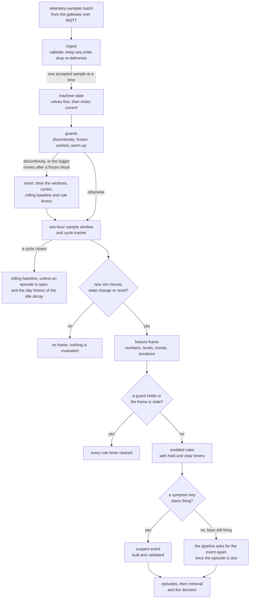
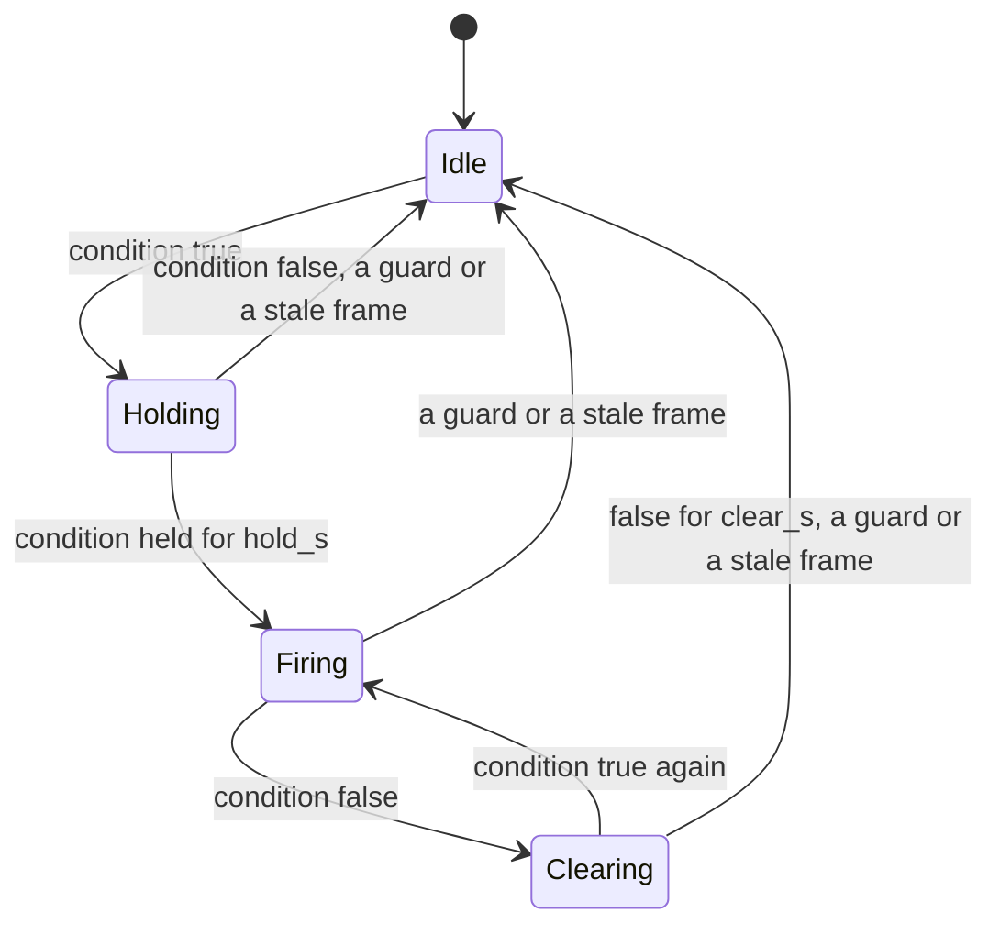

<!-- SPDX-FileCopyrightText: 2026 Meddle S.r.l. -->
<!-- SPDX-License-Identifier: CC-BY-4.0 -->

# Detection rules

This guide explains how the backend turns telemetry into suspect events: the features it computes from the samples, what "normal" means, the 16 rules, the message a firing rule produces, how gaps, jumps and a stalled logger reset it all, and how to tune it. Read it before you change a threshold or switch a rule off, or when you want to know why an alert fired. What happens after a suspect event (retrieval, the decision, the confidence gate and the tickets) is in [Decision backends](decision-backends.md).

Detection is plain TypeScript in `apps/backend/src/detection/`. It runs on the simulated time of the samples (`sim_ts`), uses the wall clock only to stamp the message it sends, and touches no database or broker, so the running backend and the evaluation harness in `tools/eval` drive the same code and get the same events at any replay speed. No model reads the raw series: detection sums each signal up in words (a level, a trend and a duration) before anything leaves it.

The path of one sample, from the broker to a suspect event:



## Features: windows, trends and machine state

### What detection reads

The gateway publishes the samples in batches of 1 to 25 on `plant/cau-7/telemetry/samples`. Ingest (`apps/backend/src/ingest/index.ts`) validates each batch against the contract, keeps `seq` order and drops a batch it has already taken, unless the batch opens with the discontinuity flag: that is how a simulator restart, whose counter starts again at 1, differs from a re-delivery. Detection then takes the accepted samples one at a time. Ingest also feeds the chart ring buffer, the one-minute aggregates and the controller alarm transitions; see [Architecture](architecture.md) and [API and topics](api.md).

One sample, taken from the contract fixture `packages/contracts/fixtures/telemetry-samples/valid-single.json` and trimmed to seven of its sixteen tags. It reads `unloaded` (the intake is closed and the motor draws 3.77 A) and carries the discontinuity flag, as the first sample of a replay does:

```json
{
  "seq": 1,
  "sim_ts": "2020-02-01T00:00:00.000Z",
  "flags": { "discontinuity": true, "missing": false },
  "values": {
    "line_pressure": 9.67,
    "dryer_purge_pressure": -0.018,
    "motor_current": 3.77,
    "intake_closed": true,
    "load_valve": false,
    "oil_level_ok": true,
    "ambient_temperature": 9.1
  },
  "alarms": []
}
```

Detection names each signal by a role taken from its MetroPT-3 column and emits the register map's tag ids; `resolveRoles` in `apps/backend/src/detection/signals.ts` binds them at start-up and stops the backend when a column is missing. The register map already gives every tag its meaning, so detection reads each boolean as published and never inverts one: `oil_level_ok` is true when the level is fine, although the dataset describes its column the other way round. A value a sample does not carry is treated as a hole: detection keeps using the last value it saw.

| Tag                            | MetroPT-3 column | Kind        | What detection uses it for                                                          |
| ------------------------------ | ---------------- | ----------- | ----------------------------------------------------------------------------------- |
| `discharge_pressure`           | TP2              | analog, bar | Discharge minus line pressure while loaded; the frozen test                         |
| `line_pressure`                | TP3              | analog, bar | Cut-out, idle decay and rise, the 5-minute slope, the parked guard; the frozen test |
| `separator_discharge_pressure` | H1               | analog, bar | Return to line pressure after cut-out; the frozen test                              |
| `dryer_purge_pressure`         | DV_pressure      | analog, bar | Purge pressure while loaded                                                         |
| `reservoir_pressure`           | Reservoirs       | analog, bar | Difference to line pressure                                                         |
| `oil_temperature`              | Oil_temperature  | analog, °C  | 30-minute minimum and 2-hour trend; the frozen test                                 |
| `motor_current`                | Motor_current    | analog, A   | Machine state, loaded current, start peak; the frozen test                          |
| `intake_closed`                | COMP             | digital     | Machine state                                                                       |
| `load_valve`                   | DV_eletric       | digital     | Machine state                                                                       |
| `dryer_tower`                  | Towers           | digital     | Tower in service, changeover pulse after cut-in                                     |
| `regulator_contact`            | MPG              | digital     | No rule; carried as an observation                                                  |
| `low_pressure_switch`          | LPS              | digital     | How long it has been closed                                                         |
| `purge_switch`                 | Pressure_switch  | digital     | No rule; carried as an observation                                                  |
| `oil_level_ok`                 | Oil_level        | digital     | How long it has read low                                                            |
| `flow_pulse`                   | Caudal_impulses  | digital     | How long it has not changed                                                         |
| `ambient_temperature`          | none, synthetic  | analog, °C  | Ambient bucket                                                                      |

The 15 recorded variables and their quirks are described in [Dataset](dataset.md); the synthetic ambient temperature comes from the simulator ([Simulation and fault injection](simulation.md)).

### Machine state

```text
loaded   := intake_closed == false and load_valve == true
unloaded := not loaded and motor_current >= 1.0 A
off      := not loaded and motor_current <  1.0 A
```

The valves decide first, whatever the current says; the current then separates the run-on (the motor turning with the intake closed) from a stopped motor. This is the state rule of `manual/spec/signals.yaml` and of the [dataset guide](dataset.md#the-15-variables), and it agrees with a reading of the motor current alone on 99.46 % of the recording's rows. A sample that lacks the state tags keeps the previous state, so `unknown` only appears before the first readable sample. The code is `machineMode` in `apps/backend/src/detection/state.ts`.

### The feature frame

Everything a rule reads is one feature frame (`FeatureFrame` in `apps/backend/src/detection/types.ts`), which `apps/backend/src/detection/features.ts` recomputes on every new simulated minute, on every state change and right after a reset. Rules are evaluated only when a frame is computed. The engine keeps its own window of the last two hours and one minute of samples (at most 8,192), separate from the chart ring buffer so that it runs the same inside `tools/eval`. Every window is keyed by `sim_ts`, and no rate assumes the recording's ten-second step. A field whose window cannot answer yet is undefined, never zero, and no rule fires on an undefined field.

| Field                                                 | What it holds                                                                                                          | Window                                      |
| ----------------------------------------------------- | ---------------------------------------------------------------------------------------------------------------------- | ------------------------------------------- |
| `mode`, `mode_since_sim_ts`, `mode_for_s`             | The machine state and how long it has held                                                                             | Latest sample                               |
| `dryer_tower`                                         | Tower in service, 1 or 2, from `dryer_tower`                                                                           | Latest sample                               |
| `loaded_run_s`                                        | Length of the loaded run in progress; undefined when not loaded                                                        | Current run                                 |
| `tp3_slope_bar_per_min`                               | Least-squares slope of line pressure                                                                                   | 5 min, 3 samples or more                    |
| `cycles_per_hour`                                     | Cut-ins per hour, counted from the first to the last cut-in of the window                                              | 2 h, 2 cut-ins or more                      |
| `loaded_run_median_s`, `off_median_s`, `decay_median` | Medians of the loaded run, the off phase and the idle decay                                                            | Last 5 closed cycles                        |
| `long_runs_in_last5`                                  | Cycles loaded for longer than the long-run threshold                                                                   | Last 5 closed cycles                        |
| `fast_decays_in_row`                                  | Newest closed cycles in a row whose idle decay is above the fast-decay threshold                                       | Closed cycles                               |
| `dv_pressure_loaded_consecutive_gt`                   | Consecutive loaded samples with a purge pressure above 0.5 bar                                                         | Samples                                     |
| `oil_c`, `oil_30min_min_c`, `oil_trend_c_per_h`       | Latest oil temperature, its lowest value and its slope                                                                 | Latest, 30 min, 2 h with 60 samples or more |
| `motor_current_loaded_a`, `tp2_minus_tp3_loaded`      | Medians of the motor current and of discharge minus line pressure, loaded samples only                                 | 60 s                                        |
| `towers_pulse_missing_cycles`                         | Cycles without a tower changeover pulse                                                                                | Last 3 closed cycles                        |
| `h1_return_s`                                         | Seconds from cut-out until the separator is back at line pressure                                                      | Run in progress, else last closed cycle     |
| `reservoirs_minus_tp3`                                | Median of reservoir minus line pressure                                                                                | 5 min                                       |
| `lps_active_s`, `oil_level_low_s`, `caudal_stuck_s`   | How long the low-pressure switch has been closed, the oil level switch has read low and the flow pulse has not changed | Run lengths                                 |
| `ambient_c`, `ambient_bucket`, `active_alarms`        | Ambient temperature, its bucket and the controller alarm codes                                                         | Latest sample                               |
| `signals`, `behaviours`                               | Every signal and the six derived behaviours as a value, a level, a trend and how long the level has held               | See below                                   |
| `rolling`, `guards`                                   | The rolling medians and the four guards                                                                                | See the next sections                       |

The running backend serves the latest frame at `GET /api/features` (see [API and topics](api.md)).

### Load cycles

A load cycle runs from one cut-in, the moment the unit enters `loaded`, to the next; the cut-out is the moment it leaves `loaded`. The tracker in `apps/backend/src/detection/cycles.ts` gives each interval between two samples to the state of the sample that opened it, so a cycle's loaded, unloaded and off times add up to its period exactly. It keeps the last 50 closed cycles of the current stretch of data and the cycle in progress.

| Metric                                                               | Meaning                                                                                                      |
| -------------------------------------------------------------------- | ------------------------------------------------------------------------------------------------------------ |
| `loaded_s`, `unloaded_s`, `off_s`, `nonloaded_s`, `period_s`         | Time in each state; non-loaded is unloaded plus off, and the period runs from cut-in to cut-in               |
| `cutin_tp3`, `cutout_tp3`, `cut_out_reached`                         | Line pressure at cut-in and at cut-out; cut-out counts as reached at 9.8 bar or more                         |
| `decay_bar_per_min`                                                  | Least-squares fall of line pressure over the non-loaded interval, positive downwards, from 6 samples or more |
| `rise_bar_per_min`                                                   | Least-squares rise of line pressure over the loaded run, from 3 samples or more                              |
| `tp2_minus_tp3_loaded`, `motor_current_loaded`, `dv_pressure_loaded` | Medians over the loaded run; the purge pressure also keeps its maximum                                       |
| `start_current_peak`                                                 | Highest motor current in the first 30 s of the loaded run                                                    |
| `towers_pulse`                                                       | The dryer tower signal read low for at least 20 s in a row within 120 s of cut-in: the changeover pulse      |
| `h1_return_s`                                                        | Seconds after cut-out until separator pressure is back within 0.3 bar of line pressure                       |
| `oil_max`                                                            | Highest oil temperature of the cycle                                                                         |

### Derived behaviours

Six behaviours named in `manual/spec/signals.yaml` (`behaviours`) are read like signals, and the catalog's signal moves name them the same way (see [The manual and the fault catalog](manual.md)).

| Behaviour                    | Value                                                                                                                              | Unit       | Normal band (first-month p5 to p95)         |
| ---------------------------- | ---------------------------------------------------------------------------------------------------------------------------------- | ---------- | ------------------------------------------- |
| `load_cycle_rate`            | The frame's `cycles_per_hour`                                                                                                      | `per_hour` | 1.1979 to 2.1646                            |
| `loaded_run_duration`        | The loaded run in progress, else the newest closed cycle's                                                                         | `s`        | 99 to 129                                   |
| `unloaded_pressure_decay`    | The newest closed cycle's idle decay, plus `by_hours` (see [Quiet hours](#quiet-hours))                                            | `bar/min`  | 0.0482 to 0.1491                            |
| `cut_out_reached`            | 1 when the newest closed cycle reached cut-out; 0 when it did not, or when the loaded run in progress is already longer than 149 s | `bool`     | No band: 1 reads normal, 0 far below normal |
| `pressure_rise_while_loaded` | The 5-minute line pressure slope while loaded, else the newest closed cycle's rise                                                 | `bar/min`  | 0.8713 to 1.3107                            |
| `start_current_peak`         | The start peak of the loaded run in progress, else of the newest closed cycle                                                      | `A`        | 6.005 to 8.2925                             |

Three of these bands are derived rather than read, and `baseline.ts` says how: the rise from the cut-in and cut-out pressures and the length of the loaded run, the cycle rate from the first month's cycles a day divided by 24, and the start peak's upper edges from the first month's highest current and the manual's 9.5 A start-peak rating. A behaviour with no value yet is left out of the suspect event. Its trend compares the value with the median of the five cycles before the newest: twice or more reads rising sharply, 1.25 times or more rising, 0.8 times or less falling, and half or less falling sharply.

### From numbers to words

`apps/backend/src/detection/buckets.ts` turns every value into three words.

- **Level**: where the value sits in its first-month band for the current state: normal from p5 to p95, below or above normal out to p1 and p99, far below or far above beyond. An analog signal's band is first widened by its sensor's accuracy (see [Read no finer than the instrument](#read-no-finer-than-the-instrument)). A digital value is normal when the first month showed it in at least one sample in five in that state, far from normal when in fewer than one in a thousand, and below or above normal in between. The ambient temperature has fixed boundaries: below 10 °C reads below normal, 10 to 25 °C normal, 25 to 32 °C above normal and over 32 °C far above. In the `unknown` state a signal's level is normal.
- **Trend**: the slope over the signal's window against a threshold for its kind (table below). An analog signal is `erratic` when its standard deviation over 5 minutes exceeds three widths of its band (p5 to p95) or its sensor accuracy, whichever is larger; the ambient temperature never is. A digital signal is `erratic` at 4 or more changes within 60 s. While the frozen guard holds, every signal is `stuck`.
- **Duration**: how long the level has held: seconds under a minute, minutes under 30 minutes, about an hour under 2 hours, several hours under 12 hours, about a day under 36 hours, then days.

| Kind          | Window                  | Moving at    | Moving sharply at |
| ------------- | ----------------------- | ------------ | ----------------- |
| Pressure      | 5 min                   | 0.05 bar/min | 0.3 bar/min       |
| Temperature   | 2 h, 60 samples or more | 2 °C/h       | 6 °C/h            |
| Motor current | 5 min                   | 0.2 A/min    | 1 A/min           |
| Digital       | 60 s                    | Any change   | Not used          |

The value of an analog signal is its median over the last 60 s (the ambient temperature uses its latest value), and a digital's value is its latest state. The internal words are finer than the contract's: on the wire `rising_sharply` travels as `rising`, and the levels shorten to `far_below`, `below`, `normal`, `above` and `far_above`. The evidence sentences keep the finer words.

### Controller alarms

The unit's own alarms are input to the diagnosis, not something detection computes: the simulator, acting as the CTRL-7 controller, evaluates the triggers of `manual/spec/alarms.yaml` and writes the active codes into every sample. Detection copies the codes of the frame's sample into the suspect event as `active_alarms`, and no rule reads them. Ingest records each raise and clear in `app.native_alarms`, and the evaluation measures lead time against the first warning the emulated CTRL-7 raises inside a failure's credited span (see [Simulation and fault injection](simulation.md) and [Evaluation](evaluation.md)).

## Normal bands from the first month, and rolling baselines

### The first month

"Normal" is February 2020, the first month of the recording and the dataset's suggested training split: 28 days of data from 2020-02-01 to 2020-02-28, 214,850 rows and no frozen block ([Dataset](dataset.md#the-15-variables)). `apps/backend/src/detection/baseline.ts` carries it as constants transcribed from [`data/metropt3-first-month-stats.json`](../data/metropt3-first-month-stats.json), which `scripts/data/metropt3_stats.py` computes from the CSV, each citing its source:

- `FIRST_MONTH_ANALOG_BANDS`: p1, p5, p50, p95 and p99 of every recorded analog signal, per state;
- `FIRST_MONTH_CYCLE_BANDS`: the same percentiles for the cycle metrics and behaviours, from 1,134 clean cycles;
- `FIRST_MONTH_DIGITAL_SHARE`: the share of samples in which each digital signal read true, per state;
- `FIRST_MONTH_CYCLES_BY_HOUR`: how many cycles began in each hour of the day.

The constants never move, so a word means the same in February and in July, and every suspect event names them in `baseline_ref` (`metropt3-first-month-2020-02`). The manual prints its own bands for the same month, derived by `manual/tools/derive_bands.py` and rounded to each signal's band step. Detection never reads the manual at runtime, and the two sets differ in places: line pressure while loaded is 8.6 to 10.1 bar in `signals.yaml` and 8.048 to 10.028 bar from p5 to p95 in `baseline.ts`.

### Read no finer than the instrument

Several first-month bands are narrower than the instrument that measured them: the dryer purge pressure spans 8 mbar in every state, against a transducer that resolves 85 mbar. So every edge of an analog band moves outwards by the sensor's accuracy before a level is read, and a spread narrower than the accuracy is never erratic. The accuracies come from `manual/spec/machine.yaml` and are transcribed as `SENSOR_ACCURACY`; the YAML is never read at runtime, and `baseline.test.ts` checks the transcription.

| Signals                                                        | Instrument                                           | Accuracy                   |
| -------------------------------------------------------------- | ---------------------------------------------------- | -------------------------- |
| Discharge, line, separator, dryer purge and reservoir pressure | Pressure transducer, −1 to 16 bar, 0.5 % of the span | 0.085 bar                  |
| Oil temperature                                                | Resistance thermometer, −20 to 120 °C                | 1 °C                       |
| Motor current                                                  | Current transformer, 0 to 20 A, 2 % of the span      | 0.4 A                      |
| Ambient temperature                                            | Resistance thermometer, −20 to 60 °C                 | 1 °C, which widens nothing |

An example: while loaded, the dryer purge pressure's band is p5 −0.022, p95 −0.014 and p99 −0.012 bar. Widened by 0.085 bar, it reads normal up to 0.071 bar and far above normal beyond 0.073 bar, so the 0.5 bar that `purge_pressure_high` watches for is far above normal. The cycle metrics and behaviours keep their raw bands, because rules read their levels.

### Rolling baselines

A normal summer week does not look like February: 3.0 to 3.9 cycles an hour against 1.97, an idle decay of 0.11 to 0.16 bar/min against 0.069, and loaded runs of 139 to 149 s against 109. Thresholds fixed at February's values would fire every summer day, and thresholds that only follow the recent past would follow a slow leak as well. The drift-prone cycle metrics therefore also get a rolling median (`createRollingBaseline` in `baseline.ts`), and their rule compares against `max(absolute floor, k × rolling median)`:

- the median is taken over the closed cycles of the last 48 sim hours and needs at least 20 of them; with fewer, the floor stands alone;
- cycles that close while any episode is open are left out, so a fault cannot raise its own threshold;
- the median is capped at twice the first month's value, which limits how far a slow leak can drag the threshold up;
- every reset (a discontinuity, or the logger moving after a frozen block) empties it, so until 20 cycles have closed again every threshold is its floor.

| Metric              | Floor        | k   | Cap on the median | Highest threshold | Rule               |
| ------------------- | ------------ | --- | ----------------- | ----------------- | ------------------ |
| Idle pressure decay | 0.25 bar/min | 2.0 | 0.138 bar/min     | 0.276 bar/min     | `fast_decay`       |
| Cycles per hour     | 5            | 1.8 | 3.936             | about 7.08        | `frequent_cycling` |
| Loaded run          | 200 s        | 1.5 | 218 s             | 327 s             | `long_loaded_runs` |

The rolling term takes over from the floor once the recent median passes 0.125 bar/min, about 2.78 cycles an hour or about 133 s. The off phase has a rolling median too, but no rule scales with it: `frequent_cycling` compares the median off phase of the last five cycles with a fixed 250 s. The floors and factors were chosen after looking at the four labelled leaks, so every score against those leaks is in-sample.

### Quiet hours

The manual tells a leak in the distribution network from a plant that simply draws more air by when the line drains: a leak runs day and night, while heavy demand follows the production pattern and stops when the plant stops (`manual/spec/faults.yaml`, `downstream_air_leak` and `high_air_demand`). Detection gives the decision that evidence (`apps/backend/src/detection/quiet-hours.ts`):

- The quiet hours are the unit's own: the hours of the day whose first-month cycle count lies below the midpoint between the quietest hour's count and the median hour's. For CAU-7 that is 00:00 to 04:59 on the data clock, which the replay keeps in UTC ([Dataset](dataset.md#sampling-size-and-clock)).
- Every closed cycle with an idle decay and an idle phase of at most six hours is kept for 24 sim hours, filed as quiet or busy by the hour in the middle of its idle phase.
- Each kind of hour is read on the median of its last five cycles, with at least three, against the same first-month decay band as `unloaded_pressure_decay`.
- Once three cycles in a row within the day read above that band, only the cycles from the first of them count, so a quiet night before the loss began cannot vouch for it.
- Cycles inside an open episode count here, unlike in the rolling baseline: they are the evidence, and the band they are read against is fixed.
- The history survives the guards' resets and ages out by sim time instead, because the recording's gaps fall mostly in the quiet hours.

The result travels as `by_hours: { quiet, busy }` on the `unloaded_pressure_decay` observation, with `unknown` for a kind of hour that has too few cycles, and the decision state turns it into a sentence (see [Decision backends](decision-backends.md)). It changes no rule and no threshold.

## The 16 rules

### Reference

Each rule is a pure function of one frame, in its own file under `apps/backend/src/detection/rules/`. [`rules/index.ts`](../apps/backend/src/detection/rules/index.ts) registers them in the order of the table below; that order breaks ties between rules of equal severity and orders `rule_ids` in the suspect event. Nothing is evaluated while one of the four guards holds or when the frame is stale (see [Discontinuities](#discontinuities-jumps-gaps-and-a-frozen-logger)); the Guards column lists the conditions each rule adds on top. Every rule clears after the same time it holds.

| Rule                          | Fires when                                                                                                                             | Guards                                      | Hold and clear | Symptom key                   | Severity hint | Default |
| ----------------------------- | -------------------------------------------------------------------------------------------------------------------------------------- | ------------------------------------------- | -------------- | ----------------------------- | ------------- | ------- |
| `stuck_loaded`                | The loaded run in progress is longer than 600 s and line pressure rises by less than 0.1 bar/min over 5 minutes                        | Loaded                                      | None           | `continuous_load`             | high          | On      |
| `purge_pressure_high`         | Dryer purge pressure is above 0.5 bar on 6 or more consecutive loaded samples                                                          | Loaded                                      | None           | `purge_pressure_high`         | high          | On      |
| `fast_decay`                  | The idle decay of each of the 3 newest closed cycles is above max(0.25, 2.0 × rolling median) bar/min                                  | None                                        | None           | `low_line_pressure`           | medium        | On      |
| `frequent_cycling`            | Cut-ins over the last 2 hours exceed max(5, 1.8 × rolling median) an hour, or the median off phase of the last 5 cycles is under 250 s | None                                        | None           | `frequent_cycling`            | medium        | On      |
| `long_loaded_runs`            | 3 or more of the last 5 closed cycles were loaded for longer than max(200, 1.5 × rolling median) s                                     | None                                        | None           | `frequent_cycling`            | medium        | On      |
| `low_pressure_switch`         | The low-pressure switch is closed                                                                                                      | Motor running (loaded or unloaded)          | 60 s           | `low_line_pressure`           | critical      | On      |
| `oil_temperature_high`        | The lowest oil temperature of the last 30 minutes is above 75 °C                                                                       | None                                        | 30 min         | `oil_temperature_high`        | medium        | On      |
| `oil_temperature_rising`      | Oil temperature climbs faster than 4 °C/h over 2 hours                                                                                 | Load cycle rate inside its first-month band | 2 h            | `oil_temperature_high`        | low           | On      |
| `motor_current_high`          | The 60-second median of the loaded motor current is above 6.5 A                                                                        | Loaded                                      | 60 s           | `motor_current_high`          | medium        | On      |
| `motor_current_low`           | The 60-second median of the loaded motor current is below 5.2 A                                                                        | Loaded for more than 30 s                   | 60 s           | `motor_current_low`           | medium        | On      |
| `discharge_differential_low`  | The 60-second median of discharge minus line pressure while loaded is below 0.1 bar                                                    | Loaded                                      | 60 s           | `motor_current_low`           | medium        | On      |
| `dryer_tower_not_switching`   | None of the last 3 closed cycles shows a tower changeover pulse after cut-in                                                           | None                                        | None           | `dryer_changeover_fault`      | low           | On      |
| `separator_not_venting`       | The separator took more than 120 s after cut-out to come back within 0.3 bar of line pressure, or has not come back after 120 s        | None                                        | None           | `separator_pressure_abnormal` | medium        | On      |
| `reservoir_pressure_mismatch` | The 5-minute median of reservoir minus line pressure is beyond ±0.3 bar                                                                | None                                        | 5 min          | `reservoir_deviation`         | low           | On      |
| `low_oil_level`               | The oil level switch reads low (`oil_level_ok` false)                                                                                  | Motor running (loaded or unloaded)          | 5 min          | `oil_level_low`               | medium        | On      |
| `flow_pulses_missing`         | The flow pulse has not changed for more than 600 s                                                                                     | Loaded                                      | 10 min         | `no_flow_signal`              | low           | Off     |

### How a rule fires

The rules hold no state; the hold and clear timers live in the registry and run on simulated time, so a replay gives the same hits at the same instants at any speed:



- A rule is reported once its condition has held for its hold time, and the hit is dated from the moment the condition first held (`since_sim_ts`).
- Once firing, it keeps being reported until the condition has been false for its clear time; if the condition returns in the meantime, the rule goes on firing without serving its hold again.
- A rule with no hold fires on the first frame that meets its condition and stops on the first frame that does not.
- While a guard holds, or when the frame is stale, nothing is evaluated and every timer goes back to idle, so a rule must serve its hold again once the guard lifts. A reset does the same.

Each hit carries its numbers (`value`, `threshold`, `unit`) and one sentence (`detail`) that says what was seen, never what it means; the ticket repeats the sentence verbatim.

### Notes on the rules

The four labelled air leaks of the recording show two pictures ([Dataset](dataset.md#two-leak-signatures), which also holds the failure table). In signature A (F1 to F3, a leak on the dryer or drain side) the unit stays loaded, never reaches cut-out and the dryer purge pressure stays high: `stuck_loaded` and `purge_pressure_high` are its rules. In signature B (F4, a downstream leak) the purge pressure stays normal while the cycles grow longer and closer and the idle decay rises: `fast_decay`, `frequent_cycling` and `long_loaded_runs`, then `stuck_loaded` and `low_pressure_switch` once the unit can no longer keep up. Most of the other rules were written for faults the recording does not contain and the fault injector adds ([Simulation and fault injection](simulation.md#fault-injection)).

- `stuck_loaded` has no hold because ten minutes of loaded running already is one. The loaded run counts from the last state change or reset, so after a gap it starts again.
- `purge_pressure_high` counts samples, not frames: a sample that is not loaded, or that reads 0.5 bar or less, sets the count back to zero. At the recording's ten-second step six samples are about a minute, which the one- to three-sample spikes the recording shows at tower changeovers cannot reach. The value it reports is the 60-second median of the purge pressure.
- `fast_decay` and `long_loaded_runs` read closed cycles only, and a cycle closes at the next cut-in, so they start and stop firing on cut-in frames. `frequent_cycling` fires on either of its two conditions: its rate counts the cut-ins of the last two hours, the run in progress included, and its off-phase test compares the median of the last five closed cycles with the fixed 250 s. Apart from that off-phase test, the thresholds of all three scale with the rolling medians above.
- `low_pressure_switch` is the one `critical` hint. The switch also closes when a depot vents the line with the motor off; the state test leaves out `off`, and the parked guard removes the rest. In the recording the switch closes far more often at depot depressurisations than during leaks ([Dataset](dataset.md#excluded-windows)).
- `oil_temperature_high` tests the lowest reading of the last half hour, not the latest one, and then holds for another half hour, so in continuous data the oil has stayed above 75 °C for about an hour when the hit appears. Hot oil has benign causes (a hot day, a busy shift), hence the `medium` hint.
- `oil_temperature_rising` wants the load pattern to be normal: the `load_cycle_rate` behaviour must read `normal` against the February band. A summer day at three to four cycles an hour reads above that band and keeps the rule quiet, while a rate that cannot be measured yet (fewer than two cut-ins in two hours) reads `normal` and lets it through.
- `motor_current_high` and `motor_current_low` read a 60-second median of loaded samples only, so a start peak cannot trip the high one, and the low one waits until the run is 30 s old for the current to settle. `motor_current_low` is weak for signature A: the current sags to 5.5 to 5.7 A there ([Dataset](dataset.md#two-leak-signatures)), above the rule's 5.2 A.
- `discharge_differential_low` reports under `motor_current_low` because a collapsed difference between discharge and line pressure (first-month median 0.322 bar) tells the same story: the element makes less of the difference it should, or the check valve does not hold it.
- `dryer_tower_not_switching` needs all of the last three closed cycles without a changeover pulse; the first month shows the pulse in all but a handful of cycles.
- `separator_not_venting` counts the time elapsed since the latest cut-out while the separator has not come back up to the line, so a separator that never comes back up makes the rule fire instead of leaving it silent. During the next loaded run, the last closed cycle's value stands. The separator discharge is vented close to zero while the unit delivers and stands at the line pressure while it does not, so the rule fires when the reading stays **below** the line after cut-out, and its sentence says so; the rule's id is older than that reading.
- `reservoir_pressure_mismatch` compares two gauges that read the same air; in the recording they track each other within a couple of millibar ([Dataset](dataset.md#the-15-variables)).
- `low_oil_level` reports the symptom key `oil_level_low`, which the manual uses as a cause id (listed under the `oil_temperature_high` condition) and not as a condition id, so retrieval finds no condition to start from for it; the mismatch is a known open point. The recording's `Oil_level` reads 0 for long stretches of August 2020, which the project treats as unlabelled and informational ([Dataset](dataset.md#the-15-variables)).
- `flow_pulses_missing` ships switched off: the recording's flow pulse carries no flow information at the ten-second step and stands still for long stretches that are no fault ([Dataset](dataset.md#the-15-variables)).

## Suspect events and episodes

### When detection raises one

A suspect event is detection's only output, built by `apps/backend/src/detection/suspect.ts`. The detector raises one on a frame where a symptom key fires that did not fire on the previous frame, and the event describes every rule firing on that frame. While the same keys keep firing, detection raises nothing more; re-decisions are asked for by the pipeline (see below). A reset or a guard empties the list of firing keys, so a rule that fires again after a gap, a frozen block, a depot stop or the warm-up raises a new event.

Every message is validated against `packages/contracts/schemas/v1/suspect-event.schema.json` before it leaves. One that does not validate is dropped rather than thrown, so a malformed frame cannot stop a replay; the detector would log the drop, but the pipeline builds it without a logger. The running backend publishes each event on `plant/cau-7/events/suspect` (QoS 1, not retained), stores it in `app.suspect_events` and sends it to the browser as an `event.suspect` frame, where it shows in the Alerts feed ([README tour](../README.md#try-it-in-five-minutes), [API and topics](api.md)).

### The payload

| Field                                      | Content                                                                                                                                                                                                              |
| ------------------------------------------ | -------------------------------------------------------------------------------------------------------------------------------------------------------------------------------------------------------------------- |
| `schema`, `unit_id`, `wall_ts`, `event_id` | The envelope: the schema id, `cau-7`, the wall time and a fresh UUID                                                                                                                                                 |
| `sim_ts`                                   | The frame's instant                                                                                                                                                                                                  |
| `symptom_key`                              | The symptom of the firing rule with the highest severity hint (critical, then high, medium and low), ties going to the rule listed first                                                                             |
| `rule_ids`                                 | Every firing rule under that symptom, in registry order                                                                                                                                                              |
| `co_symptoms`                              | The symptom keys of the other firing rules                                                                                                                                                                           |
| `machine_state`                            | `mode`, `since_sim_ts` and `dryer_tower` (1, 2 or null)                                                                                                                                                              |
| `window`                                   | From the earliest onset among the firing rules to the frame, with the number of samples in detection's window                                                                                                        |
| `evidence`                                 | One item per rule in `rule_ids` (what it measured, its sentence, value, unit, threshold as `baseline` and how long it has held), then one per observation that moved                                                 |
| `observations`                             | Every signal and every behaviour that has a value, at most 24: behaviours and signals that moved first, still signals after them. A decay known only from the day history comes last, with level and trend `unknown` |
| `active_alarms`                            | The controller alarm codes of the frame's sample                                                                                                                                                                     |
| `ambient`                                  | `cold` below 10 °C, `mild` to 25, `warm` to 32, `hot` above, or `unknown`                                                                                                                                            |
| `rules_fired`                              | Additive: per rule in `rule_ids`, its onset, sentence, value, threshold and unit                                                                                                                                     |
| `baseline_ref`                             | Additive: `metropt3-first-month-2020-02`                                                                                                                                                                             |

An observation "moved" when its level is not normal or its trend is not flat. Its evidence sentence reads `<label> <level>, <trend> for <duration>.`, for example "Line pressure normal, falling for minutes." Still signals travel in `observations` only, so the decision can judge a cause that expects a signal to stay put; narrowing them to what matters for each candidate is the decision state's job ([Decision backends](decision-backends.md)).

An event from the contract fixture `packages/contracts/fixtures/suspect-event/valid-idle-decay-by-hours.json`, trimmed of its `wall_ts` and of its fourth observation (`low_pressure_switch`). The fixture is a schema test case rather than detector output; an event the detector builds carries all sixteen signals and one evidence item per observation that moved:

```json
{
  "schema": "urn:fdp:schema:suspect-event:v1",
  "unit_id": "cau-7",
  "event_id": "5f1c9e27-3a4b-4c8d-9e02-6b7a8c9d0e13",
  "sim_ts": "2020-03-10T03:12:00.000Z",
  "symptom_key": "low_line_pressure",
  "rule_ids": ["fast_decay"],
  "machine_state": { "mode": "unloaded", "since_sim_ts": "2020-03-10T03:09:40.000Z", "dryer_tower": 2 },
  "window": { "from_sim_ts": "2020-03-10T02:41:00.000Z", "to_sim_ts": "2020-03-10T03:12:00.000Z", "samples": 720 },
  "evidence": [
    {
      "metric": "unloaded_pressure_decay",
      "observation": "Line pressure has fallen away faster than usual after cut-out on consecutive cycles.",
      "value": 0.31,
      "unit": "bar/min",
      "baseline": 0.25,
      "duration": "minutes"
    }
  ],
  "observations": [
    {
      "signal": "unloaded_pressure_decay",
      "level": "far_above",
      "trend": "flat",
      "since": "several hours",
      "value": 0.31,
      "unit": "bar/min",
      "by_hours": { "quiet": "far_above", "busy": "far_above" }
    },
    {
      "signal": "load_cycle_rate",
      "level": "far_above",
      "trend": "flat",
      "since": "several hours",
      "value": 6.2,
      "unit": "per_hour"
    },
    {
      "signal": "line_pressure",
      "level": "normal",
      "trend": "falling",
      "since": "minutes",
      "value": 9.42,
      "unit": "bar"
    }
  ],
  "active_alarms": [],
  "co_symptoms": ["frequent_cycling"],
  "ambient": "mild",
  "rules_fired": [
    {
      "rule_id": "fast_decay",
      "since_sim_ts": "2020-03-10T02:41:00.000Z",
      "detail": "Line pressure has fallen away faster than usual after cut-out on consecutive cycles.",
      "value": 0.31,
      "threshold": 0.25,
      "unit": "bar/min"
    }
  ],
  "baseline_ref": "metropt3-first-month-2020-02"
}
```

### Symptom keys

The 16 rules report 12 symptom keys. All but one are condition ids of the manual (`manual/spec/faults.yaml`), so retrieval can start from the causes the manual files under the event's condition (see [Decision backends](decision-backends.md)).

| Symptom key                   | Rules                                                                |
| ----------------------------- | -------------------------------------------------------------------- |
| `continuous_load`             | `stuck_loaded`                                                       |
| `purge_pressure_high`         | `purge_pressure_high`                                                |
| `low_line_pressure`           | `fast_decay`, `low_pressure_switch`                                  |
| `frequent_cycling`            | `frequent_cycling`, `long_loaded_runs`                               |
| `oil_temperature_high`        | `oil_temperature_high`, `oil_temperature_rising`                     |
| `motor_current_high`          | `motor_current_high`                                                 |
| `motor_current_low`           | `motor_current_low`, `discharge_differential_low`                    |
| `dryer_changeover_fault`      | `dryer_tower_not_switching`                                          |
| `separator_pressure_abnormal` | `separator_not_venting`                                              |
| `reservoir_deviation`         | `reservoir_pressure_mismatch`                                        |
| `oil_level_low`               | `low_oil_level` (a cause id, not a condition id; see the rule notes) |
| `no_flow_signal`              | `flow_pulses_missing`                                                |

Six of the manual's 17 conditions have no rule: `oil_temperature_low`, `discharge_pressure_high`, `water_in_air`, `oil_in_air`, `no_start` and `no_unload`. The severity hints also reach the rules backend, which reports the worst hint among the rules that fired.

### How events open and extend episodes

An episode is keyed by `(unit_id, symptom_key)` and runs on simulated time in `apps/backend/src/episodes/index.ts`; the lifecycle, the merges between episodes and the tickets are in [Decision backends](decision-backends.md). Seen from detection:

- The first event for a key opens an episode, which is decided once its key has fired without a break for `GATE_PERSIST_SIM_MIN` (1) sim minute, measured from the rules' own `since_sim_ts`; until then the event is published and nothing is decided.
- A later event for an open episode is published and counted on it, co-symptoms included, and decided only when the episode is due: never decided yet, or last decided `DECISION_INTERVAL_SIM_MIN` (30) sim minutes ago or more.
- While rules keep firing without a new event, the pipeline has detection build the event it would send now (`buildEvent`, with a fresh `event_id`) once the primary symptom's episode is due; until then nothing is published.
- A key silent for `EPISODE_CLEAR_SIM_MIN` (120) sim minutes closes its episode with the reason `silence`, and a discontinuity aborts every open episode at the time of the last sample before the jump.

An episode whose key now fires only as a co-symptom stays open, because its key is still firing, but it is not decided again. While any episode is open, closed cycles stay out of the rolling baseline. For scale: over the whole recording, the rules-only baseline run raised 2,704 suspect events, opened 344 episodes and made 1,612 decisions ([Evaluation](evaluation.md#the-rules-only-baseline-on-the-whole-recording); in-sample and provisional).

## Discontinuities: jumps, gaps and a frozen logger

The recording is not a clean signal. It has 331 gaps longer than a minute, nine blocks in which the logger repeated the same values, and depot stops in which the line is vented with the motor off; each of them would otherwise look like a fault. Four guards (`apps/backend/src/detection/state.ts`) run before any rule:

| Guard           | Holds when                                                                                                                       | Effect                                                                            |
| --------------- | -------------------------------------------------------------------------------------------------------------------------------- | --------------------------------------------------------------------------------- |
| `discontinuity` | The sample carries `flags.discontinuity`, comes more than 60 s after the previous sample, or comes before it                     | Reset: see [What a reset clears](#what-a-reset-clears); open episodes are aborted |
| `frozen`        | Discharge, line and separator pressure, oil temperature and motor current have been identical for 60 consecutive samples or more | Rules suppressed; a reset when the logger moves again                             |
| `parked`        | The motor is off and line pressure is below 2.0 bar                                                                              | Rules suppressed                                                                  |
| `warmup`        | Fewer than 30 samples since the last reset or the start of the stream                                                            | Rules suppressed                                                                  |

### Replay jumps and restarts

The simulator sets the discontinuity flag on the first sample after it boots, on the first row after a source gap, and on the first sample after a jump, a reset or a loop wrap ([Simulation and fault injection](simulation.md#gaps-and-the-discontinuity-flag)). A **Jump to** preset reaches detection only as that flag: which fault a preset shows is ground truth and stays out of the diagnosis ([README](../README.md#ground-truth-stays-out-of-the-diagnosis)). A restarted simulator counts `seq` from 1 again, and ingest takes that batch instead of dropping it as a re-delivery because it opens with the flag. Detection does not rely on the flag alone: a step of more than 60 s, or a step backwards in `sim_ts`, counts as a discontinuity too.

### Data gaps

The recording's 331 gaps add up to 909.5 hours, and most of them start between midnight and 01:00 or between 19:00 and 20:00, at the depot ([Dataset](dataset.md#gaps)). The simulator collapses each one: the clock jumps to the next row, which carries the flag. Windows, slopes and cycles therefore never span a gap, and every cycle is measured inside one stretch of continuous data.

### Frozen logger blocks

Nine times, 170.6 hours in all, the logger kept repeating the same analog values while the digital signals flickered ([Dataset](dataset.md#frozen-logger-blocks)). The simulator replays those blocks as recorded, and catching them is detection's job:

- The `frozen` guard rises at the 60th identical sample of the five analog values it watches, about ten minutes into a stall at the recording's step.
- Until then the registry applies the same test frame by frame: a frame whose five values equal the previous frame's is stale, so nothing is evaluated and every timer is cleared. Without it, the block of 22 June, which freezes a cut-in transient with discharge pressure below line pressure, would read as a compressor that stopped delivering, and its digital flicker as cut-ins that no pressure followed.
- When the logger moves again, the windows are cleared as after a discontinuity and the warm-up starts over, but episodes are not aborted: with every rule silent, an open episode closes by silence after `EPISODE_CLEAR_SIM_MIN`.

### Depot stops and warm-up

A depot stop vents the line with the motor off, and the low-pressure switch closes on the way down; in the recording many of these stops start right after a logging gap or at night ([Dataset](dataset.md#excluded-windows)). The `parked` guard holds while the motor is off and line pressure is below 2.0 bar, so no rule is evaluated and every rule timer is cleared, but the windows are kept. After every reset, and at the start of a stream, the `warmup` guard keeps the rules silent until 30 samples have arrived, about five minutes at the recording's step, while the windows refill.

### What a reset clears

| State                                                         | Discontinuity                               | Logger moves after a frozen block            | A guard holds or the frame is stale |
| ------------------------------------------------------------- | ------------------------------------------- | -------------------------------------------- | ----------------------------------- |
| Sample window, cycle tracker, level durations and run lengths | Cleared                                     | Cleared                                      | Kept                                |
| Rolling baseline                                              | Cleared                                     | Cleared                                      | Kept                                |
| Rule timers and the list of firing keys                       | Cleared                                     | Cleared                                      | Cleared                             |
| Warm-up                                                       | Starts over                                 | Starts over                                  | Unchanged                           |
| Day history of the idle decay (quiet hours)                   | Kept                                        | Kept                                         | Kept                                |
| Open episodes                                                 | Aborted                                     | Kept; they close by silence if nothing fires | Kept                                |
| Chart ring buffer in ingest                                   | Kept; a flagged sample starts a new segment | Kept                                         | Kept                                |

## Tuning

### Switching rules off

`RULES_DISABLED` is a comma-separated list of rule ids that the registry leaves out; the default is `flow_pulses_missing`. Set it in `.env` and run `make up` again (see [Configuration](../README.md#configuration)):

```bash
# .env: keep the flow-pulse rule off and leave the low-oil rule out too
RULES_DISABLED=flow_pulses_missing,low_oil_level
```

- The list replaces the default, so name `flow_pulses_missing` again if it should stay off.
- An empty value counts as unset and brings the default back. The list is not checked against the registry, and an id that names no rule changes nothing, so `RULES_DISABLED=none` runs all 16 rules.
- A disabled rule is not evaluated at all, but its symptom key can still come from another rule: `low_line_pressure`, for example, comes from `fast_decay` and from `low_pressure_switch`.

The evaluation harness reads the same variable from its own environment, not from `.env`, and each report lists it as "Rules left out".

### Where the thresholds live

Thresholds are code constants, not configuration: each sits next to the reason for it, and changing one is a code change with its tests. Paths are relative to `apps/backend/src/detection/`.

| What                                                                                | Where                                                                                                                                                                                                                         |
| ----------------------------------------------------------------------------------- | ----------------------------------------------------------------------------------------------------------------------------------------------------------------------------------------------------------------------------- |
| A rule's threshold, hold and clear time                                             | The rule's own file in `rules/`, for example `LOADED_RUN_S` and `TP3_SLOPE_BAR_PER_MIN` in `rules/stuck-loaded.ts`                                                                                                            |
| Absolute floors, rolling factors, caps, the 48-hour window and the 20-cycle minimum | `ABSOLUTE_THRESHOLD`, `ROLLING_FACTOR`, `ROLLING_CAP_BASE`, `ROLLING_WINDOW_H` and `ROLLING_MIN_CYCLES` in `baseline.ts`                                                                                                      |
| First-month bands, digital shares, cycles by hour and sensor accuracies             | The `FIRST_MONTH_*` constants and `SENSOR_ACCURACY` in `baseline.ts`                                                                                                                                                          |
| Guards                                                                              | `RUNNING_CURRENT_A`, `GAP_MS`, `FROZEN_SAMPLES`, `PARKED_TP3_BAR` and `WARMUP_SAMPLES` in `state.ts`                                                                                                                          |
| Windows and the purge-pressure level                                                | `VALUE_WINDOW_S`, `SLOPE_WINDOW_S`, `TEMPERATURE_WINDOW_S`, `OIL_MIN_WINDOW_S`, `CYCLE_RATE_WINDOW_S`, `RESERVOIR_WINDOW_S`, `DV_PRESSURE_HIGH_BAR`, `TOWER_PULSE_LOOKBACK_CYCLES` and `CYCLE_MEDIAN_CYCLES` in `features.ts` |
| Cycle definitions                                                                   | `CUT_OUT_BAR`, `MIN_DECAY_SAMPLES`, `MIN_RISE_SAMPLES`, `START_PEAK_WINDOW_S`, `TOWER_PULSE_WINDOW_S`, `TOWER_PULSE_MIN_S`, `H1_RETURN_MARGIN_BAR` and `MAX_CYCLES` in `cycles.ts`                                            |
| The words                                                                           | `TREND_THRESHOLDS`, `DURATION_BOUNDARIES_S`, the ambient boundaries, `ERRATIC_BAND_WIDTHS` and `ERRATIC_TRANSITIONS` in `buckets.ts`                                                                                          |
| Quiet hours                                                                         | `DAY_LOOKBACK_MS`, `HOURS_MIN_CYCLES`, `HOURS_RECENT_CYCLES` and `MAX_IDLE_S` in `quiet-hours.ts`                                                                                                                             |
| Re-decisions and silence                                                            | `DECISION_INTERVAL_SIM_MIN` and `EPISODE_CLEAR_SIM_MIN` in `.env`                                                                                                                                                             |

The first-month constants belong to MetroPT-3: if the simulator ever replays another dataset, `baseline.ts` has to be regenerated from that dataset's training split.

### Checking a change

The thresholds were chosen while looking at the four labelled leaks, so every score against them is in-sample. Tuning therefore reads only synthetic frames and the explicit tuning list ([Evaluation](evaluation.md#the-profiles)): never a result of the ten core scenarios, and never the `dev` profile as a whole, which replays the whole recording and F4's scored hours.

1. **Unit tests.** `pnpm --filter @fdp/backend test` runs them all, and `pnpm --filter @fdp/backend exec vitest run src/detection` narrows the run to detection. The positive cases are synthetic streams built from the first-month statistics (`apps/backend/test/fixtures/synthetic/`), so every threshold crossing is a number a reader can check.
2. **Dataset fixtures.** After the dataset is downloaded, `make fixtures` and then `pnpm --filter @fdp/backend fixtures` write six slices the tests replay when they are present: a February morning, a normal summer day and the frozen logger, all of which must raise no event, a depot depressurisation, an unlabelled continuous-load episode and a synthetic gap followed by that episode. With `FDP_REQUIRE_DATASET=1` a missing slice fails instead of skipping. See [apps/backend/README.md](../apps/backend/README.md#telemetry-fixtures).
3. **A tuning run.** `pnpm --filter @fdp/eval run eval -- --tuning --backends rules` replays the ten scenarios of the tuning list through the same pipeline and writes `run.json`, `report.md` and one event log per scenario (`scenarios/*.jsonl`, every suspect event included) under `reports/eval/<run id>/`. Each scenario entry of `run.json` counts its suspect events, its episodes (opened, merged, closed and aborted) and its decisions by gate outcome, so a run before and a run after the change can be compared.
4. **The sweep.** `fdp-eval sweep --run <tuning run>` re-gates a tuning run's stored decisions over a grid of `GATE_*` thresholds, and `make eval-sweep` does the same for Jev's recorded answers on the tuning list, as the [Jev thresholds pre-registration](../tools/eval/records/jev-thresholds-preregistration.md) fixed. Neither runs detection again: they show what the gate makes of the events detection raised, not what a detection threshold would change, which only a second tuning run can show. See [Evaluation](evaluation.md).

To watch detection on a running stack, `curl -s http://localhost:8080/api/features` returns the latest frame with its guards and rolling medians, and `mosquitto_sub -h localhost -p 1883 -t 'plant/cau-7/events/suspect' -v` prints each suspect event as it is published.

## Further reading

- [Dataset](dataset.md): the 15 variables, the state logic, the gaps and frozen blocks, the first-month period and the two leak signatures.
- [`data/metropt3-first-month-stats.json`](../data/metropt3-first-month-stats.json): the statistics every constant of `baseline.ts` is transcribed from, computed by `scripts/data/metropt3_stats.py`.
- [Simulation and fault injection](simulation.md#gaps-and-the-discontinuity-flag): gaps and the discontinuity flag.
- [Evaluation](evaluation.md): what tuning may read ([The profiles](evaluation.md#the-profiles)) and the rules-only baseline on the whole recording.
- [Decision backends](decision-backends.md#the-confidence-gate-episodes-and-tickets): the confidence gate and the episode policy.
- Code: [`detection/index.ts`](../apps/backend/src/detection/index.ts), [`state.ts`](../apps/backend/src/detection/state.ts), [`signals.ts`](../apps/backend/src/detection/signals.ts), [`features.ts`](../apps/backend/src/detection/features.ts), [`cycles.ts`](../apps/backend/src/detection/cycles.ts), [`baseline.ts`](../apps/backend/src/detection/baseline.ts), [`buckets.ts`](../apps/backend/src/detection/buckets.ts), [`quiet-hours.ts`](../apps/backend/src/detection/quiet-hours.ts), [`suspect.ts`](../apps/backend/src/detection/suspect.ts), [`rules/index.ts`](../apps/backend/src/detection/rules/index.ts), [`ingest/index.ts`](../apps/backend/src/ingest/index.ts), [`episodes/index.ts`](../apps/backend/src/episodes/index.ts) and [`pipeline/index.ts`](../apps/backend/src/pipeline/index.ts).
- Contracts: [`suspect-event.schema.json`](../packages/contracts/schemas/v1/suspect-event.schema.json) and its fixtures in `packages/contracts/fixtures/suspect-event/`.
- Manual sources: [`signals.yaml`](../manual/spec/signals.yaml), [`machine.yaml`](../manual/spec/machine.yaml) and [`faults.yaml`](../manual/spec/faults.yaml).
- Evaluation: [`tools/eval/src/tuning.ts`](../tools/eval/src/tuning.ts) and [`tools/eval/src/commands/sweep.ts`](../tools/eval/src/commands/sweep.ts).
- Other guides: [Architecture](architecture.md), [Decision backends](decision-backends.md), [Simulation and fault injection](simulation.md), [Dataset](dataset.md), [The manual and the fault catalog](manual.md), [Evaluation](evaluation.md), [API and topics](api.md) and [Development](development.md).
