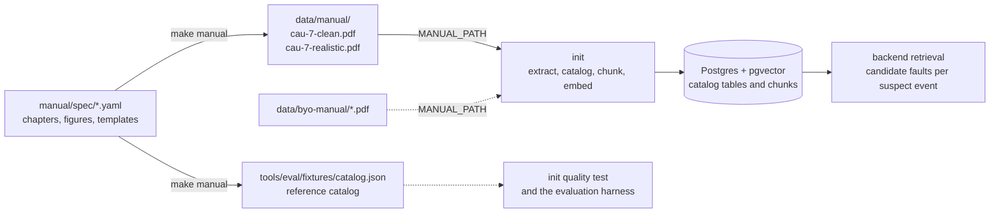
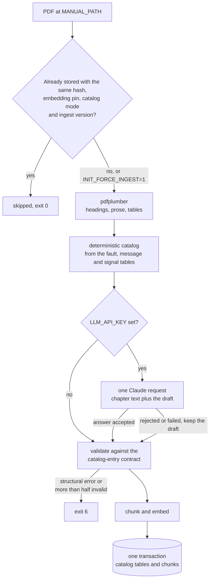
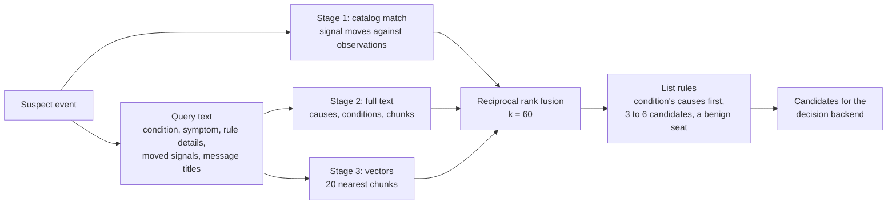

<!-- SPDX-FileCopyrightText: 2026 Meddle S.r.l. -->
<!-- SPDX-License-Identifier: CC-BY-4.0 -->

# The manual and the fault catalog

Every fault the diagnosis can name comes from one machine manual. This guide follows that manual from end to end: the fictional CAU-7 unit it describes, the YAML files it is generated from, the build that renders them into the two committed PDFs, the init step that reads a PDF back into a fault catalog and a retrieval index, the search the backend runs over both for each suspect event, and how to ingest a manual of your own. Read it before you edit anything under `manual/`, when init stops with exit code 6, or when you want to try another manual. What the decision backends do with the candidate faults is in [decision-backends.md](decision-backends.md).



The diagnosis takes its fault catalog from the PDF, never from `faults.yaml`, so what extraction recovers is what the stack knows and its quality stays measurable. The signal and message registries reach the stack by a second road: `make generate` turns `signals.yaml` and `alarms.yaml` into the Modbus register map and the CTRL-7 message triggers the simulator evaluates ([simulation.md](simulation.md)).

## The fictional CAU-7 unit

The CAU-7 Compressed-Air Unit is a compressed-air production unit invented for this repository: an oil-injected single-stage screw compressor with a fixed-speed motor and load/unload regulation, a cyclonic separator with an automatic condensate drain, a twin-tower heatless desiccant dryer, two air reservoirs and a pneumatic panel, all run by the CTRL-7 controller. Its instruction manual is document `CAU7-IOM-EN`, revision 1.0 of 2026-01-15, written in English and published under CC BY 4.0. Neither the machine nor the controller exists: do not use the manual on real equipment ([README](../README.md#disclaimer)).

The unit is built around MetroPT-3, the real compressor recording the stack replays ([dataset.md](dataset.md)). Each of the dataset's 15 variables is a native CAU-7 signal with the same meaning, unit and state logic, so a replayed row needs no mapping, and the setpoints follow the dataset's description: a rated motor current of 7.0 A, a default cut-in of 8.0 bar and a low-pressure switch at 7.0 bar. Everything else was invented for this repository.

| Item                          | Value                                                                                     | Where it is set                       |
| ----------------------------- | ----------------------------------------------------------------------------------------- | ------------------------------------- |
| Drive                         | 4.0 kW fixed-speed motor, rated current 7.0 A, 2950 rpm, 400 V 50 Hz                      | `machine.yaml`, `ratings`             |
| Pressure                      | maximum working pressure 11.0 bar, safety valve 12.0 bar                                  | `machine.yaml`, `ratings`             |
| Delivery                      | 0.45 m³/min free air delivery, two reservoirs of 200 L                                    | `machine.yaml`, `ratings`             |
| Regulation                    | cut-in 8.0 bar and cut-out 10.0 bar by default (parameters P01 and P02)                   | `settings.yaml`                       |
| Low-pressure switch           | closes below 7.0 bar, opens above 7.7 bar                                                 | `machine.yaml`, `hardware_switches`   |
| Dryer                         | pressure dew point −40 °C, purge fraction 15 %                                            | `machine.yaml`, `ratings`             |
| Ambient operating range       | 2 to 40 °C                                                                                | `machine.yaml`, `limits`              |
| Observed cycle, February 2020 | cut-in 8.05 bar, cut-out 10.03 bar, loaded runs of about 109 s, 1.97 load cycles per hour | `machine.yaml`, `reference_operation` |

### Components

`machine.yaml` lists 27 components, each in one of ten subsystems; the same ten names classify the signals and the fault causes. Air enters through the intake filter and the intake and unloading valve, is compressed with injected oil in the screw element, leaves its oil in the separator vessel, and passes the minimum-pressure valve, the aftercooler and the cyclonic separator before the desiccant towers dry it and the reservoirs pass it on to the pneumatic panel. There is no oil pump: the vessel pressure drives the oil through the thermostatic valve, the oil cooler and the oil filter back to the screw element.

| Subsystem          | Components                                                                           |
| ------------------ | ------------------------------------------------------------------------------------ |
| `compressor`       | screw compression element, motor coupling, minimum-pressure valve, safety valve      |
| `intake_unloading` | air intake filter, intake and unloading valve, blow-down valve                       |
| `oil`              | oil separator vessel, thermostatic valve, oil filter, oil level switch               |
| `cooling`          | oil cooler, aftercooler, cooling fan                                                 |
| `separator_drain`  | cyclonic separator, automatic condensate drain                                       |
| `dryer`            | desiccant towers 1 and 2, dryer changeover valves, dryer purge valve, purge silencer |
| `reservoirs`       | air reservoirs, reservoir isolation valve, reservoir inlet flow sensor               |
| `distribution`     | pneumatic panel                                                                      |
| `electrical`       | drive motor                                                                          |
| `control`          | CTRL-7 controller                                                                    |

The file also holds the sensor ranges, the operating limits, the reference conditions and 11 consumables and service kits with invented part codes such as `CAU7-AF-01`. Chapter 2 of the manual carries a hand-drawn system schematic (`manual/figures/system-schematic.svg`) and chapter 3 a drawing of the CTRL-7 front panel (`manual/figures/control-panel.svg`).

### Signals

`signals.yaml` declares 16 signals in the order of the Modbus registers: seven analog, eight digital and one extra. Fifteen name their MetroPT-3 column, verbatim, in `metropt_column`; the extra, `ambient_temperature`, has none and is synthesised by the simulator ([simulation.md](simulation.md)). The manual prints each signal with its panel label, as in "Oil temperature (T1)".

| Tag                            | Panel label | Name                         | MetroPT-3 column  | Group   | Unit | Subsystem          |
| ------------------------------ | ----------- | ---------------------------- | ----------------- | ------- | ---- | ------------------ |
| `discharge_pressure`           | P1          | Discharge pressure           | `TP2`             | analog  | bar  | `compressor`       |
| `line_pressure`                | P2          | Line pressure                | `TP3`             | analog  | bar  | `reservoirs`       |
| `separator_discharge_pressure` | P3          | Separator discharge pressure | `H1`              | analog  | bar  | `separator_drain`  |
| `dryer_purge_pressure`         | P4          | Dryer purge pressure         | `DV_pressure`     | analog  | bar  | `dryer`            |
| `reservoir_pressure`           | P5          | Reservoir pressure           | `Reservoirs`      | analog  | bar  | `reservoirs`       |
| `oil_temperature`              | T1          | Oil temperature              | `Oil_temperature` | analog  | °C   | `oil`              |
| `motor_current`                | I1          | Motor current                | `Motor_current`   | analog  | A    | `electrical`       |
| `intake_closed`                | D1          | Intake valve closed          | `COMP`            | digital | bool | `intake_unloading` |
| `load_valve`                   | D2          | Load solenoid                | `DV_eletric`      | digital | bool | `intake_unloading` |
| `dryer_tower`                  | D3          | Dryer tower in service       | `Towers`          | digital | bool | `dryer`            |
| `regulator_contact`            | D4          | Pressure regulator contact   | `MPG`             | digital | bool | `control`          |
| `low_pressure_switch`          | D5          | Low-pressure switch          | `LPS`             | digital | bool | `reservoirs`       |
| `purge_switch`                 | D6          | Purge pressure switch        | `Pressure_switch` | digital | bool | `dryer`            |
| `oil_level_ok`                 | D7          | Oil level switch             | `Oil_level`       | digital | bool | `oil`              |
| `flow_pulse`                   | D8          | Flow pulse                   | `Caudal_impulses` | digital | bool | `reservoirs`       |
| `ambient_temperature`          | T2          | Ambient temperature          | none (synthetic)  | extra   | °C   | `cooling`          |

Two digital tags follow the polarity the recording shows rather than the one the dataset's description gives: `oil_level_ok` reads 1 while the oil level is above the minimum, and `regulator_contact` reads 1 in its resting state. Each carries a `source_note` that records this, so that nobody corrects it later.

The file also defines the three machine states, `loaded` (`intake_closed` is 0 and `load_valve` is 1), `unloaded` (not loaded, motor current at least 1.0 A) and `off`; six derived quantities the controller computes, such as `continuous_load_time` and `motor_starts_per_hour`; and six behaviours the fault catalog can point at: `load_cycle_rate`, `loaded_run_duration`, `unloaded_pressure_decay`, `cut_out_reached`, `pressure_rise_while_loaded` and `start_current_peak`.

Normal bands per signal and state come from February 2020 alone, the dataset's suggested training month. `manual/tools/derive_bands.py` writes them from the full CSV into `manual/spec/derived/normal-bands.json`, `signals.yaml` copies them, and validator rules B1 and B2 check the copy and its provenance. The ambient band (2, 20 and 40 °C) is authored instead, because the recording has no ambient channel. To derive the bands again once the CSV is downloaded:

```bash
uv run --no-project manual/tools/derive_bands.py --csv "data/metropt3/MetroPT3(AirCompressor).csv"
```

Detection keeps its own thresholds and baselines; they are described in [detection.md](detection.md).

### Controller messages and settings

`alarms.yaml` holds the 35 messages of the CTRL-7 controller. The simulator plays the controller: on every sample it evaluates the 27 messages marked `evaluation: sim` and sets their bits in the Modbus `alarm_bits` register. The other eight are documented in the manual but never appear in `alarm_bits`.

| Type             | Codes          | Bits                | What the manual says it means                                                                                                          |
| ---------------- | -------------- | ------------------- | -------------------------------------------------------------------------------------------------------------------------------------- |
| Warning          | W101–W117 (17) | 0–16                | the unit keeps running                                                                                                                 |
| Shutdown warning | X201–X204 (4)  | 17–20               | the unit keeps running; a shutdown limit is close                                                                                      |
| Shutdown         | S301–S308 (8)  | 21–26 for S301–S306 | the unit stops and cannot start until reset; S307 (emergency stop) and S308 (motor protection relay) are external inputs without a bit |
| Service          | M401–M406 (6)  | none                | a run-hour counter or a calendar interval of a maintenance task has expired; the unit keeps running                                    |

A signal trigger is data, not prose: a state guard, an optional motor-start mask, one condition (a single comparison, or one level of `all` or `any`), a dwell time and a reset rule. A threshold may point at a programmable setting, so the message list of chapter 3 and the parameter list of chapter 4 cannot disagree. Trimmed from `manual/spec/alarms.yaml`, with `effect`, `cause_hint`, `operator_action` and the reset note left out:

```yaml
- code: W104
  type: warning
  bit: 3
  evaluation: sim
  family: oil_temperature_high
  rank: 1
  title: Oil temperature high
  display: OIL TEMP HIGH
  trigger:
    kind: signal
    state: running
    condition: { signal: oil_temperature, op: gt, threshold: { setting: oil_temperature_warning } }
    for_s: 300
  reset:
    mode: auto_hysteresis
    hysteresis: { value: 5, unit: degC }
  related_conditions: [oil_temperature_high]
```

`settings.yaml` holds the 25 programmable parameters P01 to P25, each with a minimum, a default and a maximum: among them the cut-in and cut-out pressures (P01 and P02) and the three oil-temperature limits behind W104, X201 and S301 (P09 to P11, 75, 85 and 95 °C by default). A message family must rise in threshold from warning to shutdown, which validator rule P1 checks.

### Fault conditions and causes

`faults.yaml` is the fault catalog. Its 17 conditions are symptoms as a technician meets them. Its 39 causes are each defined once, with a stable `fault_id`, and listed under one or more conditions, most likely first, with a likelihood (`common`, `occasional` or `rare`) and an optional note that tells the cause apart from its neighbours. The conditions list 81 (condition, cause) pairs, and every condition shares at least one cause with another, so a symptom alone rarely decides the fault.

Three causes are benign, alarming symptoms without a defect: `high_air_demand`, `high_ambient_temperature` and `low_ambient_temperature`. The two air-leak mechanisms MetroPT-3 shows are separate causes: `dryer_purge_leak` keeps the unit loaded with the purge pressure high and the cut-out never reached, while `downstream_air_leak` shows as a faster pressure decay at idle and more frequent, longer load cycles.

| Condition                     | Title                                                         | Typical messages                   | Causes listed |
| ----------------------------- | ------------------------------------------------------------- | ---------------------------------- | ------------- |
| `low_line_pressure`           | Line pressure below setpoint                                  | W101, S305                         | 11            |
| `frequent_cycling`            | Compressor starts and loads too often                         | W108                               | 4             |
| `continuous_load`             | Compressor stays loaded and does not reach cut-out            | W102                               | 7             |
| `purge_pressure_high`         | Dryer purge pressure high, air escaping at the purge silencer | W103                               | 3             |
| `oil_temperature_high`        | Oil temperature high                                          | W104, X201, S301, W109, W116, S306 | 9             |
| `oil_temperature_low`         | Oil temperature stays low, condensate in the oil              | W105, W110, S306                   | 3             |
| `motor_current_high`          | Motor current high                                            | W106, X203, S303                   | 7             |
| `motor_current_low`           | Motor current low under load, delivery low                    | W107                               | 3             |
| `discharge_pressure_high`     | Discharge pressure high, safety valve blows                   | X202, S302, W117                   | 3             |
| `separator_pressure_abnormal` | Separator discharge pressure abnormal                         | W112                               | 2             |
| `water_in_air`                | Condensate or moisture in the delivered air                   | none                               | 5             |
| `oil_in_air`                  | Oil carry-over, high oil consumption                          | W116                               | 5             |
| `no_start`                    | Compressor does not start                                     | S304, S307, S308                   | 6             |
| `no_unload`                   | Compressor does not unload at cut-out                         | X204                               | 5             |
| `reservoir_deviation`         | Reservoir pressure differs from line pressure                 | W113                               | 3             |
| `dryer_changeover_fault`      | Dryer towers do not change over                               | W111, W115                         | 3             |
| `no_flow_signal`              | Flow signal missing                                           | W114                               | 2             |

| Subsystem          | Causes (`fault_id`)                                                                                                                                         |
| ------------------ | ----------------------------------------------------------------------------------------------------------------------------------------------------------- |
| `compressor`       | `minimum_pressure_valve_fault`, `separator_element_clogged`, `separator_element_damaged`, `airend_bearing_wear`, `airend_element_wear`                      |
| `intake_unloading` | `intake_filter_clogged`, `intake_valve_not_opening`, `intake_valve_not_closing`, `unloader_solenoid_fault`, `blowdown_valve_fault`                          |
| `oil`              | `scavenge_line_blocked`, `oil_level_high`, `oil_level_low`, `wrong_oil_grade`, `oil_filter_clogged`                                                         |
| `cooling`          | `high_ambient_temperature` (benign), `low_ambient_temperature` (benign), `oil_cooler_fouled`, `cooling_fan_failure`, `thermostatic_valve_stuck`             |
| `separator_drain`  | `condensate_drain_stuck_open`, `condensate_drain_blocked`                                                                                                   |
| `dryer`            | `dryer_purge_leak`, `purge_silencer_damaged`, `tower_changeover_valve_fault`, `dryer_controller_fault`, `desiccant_exhausted`, `purge_switch_fault`         |
| `reservoirs`       | `reservoir_isolation_valve_closed`, `flow_sensor_fault`                                                                                                     |
| `distribution`     | `downstream_air_leak`, `high_air_demand` (benign)                                                                                                           |
| `electrical`       | `supply_voltage_low_or_unbalanced`, `motor_overload_relay_tripped`                                                                                          |
| `control`          | `regulator_contact_fault`, `oil_temperature_sensor_fault`, `emergency_stop_active`, `line_pressure_transducer_fault`, `reservoir_pressure_transducer_fault` |

A cause carries a summary, its signal moves, ordered checks, a remedy, and the parts, maintenance tasks and components involved. Trimmed from `manual/spec/faults.yaml`, with the condition's `symptom`, the notes, and the cause's `summary`, `checks` and `remedy` left out:

```yaml
conditions:
  - id: oil_temperature_high
    title: Oil temperature high
    alarms: [W104, X201, S301, W109, W116, S306]
    signals: [oil_temperature, ambient_temperature, motor_current]
    causes:
      - { fault_id: oil_cooler_fouled, likelihood: common }
      - { fault_id: high_ambient_temperature, likelihood: common }
      - { fault_id: oil_level_low, likelihood: common }
      # six more causes
causes:
  - fault_id: oil_cooler_fouled
    name: Oil cooler fouled
    subsystem: cooling
    benign: false
    signal_moves:
      - { signal: oil_temperature, direction: rises, phase: any, onset: gradual }
      - { signal: ambient_temperature, direction: unchanged, phase: any }
      - { behaviour: load_cycle_rate, direction: unchanged }
      - { signal: motor_current, direction: unchanged, phase: loaded }
    parts: [cooler_cleaning_kit]
    maintenance: [oil_cooler_cleaning]
    components: [oil_cooler, aftercooler, cooling_fan]
```

The per-condition notes tell neighbouring causes apart. Under `oil_temperature_high`, `oil_cooler_fouled` carries "The rise is slow and shows in every state, including the idle and stopped phases." and `high_ambient_temperature` carries "The room itself is warm; the difference between oil and cooling air is the same as always." The move notes reappear in the rendered sentences under [The signal-move vocabulary](#the-signal-move-vocabulary).

### Maintenance

`maintenance.yaml` holds 13 tasks, each with an interval in running hours, months or a calendar period (whichever comes first), consumables, tools, safety notes, steps and post-service checks. Seven of them raise one of the six service messages; M403 covers both the oil filter and the separator element.

| Task                         | Name                                | Interval                         | Service message |
| ---------------------------- | ----------------------------------- | -------------------------------- | --------------- |
| `daily_checks`               | Daily checks                        | daily                            | none            |
| `weekly_checks`              | Weekly checks                       | weekly                           | none            |
| `air_filter_service`         | Air intake filter service           | 2,000 h or 12 months             | M402            |
| `oil_change`                 | Oil change                          | 4,000 h or 12 months             | M401            |
| `oil_filter_change`          | Oil filter change                   | 4,000 h                          | M403            |
| `separator_element_change`   | Separator element change            | 8,000 h or 24 months             | M403            |
| `oil_cooler_cleaning`        | Oil cooler and aftercooler cleaning | 2,000 h or 6 months              | none            |
| `condensate_drain_service`   | Condensate drain service            | 2,000 h                          | M405            |
| `dryer_desiccant_inspection` | Dryer desiccant inspection          | 8,000 h, replacement at 16,000 h | M404            |
| `dryer_purge_valve_service`  | Purge valve and silencer service    | 4,000 h                          | none            |
| `safety_valve_test`          | Safety valve test                   | 12 months                        | none            |
| `drive_coupling_inspection`  | Drive coupling inspection           | 8,000 h                          | none            |
| `annual_inspection`          | Annual inspection                   | 12 months                        | M406            |

## The YAML source of truth

Everything the manual says about the machine lives as data under `manual/`, and nobody edits a number by hand in a chapter or in a PDF: prose and tables are rendered from the files below. [`manual/README.md`](../manual/README.md) documents every field.

| Path                                    | What it holds                                                                                                        | Licence                                                |
| --------------------------------------- | -------------------------------------------------------------------------------------------------------------------- | ------------------------------------------------------ |
| `manual/build.yaml`                     | document metadata, chapter list, variant knobs, lint allowlist; the `pdf:` block at the end belongs to the PDF build | CC BY 4.0                                              |
| `manual/spec/machine.yaml`              | identity, ratings, limits, reference conditions, sensors, components, parts, reference operation, the ten subsystems | CC BY 4.0                                              |
| `manual/spec/signals.yaml`              | the 16 signals in register order, machine states, derived signals, behaviours, normal bands                          | CC BY 4.0                                              |
| `manual/spec/settings.yaml`             | the 25 programmable parameters                                                                                       | CC BY 4.0                                              |
| `manual/spec/alarms.yaml`               | the 35 controller messages and their triggers                                                                        | CC BY 4.0                                              |
| `manual/spec/faults.yaml`               | the 17 conditions and 39 causes                                                                                      | CC BY 4.0                                              |
| `manual/spec/maintenance.yaml`          | the 13 maintenance tasks                                                                                             | CC BY 4.0                                              |
| `manual/spec/derived/normal-bands.json` | the bands and reference cycle derived from February 2020, never edited by hand                                       | CC BY 4.0                                              |
| `manual/spec/schemas/*.schema.json`     | one JSON Schema per file, plus the shared `$defs` of `common.schema.json`                                            | Apache-2.0                                             |
| `manual/content/*.md`                   | one Markdown partial per chapter                                                                                     | CC BY 4.0                                              |
| `manual/figures/*.svg`                  | the two hand-drawn figures                                                                                           | CC BY 4.0                                              |
| `manual/templates/`                     | the HTML templates and stylesheets of the PDF build                                                                  | Apache-2.0                                             |
| `manual/fonts/`                         | the six IBM Plex Sans and IBM Plex Mono faces, and `fonts.json` with their pinned hashes                             | SIL OFL 1.1 for the faces, Apache-2.0 for `fonts.json` |
| `manual/tools/`                         | loader, validator, content checks, preview and band derivation                                                       | Apache-2.0                                             |

### Rules every file follows

- **One schema per file.** JSON Schema draft 2020-12 with `$id: urn:fdp:manual:<name>:v1` and `additionalProperties: false` throughout. Every YAML file opens with its two SPDX comments and `schema_version: 1`, and every JSON file has a `.license` sidecar.
- **Identifiers.** Ids are snake_case, `^[a-z][a-z0-9_]{1,39}$`, unique within a file and across the whole of `manual/spec`, so a signal and a cause never share one (part ids are the single exception). Alarm codes match `^[WXSM][0-9]{3}$`, parameter numbers `^P[0-9]{2}$` and panel labels `^[PTID][0-9]$`.
- **Numbers live in typed fields.** Every value carries a unit from a closed list: `bar`, `degC`, `A`, `V`, `kW`, `Hz`, `s`, `min`, `h`, `months`, `L`, `m3_per_min`, `mm`, `m`, `kg`, `dBA`, `rpm`, `percent`, `count`, `per_hour`, `bar_per_min` and `bool`. A text field never types a number with a unit (rule N1); it calls the shared Jinja namespace of `manual/tools/context.py` instead, as in `{{ sig('dryer_purge_pressure') }}` or `{{ ref('task:oil_cooler_cleaning') }}`. Cause summaries and move notes contain no digit at all (rule N2).
- **Thresholds point at settings.** A message threshold is `{setting: <id>, offset?}` or an inline `{value, unit}`.
- **Order carries meaning in two places.** `signals.yaml` is the register order, and a condition's cause list runs from the most to the least likely cause.
- **Quote `"off"`.** YAML 1.1 reads a bare `off`, `on`, `yes` or `no` as a boolean. `manual/tools/load.py` resolves booleans the YAML 1.2 way, and quoting keeps the files right under a plain `yaml.safe_load` too.
- **Chapters are templates.** A partial in `manual/content/NN-<slug>.md` is rendered by Jinja before Markdown: every heading carries an explicit anchor (`## Message list {#sec:message-list}`), numbers come from template calls such as `{{ q(machine.ratings.oil_fill_volume) }}`, generated tables from macros such as `{{ tables.troubleshooting() }}`, and a comment is written `{## … ##}`, because `{# … #}` would swallow the heading anchors.

### The `fault_id` registry

A cause's `fault_id` is its identity everywhere in the stack: the decision's `choice`, the retrieval candidates, tickets, the evaluation scenarios and the fault injections of `packages/ground-truth/data/injections.json` all key on it. The registry of 17 conditions and 39 causes was fixed before the file existed, so the rest of the stack could use the ids early. An id never changes once merged: a cause that turns out wrong is marked `deprecated: true` with a `successor` id, two fields the faults schema accepts. Chapter 8 prints every condition id and fault id verbatim and never breaks one over two lines, because init has to read them back from the page.

### The signal-move vocabulary

Every cause states in plain words which signals move and in which direction. The manual never gives a numeric fault signature; those belong to the fault injector ([simulation.md](simulation.md#fault-injection)). A move targets exactly one signal or one behaviour, with a direction from a closed list that depends on the target:

| Target         | Directions                                                                             |
| -------------- | -------------------------------------------------------------------------------------- |
| Analog signal  | `rises`, `falls`, `high`, `low`, `unchanged`, `fluctuates`, `near_zero`, `not_venting` |
| Digital signal | `on`, `off`, `stays_on`, `stays_off`, `toggles`, `no_pulse`                            |
| Behaviour      | `higher`, `lower`, `longer`, `shorter`, `faster`, `slower`, `not_reached`, `unchanged` |

A move may add a `phase` (`loaded`, `unloaded`, `off`, `any` or `start`), an `onset` (`sudden`, `gradual`, `intermittent` or `sustained`) and a `note`. `move_text()` in `manual/tools/context.py` renders each move as one sentence, and the PDF prints the sentences in the `Signals:` row of the cause's entry in chapter 8. The moves of `oil_cooler_fouled`, as the reference catalog `tools/eval/fixtures/catalog.json` holds them:

```text
Oil temperature (T1) rises gradually in every state. The rise shows in the idle and stopped phases too, not only under load.
Ambient temperature (T2) is unchanged in every state. The room is as warm as it always was, which rules out a hot site.
How often the compressor loads per hour is unchanged. The unit is not working any harder than before.
Motor current (I1) is unchanged while loaded.
```

The contracts use the same words: `packages/contracts/schemas/v1/common.schema.json` pins the direction enum and the ten subsystems, so the catalog init extracts from the PDF keeps the manual's vocabulary unchanged. Adding a direction or a behaviour is a schema change the backend's matcher has to follow.

### No real brands

Ground rule 2 ([CONTRIBUTING.md](../CONTRIBUTING.md#ground-rules)) forbids real manufacturer names, product lines, controller names, part numbers and model codes anywhere in the repository, and rule 1 forbids committing, quoting or paraphrasing a real manual. CAU-7, CTRL-7 and the `CAU7-…` part codes are invented. Three scans enforce the brand rule against one hashed list, `tools/blocklist/data/blocklist.sha256`, so that no brand name is stored in plain text:

- `make blocklist` (`uv run fdp-blocklist scan`, part of `make lint`) scans the repository's files, including the text of the committed PDFs.
- Rule N3 of `manual/tools/content_checks.py` scans the YAML text fields, the chapter partials and the text of the SVG figures.
- Check 6 of `make check-manual` scans the built PDFs.

The scans match names, not meaning: whether a fictional name resembles a real trademark, and whether a chapter's text echoes a real manual, are questions for human review.

### Validating the sources

```bash
make check-manual-spec
```

This runs `manual/tools/validate.py --strict --report` and `manual/tools/content_checks.py --variant both`, the same two commands the `manual-spec` CI job runs. The tools sit outside the uv workspace on purpose (`uv run --no-project --with-requirements manual/tools/requirements.txt …`), so they work in a fresh checkout without `make install`. Every finding prints one line, `RULE file:pointer message`, and any finding fails the run.

| Rules  | What they check                                                                                                                                                                                                                                           |
| ------ | --------------------------------------------------------------------------------------------------------------------------------------------------------------------------------------------------------------------------------------------------------- |
| S1, S2 | every file validates against its schema; ids, codes, bits, parameter numbers, panel labels and MetroPT-3 columns are unique                                                                                                                               |
| R1–R5  | every reference resolves; every cause is listed and every condition has a cause; every evaluable message is reachable from a condition; every setting is used; service messages and maintenance tasks agree                                               |
| P1–P6  | message families rise in threshold; thresholds sit inside the sensor ranges and clear of the normal bands; setting constraints hold; the ambient limits and the document block agree across files                                                         |
| M1, M2 | exactly the 15 MetroPT-3 columns are mapped; the register order is analog, digital, extra                                                                                                                                                                 |
| B1, B2 | the YAML copies `normal-bands.json`, whose provenance is the pinned CSV and February 2020                                                                                                                                                                 |
| A1–A5  | at least 12 conditions, 30 causes, 5 conditions sharing a cause and 2 benign causes; every subsystem with a signal has a cause; `downstream_air_leak` sits under `low_line_pressure` and `frequent_cycling`; every cause has a move, a check and a remedy |
| N1–N3  | no hand-typed number with a unit in text, no digit in summaries and move notes, no brand                                                                                                                                                                  |
| C1–C6  | both variants render and every cross-reference resolves; anchors, table macros, word budget, fact placement and the SVG rules                                                                                                                             |
| L1     | an SPDX header on every file                                                                                                                                                                                                                              |

## Building the PDFs

`make manual` turns the sources into both PDFs inside a pinned container. It is a development command, not part of `make up`: the stack ingests the committed PDF. The build, `tools/manual-build` (`fdp-manual-build`), validates the YAML with the loader of `manual/tools`, runs every chapter partial and every YAML text field through the Jinja namespace of `manual/tools/context.py`, renders the Markdown with markdown-it-py (attributes and footnotes), assembles one HTML document per variant from `manual/templates/` and renders it with WeasyPrint 70.0. It builds the clean variant, then the realistic one, then exports the reference catalog and writes the build manifest.

### What the build produces

| File                               | Contents                                                                                              | In Git |
| ---------------------------------- | ----------------------------------------------------------------------------------------------------- | ------ |
| `data/manual/cau-7-clean.pdf`      | the clean variant, 50 A4 pages                                                                        | yes    |
| `data/manual/cau-7-realistic.pdf`  | the realistic variant, 47 A4 pages; the default `MANUAL_PATH`                                         | yes    |
| `data/manual/build-manifest.json`  | the audit trail: image, tool versions, input and output hashes                                        | yes    |
| `tools/eval/fixtures/catalog.json` | the reference catalog exported from the YAML, with the pages each cause is printed on in each variant | yes    |
| `data/manual/cau-7-scanned.pdf`    | the image-only OCR test copy of `make manual-scanned`                                                 | no     |
| `tools/manual-build/.build/`       | intermediate HTML and native builds                                                                   | no     |

A variant outside 28 to 56 pages fails the build with exit code 3; the design target is 30 to 50. The ten chapters, with the tables and figures the build takes from the sources:

| Chapter | Title                                 | Generated from the sources                                                                                   |
| ------- | ------------------------------------- | ------------------------------------------------------------------------------------------------------------ |
| 1       | Safety precautions                    | none                                                                                                         |
| 2       | General description                   | the system schematic                                                                                         |
| 3       | Controller CTRL-7                     | the message list (`alarms.yaml`) and the control panel drawing                                               |
| 4       | Programmable settings                 | the parameter list (`settings.yaml`)                                                                         |
| 5       | Installation and reference conditions | none                                                                                                         |
| 6       | Operation                             | none                                                                                                         |
| 7       | Maintenance                           | the schedule and the procedures (`maintenance.yaml`)                                                         |
| 8       | Problem solving                       | one section per condition, 8.3 to 8.19, with its causes (`faults.yaml`)                                      |
| 9       | Technical data and signal list        | technical data, signal list, normal bands, spare parts (`machine.yaml`, `signals.yaml`, `normal-bands.json`) |
| 10      | Appendix                              | the revision history (`build.yaml`)                                                                          |

### The clean and realistic variants

Both variants print the same content from the same templates. `manual/build.yaml` sets the knobs that make the realistic variant harder to read back, and the realistic variant is what the stack ingests by default.

| Knob             | `clean`                                                                                                                                  | `realistic`                                                                                                                                                       |
| ---------------- | ---------------------------------------------------------------------------------------------------------------------------------------- | ----------------------------------------------------------------------------------------------------------------------------------------------------------------- |
| Layout           | single column                                                                                                                            | chapters 2, 6 and 7 in two columns                                                                                                                                |
| Tables           | long tables split into smaller ones with their own headings: messages by type, signals by group, one troubleshooting table per condition | one table each for the messages, the signals and the troubleshooting entries, running over page breaks with the header repeated; a group row opens each condition |
| Fact placement   | every limit in a table                                                                                                                   | five facts only in the prose (their table cells read "see text"), three only in the tables                                                                        |
| Cross-references | "section 8.4"                                                                                                                            | "8.4" plus a footnote "Section 8.4, title"                                                                                                                        |
| Units            | SI                                                                                                                                       | SI with the imperial value in parentheses (psi, °F, US gal, lb, in, ft, cfm, hp)                                                                                  |
| Page furniture   | page number                                                                                                                              | document title and running chapter at the top; revision stamp, short machine name and "Page N of M" at the bottom                                                 |
| Body size        | 9.5 pt                                                                                                                                   | 9 pt                                                                                                                                                              |

In both variants chapter 8 prints each (condition, cause) pair as an identification band (condition id, fault id, subsystem) above a detail row (possible cause with its likelihood, what to check, remedy, see also). The first condition that lists a cause prints its full entry, closed by a `Signals:` row with the move sentences; a later condition prints the name, the likelihood and its own note and points back to the full entry. The ids never wrap, so all 81 pairs can be read back from the extracted text.

### The scanned copy

`make manual-scanned` rasterises the realistic PDF into `data/manual/cau-7-scanned.pdf`, an image-only copy for exercising an OCR path. Every page is rendered at 200 dpi in 8-bit grey, rotated by up to ±0.8°, given Gaussian noise of six grey levels, a blur of 0.6 px, a vertical shading of up to ±4 % and a shift of up to 3 px, and stored as a JPEG with no text layer (`tools/manual-build/src/fdp_manual_build/scanned.py`). Page i draws its distortions from a generator seeded with 7 + i, so the output depends only on the source, the resolution and the seed. At about 13 MB the file is gitignored, and it stays out of the manifest unless `--update-manifest` is passed. These numbers are fixed in the code: the `raster_dpi`, `skew_deg` and `noise` keys of the disabled `scanned` variant in `build.yaml` are not read. init has no OCR path, so it rejects this copy (see [Reading the PDF](#reading-the-pdf)).

### The pinned container and reproducible builds

The committed PDFs come out of the image of `tools/manual-build/Dockerfile`, never off a developer's machine, because WeasyPrint's line breaking depends on the Pango and HarfBuzz versions, which differ between macOS and Linux.

- **Pinned image.** `python:3.13.15-slim-trixie` by digest, uv 0.12.17 and the Python dependencies of `uv.lock`. The installed versions of the five system libraries (`libpango-1.0-0`, `libpangoft2-1.0-0`, `libharfbuzz0b`, `libharfbuzz-subset0`, `fontconfig`) are written into the image at build time and recorded in the manifest.
- **Invoking user.** The container runs as you, with the checkout mounted at `/work`, so the outputs are yours.
- **Fixed rendering.** A fixed PDF identifier (`pdf.pdf_identifier` in `build.yaml`), PDF 1.7, subset fonts, no hinting and `hyphens: manual`, so Pyphen's dictionaries are never loaded. The six IBM Plex faces are checked against the SHA-256 values in `manual/fonts/fonts.json` before anything is rendered, so a missing font is an error and never a silent fallback.
- **One date.** The only date the build writes into a PDF is `source_date_epoch` from `manual/build.yaml` (1768435200, 2026-01-15T00:00:00Z, the revision date), as the `dcterms.created` metadata. The build reads no clock. The image and `make manual` also export `SOURCE_DATE_EPOCH=1767225600` to the environment.
- **The manifest.** `data/manual/build-manifest.json` records whether the build ran in the container, the image and its system packages, the tool versions, the SHA-256 of every input file, and for each PDF its byte hash, the hash of its extracted text (the pdfplumber page texts joined with form feeds), its page count and its size. `wall_time` is the only field that differs between two builds.
- **Check 9.** A second build must give the same text hash and page count as the committed PDFs; the bytes are compared too and reported. The check also recomputes the input hashes, which catches a source edited without `make manual`, and rejects forms, scripts and attachments.

### Make targets

| Target                   | What it does                                                                                                                                               | Needs                                                                                                                              |
| ------------------------ | ---------------------------------------------------------------------------------------------------------------------------------------------------------- | ---------------------------------------------------------------------------------------------------------------------------------- |
| `make manual-image`      | Build the pinned image the committed PDFs come from (`MANUAL_IMAGE`, default `fdp-manual-build:local`)                                                     | Docker                                                                                                                             |
| `make manual`            | Build the image, then rebuild both PDFs, the manifest and `catalog.json` in it                                                                             | Docker                                                                                                                             |
| `make manual-native`     | Rebuild the PDFs natively into `tools/manual-build/.build/native`, without the catalog, for iteration only                                                 | WeasyPrint's native libraries; on macOS the Makefile points `DYLD_FALLBACK_LIBRARY_PATH` at `/opt/homebrew/lib` (`WEASYPRINT_ENV`) |
| `make manual-html`       | Write the intermediate HTML of both variants to `tools/manual-build/.build/` and stop, for a browser                                                       | the uv workspace                                                                                                                   |
| `make manual-scanned`    | Write `data/manual/cau-7-scanned.pdf` in the pinned image                                                                                                  | Docker                                                                                                                             |
| `make check-manual-spec` | Validate `manual/spec` and the chapters                                                                                                                    | uv                                                                                                                                 |
| `make check-manual`      | Run the eleven acceptance checks and write `reports/manual-check.json` and `reports/manual-check.md`; `REBUILT_DIR=<dir>` hands check 9 a finished rebuild | the uv workspace; without `REBUILT_DIR`, check 9 rebuilds in process and needs WeasyPrint's native libraries                       |

### Acceptance checks

`make check-manual` (`fdp-manual-check`) runs the eleven acceptance checks of the manual. A report-level check never fails the run.

| #   | Check                | Level  | Passes when                                                                                                            |
| --- | -------------------- | ------ | ---------------------------------------------------------------------------------------------------------------------- |
| 1   | `schema`             | MUST   | every YAML file validates and every id is unique                                                                       |
| 2   | `integrity`          | MUST   | every reference resolves and no cause is orphaned                                                                      |
| 3   | `coverage.clean`     | MUST   | every fault id, condition id, tag id, message code and threshold is in the text pdfplumber extracts from the clean PDF |
| 4   | `tables.clean`       | MUST   | at least 90 % of the troubleshooting rows come back from the clean PDF as rows                                         |
| 5   | `coverage.realistic` | REPORT | the measure of check 3 on the realistic PDF, with the misses listed                                                    |
| 6   | `blocklist`          | MUST   | no brand in the manual sources, the build tool or the PDFs                                                             |
| 7   | `plausibility`       | MUST   | thresholds inside sensor ranges, warning below shutdown, units consistent                                              |
| 8   | `ambiguity`          | MUST   | the catalog meets the sharing, coverage and benign-cause rules                                                         |
| 9   | `reproducibility`    | MUST   | a rebuild gives the same text as the committed PDFs                                                                    |
| 10  | `reuse`              | MUST   | SPDX headers everywhere, REUSE lint clean                                                                              |
| 11  | `metropt_fit`        | MUST   | all 15 MetroPT-3 variables map to a signal and the bands use the first month only                                      |

The last recorded run after rebuilding the committed PDFs passed all ten MUST checks: 222 of 222 facts in the clean PDF, 81 of 81 troubleshooting rows, 220 of 222 facts in the realistic PDF (the two misses are prose-only facts, by design) and a byte-identical container rebuild.

### After changing the sources

Validate the sources, rebuild, then run the checks. The second container build is the one CI makes for check 9 (job `check-manual` in `.github/workflows/ci.yml`):

```bash
make check-manual-spec                                  # the YAML and the chapters
make manual                                             # both PDFs, the manifest and catalog.json
docker run --rm --user "$(id -u):$(id -g)" -v "$PWD":/work fdp-manual-build:local build --out-dir /work/.rebuild --no-catalog
make check-manual REBUILT_DIR=.rebuild                  # the eleven checks against that rebuild
pnpm --filter @fdp/eval run validate -- --catalog-only  # the reference catalog, as the evaluation reads it
make test-init-quality                                  # init still extracts the whole catalog
```

`.rebuild/` is gitignored. Commit the PDFs, `build-manifest.json` and `catalog.json` together. A PDF whose bytes changed has a new SHA-256, so the next `make up` ingests it again on its own. When the page count moves, read the rendered manual again, because every later page may have moved.

## How init extracts the fault catalog

init (`tools/init`, command `fdp-init`) runs once on every `make up`, before the simulator and the backend start. After waiting for Postgres and the broker, migrating the database and verifying the dataset, it checks the embedding pin, fills the model cache and ingests the PDF at `MANUAL_PATH`: text and tables, the fault catalog, chunks and embeddings, all written to Postgres. How to run each step by hand, every variable and every exit code are in [`tools/init/README.md`](../tools/init/README.md).



### When init ingests

init skips the ingest when the database already holds a manual with the same SHA-256 whose latest ingest run succeeded with the same embedding pin (model, revision, dimension, pooling and token limit of `packages/contracts/embedding.json`), the same catalog mode (`llm` when `LLM_PROVIDER` is `anthropic` and `LLM_API_KEY` is set, `tables` otherwise) and the same ingest version (`INGEST_VERSION` in `tools/init/src/fdp_init/__init__.py`, bumped whenever extraction, chunking, the catalog or the storage change). Any change re-ingests on the next start: a PDF with different bytes, a new pin, setting or clearing `LLM_API_KEY`, or a new ingest version. `INIT_FORCE_INGEST=1` re-ingests regardless, on every start while it is set.

### Reading the PDF

Extraction uses pdfplumber 0.11.10 (MIT); PyMuPDF is excluded by ground rule 9, because of its AGPL licence. There is no OCR path: a document with fewer than 200 characters of text fails with exit code 6, reported as holding no extractable text, which is what the scanned copy looks like to init. A file whose name ends in `-clean.pdf` or `-realistic.pdf` is recorded as that variant, any other as `byo`.

- **Two passes.** The pages are read once with the table regions left out, for headings and prose, and once whole, for the page-ordered text the self-check and the LLM pass use.
- **Page furniture.** A line in the top or bottom 9 % of the page that repeats, digits aside, on at least 40 % of the pages and at least three of them is a running header or footer and is dropped; so is a page number in any common form.
- **Columns.** A page is two-column when at least 60 % of its body lines sit left or right of a gutter at 47 to 53 % of the page width; its lines are then read left column first, band by band. A line pdfplumber glued across the gutter is split back into its halves.
- **Headings.** A line is a heading when it starts with `N`, `N.k` or `N.k.m` followed by a capitalised title, is bold or at least 1 pt larger than the body text (measured outside the tables), and continues the numbering: `8.2` needs `8` before it. A cross-reference such as "See 8.3" never qualifies. Every heading becomes a row of `app.catalog_sections`, and every catalog entry cites its section by the bare number, such as `8.7`.
- **Prose.** Paragraphs, lists and footnotes are grouped under the innermost heading, hyphenated line ends are joined, and footnotes are kept as `[note n]` blocks, because the realistic variant states some limits only in prose.

### Tables and header-synonym profiles

Tables are found by their ruled borders (pdfplumber's `lines` strategy), after the page background WeasyPrint paints as a rectangle is removed. A page with no ruled table but a line that reads like a header (it names at least three distinct columns of one profile, and their words make up at least 60 % of the line) is tried with the `text` strategy, and the result is flagged. A table's kind comes from its header row, matched against the profiles in `tools/init/src/fdp_init/manual/profiles.py`. Header cells are compared lower-cased, without punctuation and with whitespace collapsed, so `Fault id`, `fault-id` and `FAULT ID.` are the same words. A header must name at least two known columns and the columns its profile requires; when several profiles match, the one that recognises the most columns wins, ties going to the troubleshooting table.

| Kind            | Required columns                        | Recognised header words                                                                                                                                                                                                                                                                                                                                                                                                                                                                                                                                    |
| --------------- | --------------------------------------- | ---------------------------------------------------------------------------------------------------------------------------------------------------------------------------------------------------------------------------------------------------------------------------------------------------------------------------------------------------------------------------------------------------------------------------------------------------------------------------------------------------------------------------------------------------------- |
| Troubleshooting | cause, remedy                           | id: `id`, `fault id`, `fault`, `ref`, `reference`, `code`, `no` · cause: `cause`, `possible cause`, `probable cause`, `likely cause` · subsystem: `subsystem`, `system`, `area` · signals: `signals`, `signal behaviour`, `signal behavior`, `signal moves`, `indications`, `what the signals do` · checks: `check`, `checks`, `what to check`, `verification`, `how to check` · remedy: `remedy`, `action`, `corrective action`, `solution`, `what to do` · alarms: `alarms`, `messages`, `related alarms` · condition: `condition`, `symptom`, `problem` |
| Alarms          | code, and one of title, type or trigger | code: `code`, `message code`, `id`, `no` · title: `title`, `message`, `text`, `description`, `meaning` · type: `type`, `class`, `category`, `kind` · trigger: `trigger`, `condition`, `cause` · threshold: `threshold`, `limit`, `setpoint` · delay: `delay`, `delay s`, `time` · reset: `reset`, `reset rule`, `acknowledge` · signal: `signal`, `tag`                                                                                                                                                                                                    |
| Parameters      | parameter, min, default, max            | parameter: `parameter`, `setting`, `name`, `no`, `id` · `min`, `minimum` · `default`, `factory` · `max`, `maximum` · `unit` · `description`                                                                                                                                                                                                                                                                                                                                                                                                                |
| Signals         | tag, unit                               | tag: `tag`, `signal`, `id`, `tag id` · label: `label`, `panel label` · description: `description`, `meaning` · `unit` · kind: `kind`, `type` · range: `range`, `min`, `max` · source column: `source column`, `metropt column`, `column` · normal: `normal`, `normal band`, `loaded`, `unloaded`, `off` · rate: `sample rate`, `rate`                                                                                                                                                                                                                      |
| Maintenance     | task, interval                          | task: `task`, `activity`, `item`, `id` · interval: `interval`, `every`, `period`, `hours` · consumables: `consumables`, `parts` · `procedure` · post checks: `post service checks`, `check after`                                                                                                                                                                                                                                                                                                                                                          |

A table no profile recognises is kept as `other`: its rows still become chunks, but the catalog builder does not read it. Two layouts of the CAU-7 troubleshooting table are folded before anything else reads it: the identification band and the detail row of one entry become one record, and the `Signals:` row across the table becomes that record's signals cell.

### Tables that span pages

The realistic variant prints the troubleshooting entries, the messages and the signals as single tables that run over page breaks, and the clean variant lets a long per-condition table break too. init joins the fragments back:

- A table that ends in the bottom 20 % of a page and one that starts in the top 25 % of the next page are one table when their ruled column counts match and the second repeats the first's header, or prints no header at all. A heading between them refuses the merge, which keeps two conditions of the clean variant apart.
- A row a page break cut in two is rejoined: a continuation row whose key cell is empty and which holds no fault id is appended to the row above it.
- A row whose first cell reads `8.k Title` and whose other cells are empty is a group row: it names the condition of the rows below it in the realistic variant, as the heading above each table does in the clean one. Both paths give the same catalog.

### Identifiers

| Identifier   | Default pattern                                                                                            | Override                       | Where init reads it                                                                                                                                |
| ------------ | ---------------------------------------------------------------------------------------------------------- | ------------------------------ | -------------------------------------------------------------------------------------------------------------------------------------------------- |
| Fault id     | `\b[a-z][a-z0-9]*(?:_[a-z0-9]+)+\b`, snake_case with at least one underscore so ordinary words never match | `CATALOG_FAULT_ID_PATTERN`     | the id column of a troubleshooting row, else the first match in its cause cell                                                                     |
| Condition id | the fault id pattern                                                                                       | `CATALOG_CONDITION_ID_PATTERN` | a condition column, the realistic group row or the clean section heading, all of which print it after the title; failing that, a slug of the title |
| Alarm code   | `\b[WXSM][0-9]{3}\b`                                                                                       | `CATALOG_ALARM_CODE_PATTERN`   | the code column of the message table and any code a troubleshooting row prints                                                                     |

Ids are stored verbatim. A troubleshooting row without a fault id is kept as a chunk only and counted in the report's `rows_without_fault_id`. As a self-check that needs no reference, init compares the fault ids the tables recovered with the ids the page text prints (`table_recall_estimate`) and logs a warning below 0.9; it never fails on it.

### The deterministic catalog

The default catalog builder, `tools/init/src/fdp_init/catalog/deterministic.py`, reads the tables and invents nothing: a field the page does not print stays empty, and the same PDF bytes give the same catalog, byte for byte.

- **Conditions** come from the groups of the troubleshooting tables, with the symptom text the group row or the section prints.
- **Causes** come from the rows: the title from the head of the cause cell (`Name (likelihood, benign)`), the description from the rest of it, the checks and the remedy split into steps, the alarm codes the row prints, and the signal moves from the signals cell. A move sentence is resolved to a tag id through every signal table in the document, or to a behaviour through the wording `move_text()` prints for it (listed in `profiles.py`), with the direction, phase and onset read back into the vocabulary above.
- **Subsystem and benign flag** come from the printed subsystem cell and the printed `benign` marker; without them, keywords infer the subsystem (default `compressor`) and words such as "ambient" or "demand" mark a cause benign.
- **Messages and signals** come from the message and signal tables.
- **Not filled.** The `maintenance` and `parameters` arrays of the catalog stay empty, and `machine` is the constant CAU-7 and CTRL-7 record, because no page prints one. The printed likelihood is parsed but not stored yet: every (condition, cause) pair of an extracted catalog reads `unknown`.

### The optional LLM pass

When `LLM_PROVIDER` is `anthropic` and `LLM_API_KEY` is set, init sends one request per ingest to Claude through the `anthropic` SDK 1.7.0: the troubleshooting and message chapters of the extracted text plus the deterministic draft, asking for the corrected, complete catalog as structured output shaped by the contracts `catalog` schema. The model is `LLM_MODEL` (default `claude-opus-5`), with up to 16,000 output tokens, a timeout of `INIT_LLM_TIMEOUT_S` (120 s) and two client retries. Anthropic is the only provider this pass supports; any other `LLM_PROVIDER` leaves the deterministic catalog in place.

The answer replaces the draft only when all five rules hold: the model stopped normally; the catalog validates with no structural error and no invalid entry; every fault id fits the id pattern and is printed in the manual; at least 90 % of the draft's fault ids survive; and every section it cites exists. Otherwise, or when the request fails, init stores the draft and writes the reason to the report's `catalog.fallback_reason` (`auth`, `rate_limit`, `timeout`, `status_<code>`, `connection`, `invalid_output`, `refusal`, `truncated`, `missing_ids`, `unknown_ids`, `sdk_missing`, `sdk_error` or `stop_<reason>`). The LLM pass can improve the catalog but never fails the run. Its token use lands in the report; no cost is computed. With a key set, text from the manual leaves the stack ([security.md](security.md)).

### Validation, storage and the report

`tools/init/src/fdp_init/catalog/validate.py` validates each entry against `packages/contracts/schemas/v1/catalog-entry.schema.json` and the whole document against `catalog.schema.json`. A structural error (no conditions, a condition id declared twice, a cause listed twice under one condition) stops the run with exit code 6. An entry that fails only on the pattern of an id is kept with a warning. Any other invalid entry is stored and counted, and more than half of the entries invalid stops the run with exit code 6.

init first records the document in `app.manual_documents` and a running ingest in `app.ingest_runs`, then writes the rest in one transaction: `app.catalog_sections`, `app.catalog_conditions`, `app.catalog_causes` (one row per cause, linked to its conditions through `app.catalog_condition_causes`), `app.catalog_checks`, `app.catalog_remedies`, `app.catalog_signal_moves`, `app.catalog_alarms`, `app.catalog_signals` and `app.chunks`. The same transaction deletes every other manual, so exactly one is active afterwards; a failure rolls back, leaves the previous manual in place, marks the run failed and exits with code 8. The view `app.v_catalog_entries` puts each cause back together in the `catalog-entry` shape the backend reads.

The report goes to `app.ingest_runs.stats`, to the log as one `ingest.report` event and to `reports/init-ingest-<started_at>.json`. Its `extraction`, `catalog`, `chunks` and `embedding` sections say what was read and stored, and `warnings` names what to look at. `docker compose run --rm init report` prints the latest one; the meaning of each exit code is in the [README](../README.md#troubleshooting).

### Exporting the catalog

`fdp-init export-catalog --manual <pdf> --out <json>` writes the catalog the deterministic path extracts as a contracts `catalog` document, with no database, broker or key. A document that does not validate is refused with exit code 6 and nothing is written. The evaluation harness scores such a file with `--catalog file:<path>`, beside the reference catalog ([evaluation.md](evaluation.md)).

### The quality test

`make test-init-quality` runs the extraction and the deterministic builder on both committed PDFs and compares the result with the reference catalog `tools/eval/fixtures/catalog.json`, which `make manual` exports from the YAML. It is the only reader of that file on the init side; `tools/init/src` never opens it. The test (`tools/init/tests/quality/test_extraction_quality.py`) writes its metrics to `reports/init-extraction-quality.json`:

| Metric                                           | Measures                                                                                          |
| ------------------------------------------------ | ------------------------------------------------------------------------------------------------- |
| `fault_id_recall`                                | reference fault ids the extraction found                                                          |
| `condition_recall`                               | reference conditions found, by printed id or title slug                                           |
| `cause_title_match_rate`                         | cause titles whose normalised words match the reference with a Jaccard similarity of at least 0.8 |
| `checks_non_empty_rate`, `remedy_non_empty_rate` | causes that came back with checks and with a remedy                                               |
| `alarm_code_recall`, `declared_alarm_recall`     | message codes per cause occurrence, and the codes the message table declares                      |
| `signal_move_recall`, `signal_id_recall`         | signal moves (target and direction) and signal ids                                                |
| `row_recovery`                                   | reference (condition, cause) pairs the catalog carries                                            |

The clean PDF must give a fault-id recall of 100 % and a row recovery of at least 90 %. The realistic PDF is reported, with a hard floor of 70 % fault-id recall, and each PDF must export a valid contracts catalog. The recorded result on the committed PDFs is 1.0 on every metric for both variants: 39 of 39 fault ids, 81 of 81 rows and 151 of 151 signal moves.

## Chunks, embeddings and retrieval

### Chunks

`tools/init/src/fdp_init/chunk/chunker.py` cuts the manual into retrieval units counted with the embedding model's own tokenizer:

- **Text chunks** gather a section's paragraphs up to 200 tokens and never exceed the hard maximum of 248 (the model's 256 minus 8). A longer paragraph is split at sentence boundaries with one sentence of overlap. A bulleted block becomes a `list` chunk, and a footnote joins the paragraph that calls it when the call is found on its page.
- **Table chunks** are one per row, of every table, written as `header: cell` pairs. A row is one retrieval unit, so an over-long row is truncated rather than split. Troubleshooting rows carry their `fault_id` and message rows their `alarm_code`; every row records its `table_kind`.
- **Every chunk opens with its section number and title**, so an answer can cite it. A block printed before the first heading has no section and is left out.

A troubleshooting-row chunk, trimmed from the golden chunk list of init's six-page mini-manual fixture, `tools/init/tests/fixtures/mini-manual/golden/chunks-clean.json`:

```json
{
  "kind": "table",
  "section_ref": "8.2.3",
  "section_title": "Oil temperature high oil_temperature_high",
  "content": "8.2.3 Oil temperature high oil_temperature_high — Oil temperature high oil_temperature_high\nFault id: oil_cooler_fouled | Possible cause: Oil cooler fouled. … | Subsystem: cooling | Signals: Oil temperature (T1) rises gradually in every state. | Checks: … | Remedy: …",
  "tokens": 146,
  "fault_id": "oil_cooler_fouled",
  "table_kind": "troubleshooting"
}
```

### The embedding model

`packages/contracts/embedding.json` pins the model for both sides, and both embedders read every model fact from it. The one other place the dimension is written down is the `vector(384)` column of `app.chunks`, which the contracts tests hold equal to the pin.

| Field                      | Value                                                                                                                    |
| -------------------------- | ------------------------------------------------------------------------------------------------------------------------ |
| Model                      | `sentence-transformers/all-MiniLM-L6-v2`, Apache-2.0                                                                     |
| Revision                   | `1110a243fdf4706b3f48f1d95db1a4f5529b4d41`                                                                               |
| Dimension                  | 384                                                                                                                      |
| Pooling                    | mean over the attention mask, then L2 normalisation                                                                      |
| Token limit                | 256                                                                                                                      |
| Query and passage prefixes | none                                                                                                                     |
| Files                      | `onnx/model.onnx` (90,405,214 bytes) and `tokenizer.json` (466,247 bytes), each pinned by SHA-256                        |
| Runtimes                   | onnxruntime 1.30.0 and tokenizers 0.23.2 in Python; onnxruntime-node 1.30.0 and @huggingface/tokenizers 0.2.0 in Node.js |

### Where the model runs

|             | init (Python)                                                                                              | backend (Node.js)                                                                                                                                                                         |
| ----------- | ---------------------------------------------------------------------------------------------------------- | ----------------------------------------------------------------------------------------------------------------------------------------------------------------------------------------- |
| Code        | `tools/init/src/fdp_init/embed/`                                                                           | `apps/backend/src/retrieval/embedder.ts`                                                                                                                                                  |
| Embeds      | every chunk, once per ingest                                                                               | one query per retrieval                                                                                                                                                                   |
| Model files | downloads them from Hugging Face at the pinned revision and verifies their SHA-256; exit code 7 on failure | loads them at start-up from the same cache, mounted read-only, after verifying them; a missing or mismatched file stops the start unless `EMBEDDER_ALLOW_DOWNLOAD=true` (default `false`) |
| Tuning      | `INIT_EMBED_BATCH_SIZE` (32), `INIT_ORT_THREADS` (the smaller of 4 and the CPU count)                      | batches of 8                                                                                                                                                                              |

The cache layout is `MODEL_CACHE_DIR/<model_id with "/" replaced by "--">/<revision>/<file>`, each file with a `.sha256.json` sidecar that saves re-hashing it. Compose sets `MODEL_CACHE_DIR` to `/models` for both services, the `model-cache` volume; `fdp-init` run on the host caches in `data/models/`. The first start downloads about 91 MB, and `docker compose run --rm init model` fills the cache on its own. `make reset` deletes the volume, `make reset-db` keeps it. The parity fixture `packages/contracts/fixtures/embeddings/all-minilm-l6-v2.json` (eight sentences) holds both runtimes to a cosine of at least 0.9999.

Changing the model is a change to `embedding.json`, which re-ingests on the next start because the skip check compares the pin. A different dimension also needs a migration for the `vector(384)` column of `app.chunks`, created in `db/migrations/0003_manual_chunks.sql`: init exits with code 2 while the column and the pin disagree.

### The pgvector index

The database is PostgreSQL 18 with pgvector 0.8.6 (`pgvector/pgvector:0.8.6-pg18-trixie`).

- `app.chunks.embedding` is a `vector(384)` column with the HNSW index `chunks_embedding_hnsw` (`vector_cosine_ops`, `m = 16`, `ef_construction = 64`), created by `db/migrations/0003_manual_chunks.sql`.
- `app.chunks.tsv` is a generated `to_tsvector('english', …)` of the section title and the content, with a GIN index. `app.catalog_causes` (name, summary, remedy) and `app.catalog_conditions` (title and symptom text) carry the same kind of column.
- `db/migrations/0008_chunk_links.sql` adds `fault_id`, `alarm_code` and `table_kind` to `app.chunks`, so a troubleshooting-row chunk leads straight to its cause; a prose chunk reaches a cause through its section number.
- While the active document holds fewer than 5,000 chunks, the backend turns index scans off inside its own transaction and searches exactly, so the same query always returns the same order.

### From a suspect event to candidate faults

When detection raises a suspect event ([detection.md](detection.md)), the backend's retriever (`apps/backend/src/retrieval/`) returns at most six candidate causes from the active manual, the one whose latest ingest run succeeded. It runs three searches over the same event and fuses their rankings.



1. **Query** (`query.ts`). One sentence built from the event: the title of its condition (`symptom_key`) and that condition's symptom text, the sentences of the rules that fired, the names of the signals that moved (at most twelve, most abnormal first) and the titles of the active controller messages. Digits are stripped, so no reading and no code enters the search.
2. **Catalog match** (`match.ts`). Each cause's signal moves are judged against the event's observations; the score is the matches minus half the contradictions, divided by the number of moves. A cause filed under the event's condition gets +0.15, one filed under a co-occurring condition +0.05.
3. **Full text** (`hybrid.ts`). The query's words, joined with `or`, go through `websearch_to_tsquery('english', …)` over the `tsv` columns of the causes, the conditions and the chunks, ranked by `ts_rank_cd`; a cause keeps its best hit, and the top 20 causes go on.
4. **Vectors** (`hybrid.ts`, `embedder.ts`). The query is embedded with the pinned model, and the 20 nearest chunks by cosine distance are mapped to their causes; a cause keeps its best chunk.
5. **Fusion** (`index.ts`). Reciprocal rank fusion with k = 60, because the three scores are not on one scale; ties break on `fault_id`.
6. **List rules** (`index.ts`). The causes the manual files under the event's condition come first, each part in fused order. The list is cut at six and filled up to three, so "none of these" always competes with something, and when none of the six is benign, the best-ranked benign cause within the first twelve takes the last seat.

The catalog is read through `app.v_catalog_entries` and cached for 60 seconds, and an entry that fails the `catalog-entry` contract is left out of it. Each candidate is a catalog entry plus its stage scores (`catalog`, `text`, `vector`, `rrf`). The evaluation harness runs the same assembly without a database, with a keyword overlap in place of the full-text stage and no vector stage ([evaluation.md](evaluation.md)). What each decision backend does with the candidates is in [decision-backends.md](decision-backends.md).

## Bringing your own manual

init can ingest another PDF instead of the CAU-7 manual. Use only manuals you are allowed to use, and keep them out of Git: `data/byo-manual/` is gitignored apart from its `.gitkeep`, and ground rule 1 ([CONTRIBUTING.md](../CONTRIBUTING.md#ground-rules)) keeps third-party manuals out of the repository, text extracted from them and index chunks included. With `LLM_API_KEY` set, init sends the manual's troubleshooting and message chapters to Anthropic, one request per ingest ([security.md](security.md)).

### Steps

1. Copy the PDF into `data/byo-manual/`, the directory Compose mounts read-only into the init container at `/data/byo-manual`.
2. Set `MANUAL_PATH=data/byo-manual/<file>.pdf` in `.env`. Relative paths resolve against `/` inside the container.
3. Run `make up`. The file's hash differs, so init ingests it and replaces the stored manual once the new one is stored. To start from an empty database instead, run `make reset-db && make up`, which keeps the model cache, or `make reset && make up` as the [README](../README.md#data-and-the-manual) does, which deletes the model cache too.
4. Read the result with `make logs` or `docker compose run --rm init report`, or in `reports/init-ingest-<started_at>.json`. The report's `catalog` section counts the conditions, causes and ids that were read and lists invalid entries and id warnings; `extraction` holds the table counts and `table_recall_estimate`.

To ingest the same file again, for example after changing the extraction profiles, set `INIT_FORCE_INGEST=1`; it applies to every start while it is set, so set it back to `0` afterwards.

### What may need adapting

The deterministic path reads a manual that follows the CAU-7 conventions; a different manual may need profile edits rather than code.

| init expects                                                                                                                     | If your manual differs                                                                                                                                                                                    |
| -------------------------------------------------------------------------------------------------------------------------------- | --------------------------------------------------------------------------------------------------------------------------------------------------------------------------------------------------------- |
| Selectable text                                                                                                                  | A scanned manual without a text layer fails with exit code 6: there is no OCR path.                                                                                                                       |
| Numbered headings (`8`, `8.2`, `8.2.3`) set in bold or larger type                                                               | Without them no text gets a section, and text outside a section is not chunked.                                                                                                                           |
| Ruled tables whose header row uses the words of the profiles                                                                     | Add your header words to `tools/init/src/fdp_init/manual/profiles.py`. An unruled table is found only when a line reads like a header, and an unrecognised one is chunked but not read into the catalog.  |
| A fault id printed in every troubleshooting row, and each condition id printed beside its title                                  | Set `CATALOG_FAULT_ID_PATTERN`, `CATALOG_CONDITION_ID_PATTERN` or `CATALOG_ALARM_CODE_PATTERN`. A row without a fault id becomes a chunk only; a condition without a printed id gets a slug of its title. |
| Ids in the contracts grammar, `^[a-z][a-z0-9_]{1,39}$`                                                                           | init stores other ids with a warning, but the backend drops every entry that fails the `catalog-entry` contract, so those causes never become candidates.                                                 |
| Sentences saying which signals move, in the signal-move vocabulary, naming signals from a signal table with tag and unit columns | Every catalog entry needs at least one move. Without them most entries are invalid and init exits with code 6. The LLM pass may fill moves from the text.                                                 |
| A subsystem column and a `(likelihood, benign)` marker in the cause cell                                                         | Keywords infer the subsystem, falling back to `compressor`, and a benign cause is recognised only by words such as "ambient" or "demand".                                                                 |

Compose passes none of the three `CATALOG_*_PATTERN` variables to init. Add them to the `environment` of the `init` service in `compose.yaml`, or run the ingest on the host (after `make install`) against a stack started with `make up-dev`, which publishes Postgres on port 5432:

```bash
POSTGRES_HOST=localhost LOG_FORMAT=text MANUAL_PATH=data/byo-manual/<file>.pdf CATALOG_FAULT_ID_PATTERN='<pattern>' uv run --package fdp-init fdp-init ingest
```

On the host, relative paths resolve against the repository root and the model is cached in `data/models/`, a download of its own. To see what the deterministic path makes of the file without touching the database, run `fdp-init export-catalog --manual data/byo-manual/<file>.pdf --out <json>`: it writes the catalog, or names the schema problems that stop it.

### What stays CAU-7

Only the manual changes. The simulator still replays the CAU-7 signals, the detection rules still name CAU-7 conditions as an event's symptom (`symptom_key`, such as `low_line_pressure`), and the catalog match of retrieval, which the rules backend scores with too, compares moves by signal id. A manual for another machine is therefore searched by its text and its vectors, while the catalog match and the condition-first rule help only where its ids coincide with the CAU-7's.

## Further reading

Code and data:

- [`manual/README.md`](../manual/README.md): the data model, the validator's flags and rules, and the handover to the PDF build.
- [`tools/manual-build/README.md`](../tools/manual-build/README.md), `tools/manual-build/Dockerfile` and `manual/templates/`: the build, its image and its templates.
- [`tools/init/README.md`](../tools/init/README.md): running init, its variables and exit codes, and the bring-your-own steps.
- `tools/init/src/fdp_init/manual/`, `tools/init/src/fdp_init/catalog/`, `tools/init/src/fdp_init/chunk/` and `tools/init/src/fdp_init/embed/`: extraction, the catalog, chunks and embeddings.
- `apps/backend/src/retrieval/`: the query, the three stages, the fusion and the catalog loader.
- [`packages/contracts/embedding.json`](../packages/contracts/embedding.json), [`catalog-entry.schema.json`](../packages/contracts/schemas/v1/catalog-entry.schema.json) and [`catalog.schema.json`](../packages/contracts/schemas/v1/catalog.schema.json): the embedding pin and the catalog contracts.
- `db/migrations/0003_manual_chunks.sql`, `db/migrations/0004_catalog.sql` and `db/migrations/0008_chunk_links.sql`: the tables init writes and retrieval reads.

Related guides: [architecture.md](architecture.md), [decision-backends.md](decision-backends.md), [detection.md](detection.md), [simulation.md](simulation.md), [dataset.md](dataset.md), [evaluation.md](evaluation.md), [security.md](security.md) and [development.md](development.md).
