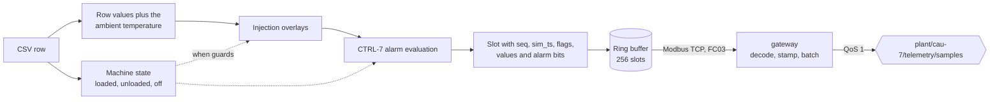
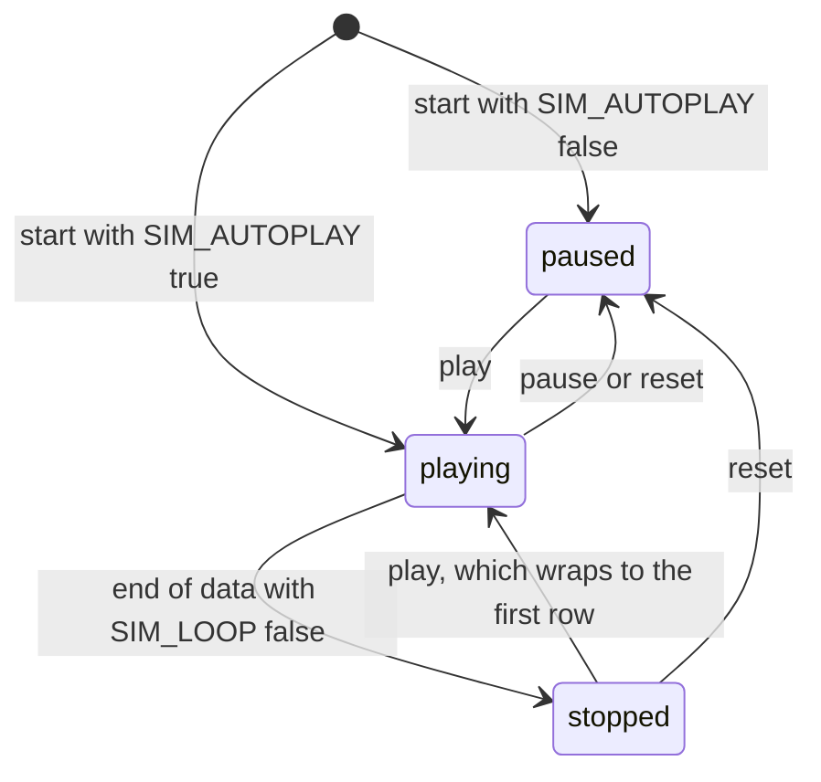
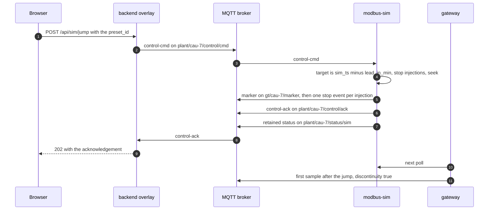

<!-- SPDX-FileCopyrightText: 2026 Meddle S.r.l. -->
<!-- SPDX-License-Identifier: CC-BY-4.0 -->

# Simulation and fault injection

This guide covers the machine side of the stack: `modbus-sim`, which replays MetroPT-3 as a read-only Modbus TCP device and applies fault injections, and `gateway`, which polls that device and publishes the samples over MQTT. Read it to learn what each register holds, how simulated time moves, what a jump or an injection does to the replay, and how to drive the replay from a script. The recording itself, its failure table and the preset list are in [dataset.md](dataset.md); the full reference of routes and topics is [api.md](api.md).

Both services come from one Go module, `services/modbus`: two binaries, `cmd/modbus-sim` and `cmd/gateway`, built from one `Dockerfile`. The simulator is the machine, so it knows which fault it injects. The gateway is an edge connector that stamps and forwards; it knows nothing about injections. One sample's path through the two:



## The emulated Modbus device

`modbus-sim` answers Modbus TCP on port 5020 inside the Compose network, and Compose publishes that port on the host as `MODBUS_PORT` (5020 by default). The device is unit id 1 and exposes holding registers only, read with function code 03 (FC03). Registers are big-endian 16-bit words, and a value that spans several registers puts its high word first.

The device is read-only in both directions. Writes to the holding registers (FC06, FC16), requests for coils, discrete inputs or input registers (FC01, FC02, FC04, FC05, FC15) and reads for another unit id are all answered with exception 01, illegal function. A read of more than 125 registers is refused with exception 03, illegal data value, and one that runs past address 9215 with exception 02, illegal data address. The server takes at most `MODBUS_MAX_CLIENTS` (5) clients at once and drops a session that stays idle for 30 s.

### Register model

The register space holds a header, a ring buffer of samples and reserved areas that read as zero. The addresses are hand-written in `services/modbus/internal/regmap/layout.go`:

| Address   | Field          | Type   | Meaning                                                               |
| --------- | -------------- | ------ | --------------------------------------------------------------------- |
| 0–1       | `head_seq`     | uint32 | Sequence number of the newest complete slot; 0 until the first sample |
| 2–5       | `sim_ts_now`   | uint64 | The simulated clock, epoch milliseconds UTC                           |
| 6         | `replay_state` | uint16 | 0 stopped, 1 playing, 2 paused                                        |
| 7         | `replay_speed` | uint16 | 1 to 3600                                                             |
| 8         | `ring_slots`   | uint16 | 256                                                                   |
| 9         | `slot_regs`    | uint16 | 32                                                                    |
| 10–11     | `ring_base`    | uint32 | 1024                                                                  |
| 12        | `map_major`    | uint16 | Major version of the register map, 1                                  |
| 13        | `map_minor`    | uint16 | Minor version of the register map, 0                                  |
| 14–1023   | reserved       |        | Read as 0                                                             |
| 1024–9215 | ring buffer    |        | 256 slots of 32 registers                                             |

Every command rewrites the whole header. While samples flow, the emit loop also refreshes `sim_ts_now`, the state and the speed, no more often than every 100 ms of wall time, and `head_seq` changes with every sample.

### The ring buffer

Sample `seq` lives in the slot that starts at `1024 + (seq mod 256) × 32`:

| Offset | Field                 | Type   | Encoding                                                           |
| ------ | --------------------- | ------ | ------------------------------------------------------------------ |
| 0–1    | `seq`                 | uint32 | From 1, never reset while the process lives                        |
| 2–5    | `sim_ts`              | uint64 | Timestamp of the source row, epoch milliseconds UTC                |
| 6      | `flags`               | uint16 | Bit 0 `discontinuity`, bit 1 `missing`                             |
| 7–13   | seven analog signals  | int16  | `round(value × scale)`, in `signals.yaml` order                    |
| 14–21  | eight digital signals | uint16 | 0 or 1, in `signals.yaml` order                                    |
| 22     | `ambient_temperature` | int16  | °C × 100, the synthetic extra                                      |
| 23–24  | `alarm_bits`          | uint32 | Bit _i_ is set while the controller message with bit _i_ is active |
| 25–31  | reserved              |        | 0                                                                  |

The simulator writes the 32 slot registers and then `head_seq` under one write lock, and serves each Modbus request under a read lock, so a reader never sees a half-written slot. It never waits for a reader: a client that falls 256 samples behind finds a slot whose `seq` is not the one it expected, which is how the gateway detects loss. At 3600× a 10-second row is due every 2.8 ms, so the ring holds about 710 ms of samples.

`seq` restarts only with the process; no pause, jump, reset or loop wrap resets it. `missing` is set when a numeric field of the source row was empty, NaN, infinite or unparsable, and the affected signals then keep their previous value; the UCI file has no such row. `discontinuity` is described in [Gaps and the discontinuity flag](#gaps-and-the-discontinuity-flag).

### Value encoding

An analog value is multiplied by its scale, rounded to the nearest integer and clamped to the int16 range; a reader divides the signed register by the same scale. Pressures use a scale of 1000 (0.001 bar per step), temperatures and the motor current 100 (0.01 °C and 0.01 A). A digital signal is 1 or 0. The codec is `services/modbus/internal/regmap/codec.go`.

### The register map from `signals.yaml`

The signal part of the map is generated, never written by hand, so the manual, the simulator and the gateway cannot disagree about a tag. `make generate` runs `pnpm --filter @fdp/contracts generate`, whose `packages/contracts/scripts/generate-regmap.ts` reads `manual/spec/signals.yaml`, `alarms.yaml` and `settings.yaml` and writes three committed files:

- `packages/contracts/generated/register-map.json`, the canonical map;
- `packages/contracts/src/generated/register-map.ts`, for the backend and the frontend;
- `services/modbus/internal/regmap/register_map_gen.go`, for the two Go binaries.

Offsets follow fixed rules: seven analog signals at 7–13, eight digital signals at 14–21, one synthetic signal at 22 and the alarm bits at 23–24. `pnpm --filter @fdp/contracts check-drift` regenerates everything and fails when a committed file differs, and a Go test compares `layout.go` with the JSON. The map as generated today:

| Offset | Tag (telemetry key)            | Label | MetroPT-3 column  | Unit | Scale |
| ------ | ------------------------------ | ----- | ----------------- | ---- | ----- |
| 7      | `discharge_pressure`           | P1    | `TP2`             | bar  | 1000  |
| 8      | `line_pressure`                | P2    | `TP3`             | bar  | 1000  |
| 9      | `separator_discharge_pressure` | P3    | `H1`              | bar  | 1000  |
| 10     | `dryer_purge_pressure`         | P4    | `DV_pressure`     | bar  | 1000  |
| 11     | `reservoir_pressure`           | P5    | `Reservoirs`      | bar  | 1000  |
| 12     | `oil_temperature`              | T1    | `Oil_temperature` | °C   | 100   |
| 13     | `motor_current`                | I1    | `Motor_current`   | A    | 100   |
| 14     | `intake_closed`                | D1    | `COMP`            |      | 1     |
| 15     | `load_valve`                   | D2    | `DV_eletric`      |      | 1     |
| 16     | `dryer_tower`                  | D3    | `Towers`          |      | 1     |
| 17     | `regulator_contact`            | D4    | `MPG`             |      | 1     |
| 18     | `low_pressure_switch`          | D5    | `LPS`             |      | 1     |
| 19     | `purge_switch`                 | D6    | `Pressure_switch` |      | 1     |
| 20     | `oil_level_ok`                 | D7    | `Oil_level`       |      | 1     |
| 21     | `flow_pulse`                   | D8    | `Caudal_impulses` |      | 1     |
| 22     | `ambient_temperature`          | T2    | none, synthetic   | °C   | 100   |

No Go code names a tag: the replay finds each CSV column through `Signal.Column`, the codec places each value through `Signal.Offset` and the gateway publishes `values[Signal.Tag]`, so a tag renamed in `signals.yaml` reaches the wire after `make generate` without a code change. A signal added in the slot's reserved area raises `map_minor`; a changed scale or a removed signal raises `map_major`, and the gateway refuses a device whose major differs from its own. What the signals mean is in [dataset.md](dataset.md#the-15-variables).

### Controller alarms

The simulator also plays the unit's controller, CTRL-7. For every sample, `services/modbus/internal/ctrl7` evaluates the 27 controller messages that carry a bit in `alarms.yaml` (W101 to W117, X201 to X204 and S301 to S306) over the values after the injection overlays, and sets `alarm_bits`; the gateway turns the bits into each sample's `alarms` list. Delays run on simulated time, so a message fires at the same sample at 1× and at 3600×. A discontinuity restarts pending delays, resets the derived quantities and releases latched messages. The alarms are informational: a shutdown message never stops the replay, because the recording already happened. What each message means is in [manual.md](manual.md).

### Synthetic ambient temperature

MetroPT-3 records no ambient temperature, so the simulator computes one and writes it at offset 22 (`services/modbus/internal/sim/ambient.go`):

```text
ambient(t) = 15 + 7·sin(2π·(doy − 105)/365) + 4·sin(2π·(hour − 9)/24) + n(t)   °C
```

`doy` is the day of the year, `hour` the fractional UTC hour, and `n(t)` a noise in ±0.3 °C derived from a hash of the timestamp. The daily mean is about 9 °C in February and 22 °C in August, with ±4 °C over the day. The value is a pure function of `sim_ts`: the same instant gives the same value at any speed and after any jump. The _High ambient temperature_ injection adds to it.

### Health and status of the simulator

`modbus-sim` serves `GET /healthz` and `GET /status` on `SIM_HTTP_PORT` (8081), which `make up-dev` publishes on the host. Both return `ok`, `csv_indexed`, `modbus_listening`, `mqtt_connected`, `state`, `speed`, `sim_ts` and `head_seq`. `/healthz` answers 200 only when the three readiness flags hold and 503 otherwise; `/status` always answers 200. The endpoint comes up before the CSV is indexed, so a slow index shows as 503 rather than as a refused connection. The broker is required: `modbus-sim run` exits when `MQTT_URL` does not answer within 60 s, since without it nothing can drive the machine. The distroless image has no `curl`, so the Compose healthcheck runs the binary's own `probe` subcommand.

## The replay clock

### Reading the CSV

`METROPT_CSV` names the file to replay: the full recording by default, or a slice such as `/data/fixtures/metropt3/ci-slice.csv` ([dataset.md](dataset.md#the-ci-slice)). The file is never loaded into memory. At start-up the simulator reads it once, parsing only the `timestamp` column, and keeps an index entry every 256 rows plus the first and last timestamps, the row count and every step between rows longer than 60 s. A seek is then a binary search on that index, a file seek and a scan of at most 256 rows. Over the full recording the pass takes about a second on a local disk; the Compose healthcheck allows a 60 s start period for slower volumes.

Columns are found by name through the register map, so their order does not matter and extra columns, the unnamed index column included, are ignored. Timestamps such as `2020-02-01 00:00:00` carry no zone and are read as UTC; they must strictly increase, and a row that does not is a fatal error of the file. The `index` and `dump` subcommands run the same code without starting the machine. From `services/modbus`, on the CI slice:

```text
$ go run ./cmd/modbus-sim index --csv ../../data/fixtures/metropt3/ci-slice.csv
rows: 5882
first: 2020-02-01T00:00:00.000Z
last: 2020-07-31T06:59:56.000Z
index entries: 23
gaps: 3
  2020-02-01T05:59:56.000Z -> 2020-06-05T06:00:02.000Z (10800006 s)
  2020-06-05T13:59:58.000Z -> 2020-07-31T01:00:01.000Z (4791603 s)
  2020-07-31T02:09:04.000Z -> 2020-07-31T05:57:50.000Z (13726 s)
```

`go run ./cmd/modbus-sim dump --csv <file> --from <ISO instant> --n <rows>` prints the rows from an instant as JSON lines, in SI units, with the ambient temperature the machine would add.

### Simulated time and speed

The simulated clock is an anchor pair. While the replay plays, `sim_now = anchor_sim + (wall_now − anchor_wall) × speed`; while it is paused or stopped, the clock stays at `anchor_sim`. Every command that changes the state, the speed or the position re-anchors the clock at the current instant, so simulated time never jumps sideways when the pace changes. A row is emitted as soon as the clock passes its timestamp. After a command the loop catches up without sleeping, and it checks for commands between rows, so a pause or a jump takes effect within one row.

`REPLAY_SPEED` sets the speed at start-up (600 by default, ten simulated minutes per wall second) and is also the speed `reset` restores. Any integer from 1 (real time) to 3600 (one simulated hour per wall second) is accepted, at start-up and through `set_speed`; at 3600× the simulator emits about 360 samples per second. The speed slider of the Simulation panel offers 1, 2, 5, 10, 30, 60, 120, 300, 600, 1200, 1800 and 3600 (`apps/frontend/src/features/simulation/speed.ts`).

Every sample carries the timestamp of its source row as `sim_ts`. Wall-clock time appears only as the `wall_ts` of each message envelope.

### Play, pause, stop and loop



The simulator starts at the first row with `head_seq` 0. `compose.yaml` sets `SIM_AUTOPLAY` to false, so the replay waits for **Play**; `compose.ci.yaml` sets it to true. Pause freezes the clock where it is, and play resumes from there. `jump` and `set_speed` leave the state as it is. `reset` stops every injection, returns to the first row, pauses and restores `REPLAY_SPEED`.

At the end of the data `SIM_LOOP` decides. When it is true, the default and the Compose setting, the replay wraps to the first row, publishes a `loop` marker on `gt/cau-7/marker` and keeps playing, so `stopped` is never reached. When it is false, the replay stops with the clock on the last row, and a later `play` wraps as a loop does.

### Gaps and the discontinuity flag

The recording has holes: 331 steps between consecutive rows are longer than 60 s ([dataset.md](dataset.md#gaps)). The replay does not wait through them. When the next row is more than 60 s after the previous one, the clock jumps to it and that row carries `discontinuity`. The 60 s threshold is a constant, `replay.GapThresholdMs`, the same guard detection and the evaluation use.

`flags.discontinuity` is set on exactly these samples:

- the first sample after the process starts;
- the first row after a source gap longer than 60 s;
- the first sample after a `jump`, a `reset`, a loop wrap or a `play` from `stopped`.

It is not set when play follows pause, because the clock kept its position. Frozen-logger blocks are rows the unit really logged, so they are replayed as recorded; recognising them is detection's job. On the backend a discontinuity resets detection's windows and ends the open episodes ([detection.md](detection.md)).

### Configuration of the simulator

| Variable             | Default                                      | Meaning                                                                     |
| -------------------- | -------------------------------------------- | --------------------------------------------------------------------------- |
| `METROPT_CSV`        | `/data/metropt3/MetroPT3(AirCompressor).csv` | The CSV to replay                                                           |
| `REPLAY_SPEED`       | `600`                                        | Speed at start-up and after `reset`, 1 to 3600                              |
| `SIM_AUTOPLAY`       | `false`                                      | Start playing at once; `compose.ci.yaml` sets `true`                        |
| `SIM_LOOP`           | `true`                                       | Wrap to the first row at the end of the data                                |
| `MODBUS_BIND`        | `0.0.0.0`                                    | Interface the Modbus listener binds                                         |
| `MODBUS_PORT`        | `5020`                                       | Port of the Modbus listener; in Compose, the host port published for it     |
| `SIM_HTTP_PORT`      | `8081`                                       | Port of `/healthz` and `/status`                                            |
| `GT_DIR`             | `/gt`                                        | Directory of `presets.json`, `injections.json` and `metropt3-failures.json` |
| `MQTT_URL`           | `mqtt://mqtt:1883`                           | The broker                                                                  |
| `MQTT_SIM_PASSWORD`  | `sim` in Compose                             | Broker password; the username is always `sim`                               |
| `UNIT_ID`            | `cau-7`                                      | Topic segment and envelope field                                            |
| `MODBUS_MAX_CLIENTS` | `5`                                          | Concurrent Modbus clients                                                   |
| `LOG_LEVEL`          | `info`                                       | Log level                                                                   |

In Compose, only `METROPT_CSV`, `REPLAY_SPEED`, `MODBUS_PORT`, `MQTT_SIM_PASSWORD` and `LOG_LEVEL` come from `.env`; the others keep their defaults or the values `compose.yaml` sets. The image copies `packages/ground-truth/data/` into `/gt` at build time, so a change to a preset or an injection needs a rebuild, which `make up` does.

## The gateway

`gateway` reads registers, decodes them with the generated map, stamps each sample with the simulated time of its slot and publishes JSON. It computes no machine state, evaluates no alarm and knows nothing about injections. Of the module it imports only `internal/regmap` and `internal/mqttio`, and the tests in `services/modbus/internal/arch` fail when it reaches the simulator, the injection engine or the replay, when it calls a Modbus write function, or when anything it ships mentions `gt/`, `inject` or `GT_DIR`.

### Polling the ring

Each poll cycle reads the 14 header registers, works out which samples are new and reads up to three whole slots, 96 registers, in one request, never across the end of the ring. The cases it handles:

- **First connection.** The gateway adopts the device's `head_seq` and starts from there; samples written before it connected are not replayed.
- **The simulator restarted.** `head_seq` went backwards, so the gateway follows it and counts one in `sim_restarts_total`; nothing is lost, because the samples it waited for no longer exist.
- **More than 256 samples behind.** The oldest samples it wanted were overwritten. It counts them in `dropped_total` and resumes at the oldest slot the ring still holds.
- **A slot with an unexpected `seq`.** The device overwrote it during the read. The gateway keeps what it already accepted, counts a resync and reads the header again. Losses are counted in one place only, so `dropped_total` is exactly the number of sequence numbers that were never published.
- **A different `map_major`.** The gateway refuses to decode the device's slots, logs it once and looks at the header again every 5 s; its health check fails meanwhile.

After a cycle that returned samples it polls again at once; only when there is nothing new does it sleep `POLL_INTERVAL_MS` (50 ms by default). A Modbus error closes the connection and reopens it with a backoff that starts at 200 ms and doubles up to 5 s, spread by ±20 %. The gateway keeps its position, so the ring rule counts what the device overwrote meanwhile.

### Publishing telemetry

Samples go to `plant/cau-7/telemetry/samples`, QoS 1 and not retained, in batches of 1 to `GATEWAY_MAX_BATCH` samples (25, the schema maximum). A batch is published when it is full or as soon as a poll finds fewer than three new slots, so a gateway that has caught up publishes small batches without delay. Analog values are the register divided by its scale, digital values are booleans, `values` is keyed by the tag ids of the register map, and `alarms` lists the active controller codes in bit order. The gateway's golden test file, `services/modbus/internal/gateway/testdata/telemetry-samples.golden.json`:

```json
{
  "schema": "urn:fdp:schema:telemetry-samples:v1",
  "unit_id": "cau-7",
  "wall_ts": "2026-03-20T10:00:00.123Z",
  "samples": [
    {
      "seq": 1201,
      "sim_ts": "2020-02-01T03:20:10.000Z",
      "flags": { "discontinuity": false, "missing": false },
      "values": {
        "ambient_temperature": 9.4,
        "discharge_pressure": -0.012,
        "dryer_purge_pressure": -0.024,
        "dryer_tower": true,
        "flow_pulse": true,
        "intake_closed": true,
        "line_pressure": 9.358,
        "load_valve": false,
        "low_pressure_switch": false,
        "motor_current": 0.04,
        "oil_level_ok": true,
        "oil_temperature": 53.6,
        "purge_switch": true,
        "regulator_contact": true,
        "reservoir_pressure": 9.358,
        "separator_discharge_pressure": 9.34
      },
      "alarms": []
    }
  ]
}
```

A batch the broker refuses, or does not acknowledge within 2 s, is dropped and counted in `publish_errors_total`, never queued. The simulator does not wait for the gateway, so a broker outage is data loss, and the backend reports it as stale telemetry after `HEARTBEAT_TELEMETRY_TIMEOUT_S`.

### Heartbeat and health

The gateway publishes a retained heartbeat on `plant/cau-7/status/gateway` when it starts and then every `GATEWAY_STATUS_INTERVAL_S` (5 s). It carries the fields of the `status-gateway` schema: `last_seq` (the newest sample published), `dropped_total`, `polls_total`, `poll_errors_total`, `poll_interval_ms`, `samples_per_s` over the last interval, `modbus` with `host`, `port`, `connected`, `map_major` and `map_minor`, and `last_error`. Beside them it adds `mqtt_connected`, `head_seq`, `last_sim_ts`, `resyncs_total`, `sim_restarts_total`, `publish_errors_total`, `samples_published_total`, `batches_published_total` and `uptime_s`.

`GET /healthz` on `GATEWAY_HTTP_PORT` (8082, which `make up-dev` publishes) answers 200 when the Modbus and MQTT connections are up and the last header was read less than 5 s ago, and 503 with a `reason` otherwise. The Compose healthcheck runs `gateway probe`, which makes that request on the loopback interface.

### Configuration of the gateway

| Variable                                                    | Default              | Meaning                                                                      |
| ----------------------------------------------------------- | -------------------- | ---------------------------------------------------------------------------- |
| `MODBUS_ADDR`                                               | `modbus-sim:5020`    | The device to poll                                                           |
| `MODBUS_TIMEOUT_MS`                                         | `1000`               | Timeout of one Modbus request                                                |
| `POLL_INTERVAL_MS`                                          | `50`                 | Sleep between two poll cycles once there is nothing new                      |
| `GATEWAY_MAX_BATCH`                                         | `25`                 | Samples per telemetry message, 1 to 25                                       |
| `GATEWAY_STATUS_INTERVAL_S`                                 | `5`                  | Heartbeat period                                                             |
| `GATEWAY_HTTP_PORT`                                         | `8082`               | Port of `/healthz`                                                           |
| `MQTT_URL`, `MQTT_GATEWAY_PASSWORD`, `UNIT_ID`, `LOG_LEVEL` | as for the simulator | The username is always `gateway`; Compose defaults the password to `gateway` |

In Compose, only `POLL_INTERVAL_MS`, `MQTT_GATEWAY_PASSWORD` and `LOG_LEVEL` come from `.env`.

## Jumping to a preset

A preset is a named instant of the recording with a lead-in. `packages/ground-truth/data/presets.json` defines nine, from _Normal operation – 1 Feb 2020_ to _Depot depressurisation – 31 Jul 2020_; [dataset.md](dataset.md#the-nine-presets) lists them with what each one replays. The simulator reads the jump targets from its copy in `GT_DIR` and forwards the whole file, unread, in the retained catalog on `gt/cau-7/catalog`. The UI builds its **Jump to** menu from that catalog through the backend's overlay module (`GET /api/overlay/catalog`).



1. The backend validates the arguments and publishes a `control-cmd` with a fresh `cmd_id`, under the `backend-ops` broker credential.
2. The simulator computes the target, the preset's `sim_ts` minus `lead_in_min`, clamped to the first row of the file. For _Air leak – 5 Jun 2020_ that is 10:00 minus 240 minutes: 06:00 on 5 June.
3. It stops every running injection with the reason `jump`, moves to the first row at or after the target and re-anchors the clock there. The replay state does not change: a playing replay keeps playing from the new instant, and a paused one stays paused.
4. It publishes a `jump` marker, then a `stop` event for each injection it ended and the new active list, then the acknowledgement with the new status, then the retained `status/sim`.
5. The next sample carries `discontinuity`. That flag is all the diagnosis learns about the jump: the marker, like every `gt/` message, is out of its reach.

The marker, from the contract fixture `packages/contracts/fixtures/gt-marker/valid-jump-preset.json`:

```json
{
  "schema": "urn:fdp:schema:gt-marker:v1",
  "unit_id": "cau-7",
  "wall_ts": "2026-06-05T09:41:12.000Z",
  "kind": "jump",
  "preset_id": "f3_air_leak_jun05",
  "sim_ts_from": "2020-02-01T02:14:10.000Z",
  "sim_ts_to": "2020-06-05T06:00:00.000Z"
}
```

`sim_ts_to` is the timestamp of the row the replay landed on; in the recording, the first row at or after 06:00 on 5 June is 06:00:02. Playing at 600×, the replay reaches the leak's data onset, 09:48:30, about 23 seconds of wall time after the jump.

A jump can also target any instant: `{"sim_ts": "2020-06-05T06:00:00.000Z"}` moves to the first row at or after it, and its marker has no `preset_id`. An instant outside the recording is refused with `out_of_range`, an unknown preset with `unknown_preset`. With the CI slice as the replay source, only _Normal operation – 1 Feb 2020_, _Air leak – 5 Jun 2020_ and _Depot depressurisation – 31 Jul 2020_ land where they should; every other preset lands at the start of the next segment of the slice ([dataset.md](dataset.md#the-ci-slice)).

## Fault injection

MetroPT-3 contains only air leaks, while the manual's catalog has many more causes, including benign ones with alarming symptoms. Fault injection covers the rest: it overlays a fault's signature on the replayed values, on top of whatever the recording is doing at that moment.

### Definitions and instances

An injection type is a definition in `packages/ground-truth/data/injections.json` (schema `urn:fdp:schema:gt-injections:v1`): an `injection_id`, the `fault_id` of the manual's catalog it produces, a menu `label`, a `benign` flag, a `description`, a default duration, an envelope, its tunable parameters and a list of transforms, each on one signal. The simulator loads and validates the file at start-up and refuses to start when a transform names a signal the register map does not have, applies an operation to the wrong kind of signal or sets a field its operation does not use, when a definition declares no `magnitude` parameter, or when an envelope is longer than its default duration.

An instance is one running copy, started by the `inject` command at the current simulated instant with its own `magnitude` and `duration_sim_min`. Its id is `inj-<boot id>-<n>`, where the boot id is six hex characters derived from the process start and `n` counts the instances of the process, so a restarted simulator never reuses an id. Several instances can run at once. They apply in the order they started, and each sees what the earlier ones wrote.

Overlays change values only. They never touch timestamps, sequence numbers or the recorded cycle timing, and the machine state they are conditioned on is computed from the untouched row, so an injection cannot change whether it applies. One consequence: no injection can make the compressor cycle faster, so the frequent-cycling symptom of a downstream leak exists only in the real F4 and F4b windows of the recording.

### Transform primitives

Each transform names a signal (`tag`), an operation (`op`), a state guard (`when`) and the operation's parameters. `when` is `any`, `loaded`, `not_loaded` (unloaded or off), `unloaded` or `off`. In the table, `v` is the replayed value and `m` the envelope times the instance's magnitude.

| `op`         | Parameters                      | On an analog signal                                                                                                                                                                       | On a digital signal                                                                                                                                                         | Uses `m` |
| ------------ | ------------------------------- | ----------------------------------------------------------------------------------------------------------------------------------------------------------------------------------------- | --------------------------------------------------------------------------------------------------------------------------------------------------------------------------- | -------- |
| `offset`     | `value`                         | `v + value·m`                                                                                                                                                                             | not allowed                                                                                                                                                                 | yes      |
| `scale`      | `factor`                        | `v × (1 + (factor − 1)·m)`                                                                                                                                                                | not allowed                                                                                                                                                                 | yes      |
| `ramp`       | `rate_per_min`, `cap`, `anchor` | `v + clamp(rate_per_min · minutes · m, ±cap)`, minutes counted from the instance start (`injection_start`), the last change of state (`state_entry`) or the guard's start (`guard_entry`) | not allowed                                                                                                                                                                 | yes      |
| `noise`      | `sigma`                         | `v + N(0, sigma·m)`, drawn from a generator seeded with the instance id, the timestamp and the transform's position                                                                       | not allowed                                                                                                                                                                 | yes      |
| `stuck`      | `value`                         | reads `value`                                                                                                                                                                             | reads `value`                                                                                                                                                               | no       |
| `duty_shift` | `run_value`, `extend_s`         | not allowed                                                                                                                                                                               | a positive `extend_s` keeps each run of `run_value` going that many seconds after it ends; a negative one suppresses that many seconds at its start, so shorter runs vanish | no       |
| `dropout`    | `value`, 0 by default           | reads `value`, an implausible reading                                                                                                                                                     | reads false                                                                                                                                                                 | no       |

The seeded noise makes an instance deterministic: the same instance over the same row gives the same value at any speed. A `guard_entry` ramp starts at the sample at which the transform's `when` guard starts to hold and keeps running through the changes of state inside the guard, such as unloaded → off under `not_loaded`; it starts again only when the guard holds again after a pause, and each transform tracks its own guard, because two transforms of one instance may carry different guards. A `state_entry` or `guard_entry` ramp counts the first sample the instance sees as an entry, because it cannot know how long the state or the guard held before. A negative `duty_shift` changes only runs that begin while the instance is active, since it cannot know when an earlier run started. The primitives are in `services/modbus/internal/injection/primitives.go`.

### Envelope and magnitude

An instance follows a trapezoid in simulated time: `m` rises linearly from 0 to 1 over `ramp_in_min`, holds at 1, falls over `ramp_out_min`, and the instance ends after `duration_sim_min`. The operations that do not use `m` act over the whole instance window instead. Two parameters tune an instance:

| Parameter          | Default                     | Bounds                                                  |
| ------------------ | --------------------------- | ------------------------------------------------------- |
| `magnitude`        | 1.0                         | 0.25 to 2.0 for all nine types                          |
| `duration_sim_min` | The type's default duration | 1 to 14,400 minutes (ten simulated days), whole minutes |

When an instance asks for a duration shorter than its two ramps, both ramps shrink by the same factor and the trapezoid becomes a triangle. An unknown parameter or a value out of bounds is refused with `bad_args`. An instance ends when its duration runs out (reason `expired`), on `clear_injections` (`cleared`), on a `jump` (`jump`) or on a `reset` (`reset`). When the simulator exits, its instances end without a message, and the next start publishes an empty active list.

### The nine injection types

Six produce a fault and three are benign look-alikes (`benign: true`), causes with alarming symptoms. An injection id can differ from its fault id, because an injection is one way to produce a fault, not the fault itself. The effects below are at magnitude 1.

| Label                         | `injection_id`                  | `fault_id`                     | Benign | Duration, ramp in / out (sim min) | What it changes                                                                                                                                                                                             |
| ----------------------------- | ------------------------------- | ------------------------------ | ------ | --------------------------------- | ----------------------------------------------------------------------------------------------------------------------------------------------------------------------------------------------------------- |
| Oil cooler fouling            | `oil_cooler_fouling`            | `oil_cooler_fouled`            | no     | 600, 180 / 60                     | Oil temperature +14 °C in every state                                                                                                                                                                       |
| High ambient temperature      | `high_ambient_temperature`      | `high_ambient_temperature`     | yes    | 720, 120 / 120                    | Ambient temperature +14 °C and oil temperature +7 °C in every state                                                                                                                                         |
| Heavy air demand              | `heavy_air_demand`              | `high_air_demand`              | yes    | 240, 20 / 20                      | Line, separator discharge and reservoir pressure fall at 0.12 bar/min, by at most 1.2 bar, while not loaded, from the start of each not-loaded period; motor current ×1.04 while loaded                     |
| Air leak downstream           | `air_leak_downstream`           | `downstream_air_leak`          | no     | 240, 10 / 10                      | The same three pressures fall at 0.3 bar/min, by at most 2.5 bar, while not loaded, from the start of each not-loaded period                                                                                |
| Intake valve sticking         | `intake_valve_sticking`         | `intake_valve_not_opening`     | no     | 180, 30 / 30                      | Discharge pressure −0.22 bar and motor current ×0.86 while loaded                                                                                                                                           |
| Dryer tower switching failure | `dryer_tower_switching_failure` | `tower_changeover_valve_fault` | no     | 300, 0 / 0                        | The first 60 s of every `false` run of the dryer tower signal is suppressed, so the short purge phase after each cut-in disappears; purge switch stuck at true; dryer purge pressure +0.25 bar while loaded |
| Separator drain blocked       | `separator_drain_blocked`       | `condensate_drain_blocked`     | no     | 300, 30 / 30                      | Separator discharge pressure −0.8 bar while not loaded; oil temperature +2 °C                                                                                                                               |
| Motor overload                | `motor_overload`                | `airend_bearing_wear`          | no     | 240, 60 / 30                      | Motor current ×1.2 plus noise of σ 0.12 A while loaded; oil temperature +6 °C                                                                                                                               |
| Oil temperature sensor fault  | `oil_temperature_sensor_fault`  | `oil_temperature_sensor_fault` | yes    | 120, 0 / 0                        | Oil temperature reads 0 °C in every state, while the unit runs normally                                                                                                                                     |

Some pairs are built to be told apart: oil cooler fouling and high ambient temperature (only the second raises the ambient temperature), heavy air demand and a downstream leak (the leak's pressures fall faster), a blocked separator drain and a dryer switching failure (one moves the separator discharge pressure, the other the dryer tower signal), motor overload and a sticking intake valve (the motor current moves in opposite directions). The numbers are the injector's, derived from the normal bands of the recording; the manual describes the same faults in words only ([manual.md](manual.md)).

Neither the downstream leak nor heavy air demand touches the oil temperature, and both anchor their pressure ramps at the start of each not-loaded period (`guard_entry`), so the pressure keeps draining when the motor stops after its unloaded run-on instead of stepping back up. The removed oil offsets stood for the longer loaded runs these causes force, and a replay cannot lengthen the recorded runs, so a warmer oil on a normal cycle would read as a cooling fault: the manual lists no oil move for the leak and ties heavy demand's warmer oil to its long loaded runs. Both injections therefore keep the faster idle decay, which the manual names as a leak's earliest sign, and heavy demand keeps its loaded motor current ×1.04. The leak's shape, the anchor and heavy demand's oil were set after the in-sample results had been seen, so the later figures of the core scenario `inject_air_leak_downstream` stay labelled in-sample ([evaluation.md](evaluation.md#decisions-that-shape-the-figures)). The cap is unchanged: the leak's drift stops growing once an idle period passes 8⅓ minutes.

### Where the ground truth goes

The simulator is the only publisher under `gt/cau-7/`, with the `sim` credential, and every message there travels at QoS 1:

| Topic                       | Retained | Carries                                                                                                                                                                                    |
| --------------------------- | -------- | ------------------------------------------------------------------------------------------------------------------------------------------------------------------------------------------ |
| `gt/cau-7/catalog`          | yes      | The replayed dataset (first and last timestamp, rows, gaps), the presets and the failure table as stored, and the injection menu without transforms or envelopes; sent on every connection |
| `gt/cau-7/injection`        | no       | One `start` or `stop` event per instance, with its parameters, `ends_sim_ts` and, for a stop, the `reason`                                                                                 |
| `gt/cau-7/injection/active` | yes      | The running instances, republished once per change; an empty list clears it                                                                                                                |
| `gt/cau-7/marker`           | no       | Every `jump`, `reset` and `loop`, with `sim_ts_from`, `sim_ts_to` and, for a preset jump, the `preset_id`                                                                                  |

Nothing about an injection reaches `plant/`. Telemetry has no injected flag, `status/sim` and both health endpoints carry no injection field, and `services/modbus/internal/sim/noleak_test.go` fails when a `plant/` payload contains `inject`, `fault_id`, `instance_id`, `preset` or `gt/`. The broker ACL lets only `sim` write under `gt/` and only `backend-ops` and `eval` read it; the diagnosis credential cannot. The whole isolation story is in [architecture.md](architecture.md) and the README section [Ground truth stays out of the diagnosis](../README.md#ground-truth-stays-out-of-the-diagnosis).

### The same model in the evaluation

The evaluation harness does not drive this simulator. `tools/eval/src/replay/` ports the replay, the injection primitives and envelope, the ambient model and the controller alarms to TypeScript and reads the same `injections.json`, and `tools/eval/test/integration/parity.test.ts` compares the port with the Go images sample by sample. A change on one side has to be mirrored on the other. More in [evaluation.md](evaluation.md).

## Control commands and acknowledgements

The replay is controlled over MQTT. The backend's overlay module publishes commands on `plant/cau-7/control/cmd`, which only the `backend-ops` credential may write; the simulator applies each one between two rows, answers every one it can read on `plant/cau-7/control/ack` and refreshes its retained status on `plant/cau-7/status/sim`, which anonymous clients may read ([api.md](api.md#mqtt-topics) has the topic table and the ACL). The simulator subscribes to the command topic at QoS 1 and subscribes again after every reconnect. On every connection it also republishes the retained catalog, active list and status.

### The seven commands

| `cmd`              | `args`                                                                                        | Effect                                                                                           |
| ------------------ | --------------------------------------------------------------------------------------------- | ------------------------------------------------------------------------------------------------ |
| `play`             | none                                                                                          | Resume playing; from `stopped`, wrap to the first row first                                      |
| `pause`            | none                                                                                          | Freeze the clock where it is                                                                     |
| `set_speed`        | `{"speed": 1…3600}`                                                                           | Change the pace at once                                                                          |
| `jump`             | `{"preset_id": "…"}` or `{"sim_ts": "…"}`, exactly one                                        | Move to a preset's lead-in start or to the first row at or after an instant; stop the injections |
| `inject`           | `{"injection_id": "…", "params": {"magnitude": …, "duration_sim_min": …}}`, `params` optional | Start an instance at the current instant                                                         |
| `clear_injections` | none                                                                                          | Stop every instance with the reason `cleared`                                                    |
| `reset`            | none                                                                                          | Stop the injections, return to the first row, pause and restore `REPLAY_SPEED`                   |

A command that takes no arguments refuses any, and an argument a command does not declare is refused with `bad_args`. A command as it travels, from the contract fixture `packages/contracts/fixtures/control-cmd/valid-jump-sim-ts.json`:

```json
{
  "schema": "urn:fdp:schema:control-cmd:v1",
  "unit_id": "cau-7",
  "wall_ts": "2026-09-19T10:00:08.000Z",
  "cmd_id": "5e6f7a8b-9c0d-4e1f-8a3b-4c5d6e7f8091",
  "cmd": "jump",
  "args": { "sim_ts": "2020-06-05T06:00:00.000Z" }
}
```

### Acknowledgements

Every command the simulator can read is answered on `plant/cau-7/control/ack` with the same `cmd_id`, `ok`, an `error` object or `null`, the status document as it stands after the command, and, for an accepted `inject`, the new `instance_id`. A refusal, from the contract fixture `packages/contracts/fixtures/control-ack/valid-error-unknown-preset.json`; the `message` is free text, and the simulator words its own:

```json
{
  "schema": "urn:fdp:schema:control-ack:v1",
  "unit_id": "cau-7",
  "wall_ts": "2026-09-19T10:00:06.040Z",
  "cmd_id": "4d5e6f7a-8b9c-4d0e-9f2a-3b4c5d6e7f80",
  "cmd": "jump",
  "ok": false,
  "error": {
    "code": "unknown_preset",
    "message": "No replay preset is called f9-unknown-2020-01-01."
  },
  "status": {
    "schema": "urn:fdp:schema:status-sim:v1",
    "unit_id": "cau-7",
    "wall_ts": "2026-09-19T10:00:06.040Z",
    "sim_ts": "2020-02-01T03:24:10.000Z",
    "state": "paused",
    "speed": 1,
    "head_seq": 1225,
    "dataset": {
      "first_ts": "2020-02-01T00:00:00.000Z",
      "last_ts": "2020-09-01T03:59:50.000Z",
      "rows": 1516948
    },
    "loop": true,
    "uptime_s": 251
  }
}
```

| Error code           | When                                                                                                                                |
| -------------------- | ----------------------------------------------------------------------------------------------------------------------------------- |
| `unknown_cmd`        | `cmd` is not one of the seven                                                                                                       |
| `bad_args`           | Arguments missing, extra or malformed; both or neither of `preset_id` and `sim_ts`; an injection parameter unknown or out of bounds |
| `unknown_preset`     | No preset has that id                                                                                                               |
| `unknown_injection`  | No injection type has that id                                                                                                       |
| `out_of_range`       | The jump instant is outside the recording                                                                                           |
| `speed_out_of_range` | The speed is outside 1 to 3600                                                                                                      |
| `internal`           | Anything else, such as a failed seek                                                                                                |

Four rules complete the protocol:

- A message the simulator cannot answer is dropped with a warning in its log: unreadable JSON, another schema, another `unit_id` or no `cmd_id`.
- The last 64 `cmd_id`s are remembered. A repeated command gets its stored acknowledgement again and is not applied twice.
- An `unknown_cmd` acknowledgement echoes the received `cmd` verbatim, so it is the one acknowledgement that does not validate against `control-ack.schema.json`; match it by `cmd_id`.
- After `play`, `pause`, `set_speed`, `jump` and `reset` the retained `status/sim` is republished at once; otherwise it is refreshed every second. It carries `state`, `speed`, `sim_ts`, `head_seq`, `dataset` (first and last timestamp, rows), `loop` and `uptime_s`, and never anything about injections, because anonymous clients read it.

### The `/api/sim` routes

The UI never talks to the broker. It calls seven backend routes, `POST /api/sim/play`, `pause`, `speed`, `jump`, `inject`, `clear` and `reset`, one per command; the backend's overlay module publishes the command under the `backend-ops` credential, waits up to 2 s for the acknowledgement and answers 202 with `cmd_id`, `accepted: true` and the `ack`, or `null` when none arrived in time (`apps/backend/src/overlay/routes-sim.ts` and `simctl.ts`). An `ack` with `ok: false` inside a 202 is the simulator's refusal. The bodies, the error codes and the other overlay routes are specified in [api.md](api.md#simulation-commands-and-the-overlay). The UI serves the API on its own port, so from a terminal:

```bash
# Jump to the README tour preset, then run at 3600× and inject oil cooler fouling
curl -s -X POST http://localhost:8080/api/sim/jump -H 'content-type: application/json' -d '{"args":{"preset_id":"f3_air_leak_jun05"}}'
curl -s -X POST http://localhost:8080/api/sim/speed -H 'content-type: application/json' -d '{"args":{"speed":3600}}'
curl -s -X POST http://localhost:8080/api/sim/inject -H 'content-type: application/json' -d '{"args":{"injection_id":"oil_cooler_fouling"}}'

# Watch the replay status (anonymous), then the acknowledgements and the ground truth (the eval credential and its PoC default password)
mosquitto_sub -h localhost -p 1883 -t 'plant/cau-7/status/sim' -v
mosquitto_sub -h localhost -p 1883 -u eval -P eval -t 'plant/cau-7/control/ack' -t 'gt/cau-7/#' -v
```

## Further reading

- [dataset.md](dataset.md): the data facts behind the replay, the state rule, the presets and the failure table.
- [`packages/ground-truth/README.md`](../packages/ground-truth/README.md): the preset and injection files.
- [`packages/contracts/README.md`](../packages/contracts/README.md): the register map generator.
- [`services/modbus/README.md`](../services/modbus/README.md): the module, its commands, images, test variables and troubleshooting.
- Code: `services/modbus/internal/regmap/` (layout, codec, generated map), `internal/replay/` (CSV index and cursor), `internal/sim/` (engine, clock, control plane, status, ground-truth publisher, health), `internal/injection/`, `internal/ctrl7/` and `internal/gateway/`; `packages/ground-truth/data/` (presets and injections); `apps/backend/src/overlay/` (the `/api/sim` routes).
- Related guides: [dataset.md](dataset.md) for the recording, the failure table and the presets, [api.md](api.md) for the routes, topics and ACL, [detection.md](detection.md) for what the backend makes of the samples and the discontinuity flag, [manual.md](manual.md) for the signals, the controller messages and the faults the injections produce, [evaluation.md](evaluation.md) for the TypeScript port of the replay, and [architecture.md](architecture.md) and [security.md](security.md) for the boundaries around the ground truth.
